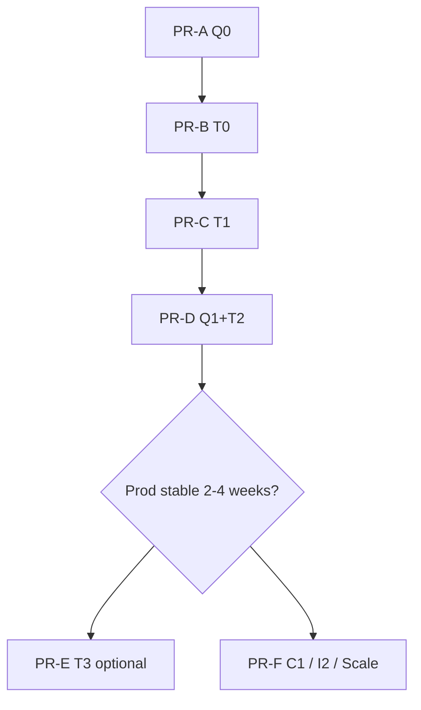

# Master Plan — C2 Hybrid Quota + LLM Usage (+ Post-Roadmap)

**Status:** IMPLEMENTED (PR-A → PR-D on branch `docs/c2-master-plan-and-ops-runbooks`).

**Single-source document**: architecture, schema, per-PR details, files to modify, tests, deploy, ops, post-phases (C1 / I2 / scale). Implement **in §D order**, don't skip phases.

Related: [chat-rate-limit-quota.md](./chat-rate-limit-quota.md), [llm-usage-tracking-plan.md](./llm-usage-tracking-plan.md) (abridged), [scale-phase-b-runbook.md](./scale-phase-b-runbook.md), [edge-cases-roadmap.md](./edge-cases-roadmap.md).

---

## A. Executive Summary

| | |
|---|---|
| **Problem** | No LLM token audit per user; changing quota (15→20) doesn't rebuild counter; hard to add tiers later |
| **Solution** | Two event tables: `messenger_chat_events` (hybrid quota) + `llm_usage_events` (tokens) |
| **Architecture decision** | **Hybrid Q0** — dual-write event + counter; **no** full event sourcing |
| **Core effort** | ~5–7 dev days (PR-A → PR-D) + ~1 day QA/deploy |
| **Not doing this round** | Full ES, billing invoices, dashboard UI, 2-pod scale, C1 tier code |

---

## B. Decisions Locked (Frozen)

1. **Quota:** `messenger_chat_events` + keep `messenger_chat_daily_usage` (H3 transaction).
2. **LLM:** Separate `llm_usage_events` — don't merge with quota events.
3. **Order:** **Q0 → T0 → T1 → Q1+T2** (PR-A → B → C → D).
4. **Runtime quota reads:** Still O(1) counter — no replay per request.
5. **Rebuild:** Ops script after rule changes — not automatic on env change.
6. **Full event sourcing:** Rejected this round; strangler pattern later if needed (§N).
7. **2-instance scale:** Runbook ready; only when CPU/latency metrics warrant (§N.3).

---

## C. Scope

### C.1. In Scope (Main Implementation Round)

| ID | Deliverable |
|----|-------------|
| Q0 | Dual-write quota events |
| Q1 | `chat-quota:rebuild` |
| Q2 | Doc + env `CHAT_QUOTA_WINDOW` stub (daily default; weekly documented) |
| T0 | Schema + `LlmUsageRecorderService` |
| T1 | Wire 3 OpenAI call sites |
| T2 | `llm-usage:status` + retention cron |
| — | Tests, migration, `.env.example`, agent docs |

### C.2. Out of Scope (Post-Phases — §N)

| ID | Notes |
|----|-------|
| T3 | USD estimate from env pricing |
| C1 | Tier limits per WISPACE package |
| I2 | Aggregated Slack alerts |
| Scale B | 2 pods + Nginx upstream |
| Billing | Charge users / invoices |

---

## D. Roadmap & PR (Mandatory Order)



| PR | Phase | Effort | Merge when |
|----|-------|--------|-----------|
| **PR-A** | Q0 | ~1 day | Migration + dual-write + transaction test |
| **PR-B** | T0 | ~0.5 days | `llm-usage` module + migration |
| **PR-C** | T1 | ~1–1.5 days | 3 features logging tokens |
| **PR-D** | Q1+T2 | ~1.5 days | Rebuild script + llm-usage:status + cron |
| PR-E | T3 | ~0.5 days | Product/finance needs USD |
| PR-F | C1/I2/Scale | varies | §N |

**CI gate per PR:** `npm ci` → `lint` → `test` → `build`.

---

## E. Database Schema

### E.1. `messenger_chat_events` (quota — PR-A)

```sql
CREATE TABLE messenger_chat_events (
  id               BIGSERIAL PRIMARY KEY,
  aggregate_id     VARCHAR(64) NOT NULL,          -- psid
  aggregate_type   VARCHAR(32) NOT NULL DEFAULT 'chat_quota',
  event_type       VARCHAR(64) NOT NULL,
  payload          JSONB NOT NULL DEFAULT '{}',
  occurred_at      TIMESTAMPTZ NOT NULL DEFAULT now(),
  usage_date       DATE NOT NULL,                   -- ICT, denormalized
  user_id          INT NULL,
  idempotency_key  VARCHAR(128) NULL,               -- mid for reserve/release
  CONSTRAINT uq_chat_events_idempotency UNIQUE (idempotency_key)
);

CREATE INDEX idx_chat_events_aggregate_time
  ON messenger_chat_events (aggregate_id, occurred_at);

CREATE INDEX idx_chat_events_usage_date
  ON messenger_chat_events (usage_date, event_type);
```

**`idempotency_key`:** only set for `CHAT_QUOTA_RESERVED` (message.mid) — `DENIED` doesn't need unique; `RELEASED` uses `{mid}:released` or NULL + payload.

#### Event Types & Payload

| `event_type` | When | `payload` (JSON) |
|--------------|------|-------------------|
| `CHAT_QUOTA_RESERVED` | After hard-cap reserve OK | `{ "limit": 15, "used_after": 3, "idempotency_key": "mid..." }` |
| `CHAT_QUOTA_RELEASED` | `refundFreeFormSlot` / H2 recover | `{ "reason": "send_failed" \| "stuck_recover", "used_after": 2 }` |
| `CHAT_QUOTA_DENIED` | Daily or burst deny | `{ "reason": "DAILY_LIMIT" \| "BURST_LIMIT", "limit": 15, "used": 15 }` |

**Note:** `CHAT_QUOTA_DENIED` does **not** increment the counter — audit only.

### E.2. `llm_usage_events` (PR-B)

```sql
CREATE TABLE llm_usage_events (
  id                 BIGSERIAL PRIMARY KEY,
  occurred_at        TIMESTAMPTZ NOT NULL DEFAULT now(),
  usage_date         DATE NOT NULL,
  feature            VARCHAR(32) NOT NULL,
  psid               VARCHAR(64) NULL,
  user_id            INT NULL,
  model              VARCHAR(64) NOT NULL,
  prompt_tokens      INT NOT NULL DEFAULT 0,
  completion_tokens  INT NOT NULL DEFAULT 0,
  total_tokens       INT NOT NULL DEFAULT 0,
  openai_response_id VARCHAR(128) NULL,
  correlation_id     VARCHAR(128) NULL,
  tool_round         SMALLINT NULL,
  status             VARCHAR(16) NOT NULL DEFAULT 'ok',
  error_message      TEXT NULL,
  estimated_cost_usd NUMERIC(12, 6) NULL
);

CREATE INDEX idx_llm_usage_user_date ON llm_usage_events (user_id, usage_date)
  WHERE user_id IS NOT NULL;
CREATE INDEX idx_llm_usage_psid_date ON llm_usage_events (psid, usage_date)
  WHERE psid IS NOT NULL;
CREATE INDEX idx_llm_usage_feature_date ON llm_usage_events (feature, usage_date);
```

| `feature` | Source |
|-----------|--------|
| `FREE_FORM_CHAT` | `messenger-agent.service.ts` (per tool round) |
| `STUDENT_REPORT` | `student-report.service.ts` |
| `STUDY_REMINDER` | `study-reminder.service.ts` |

### E.3. Tables Unchanged (Semantics Preserved)

- `messenger_chat_daily_usage` — quota projection
- `messenger_chat_idempotency` — H2 idempotency
- `messenger_message_logs` — Messenger message audit (no tokens)

---

## F. PR-A — Q0 Implementation Details

### F.1. Module / File

| Action | Path |
|--------|------|
| Migration | `src/infrastructure/database/migrations/*-CreateMessengerChatEvents.ts` |
| Entity | `src/infrastructure/database/entities/messenger-chat-event.entity.ts` |
| Port + repo | `src/modules/chat-rate-limit/domain|infrastructure/.../chat-quota-event.*` |
| Recorder | `ChatQuotaEventRecorderService` (application) |
| Wire transaction | `chat-rate-limit.repository.ts` — inside `reserveFreeFormSlotInTransaction`, `refundReservedSlot` |
| Deny path | `chat-rate-limit.service.ts` — before returning `DAILY_LIMIT` / `BURST_LIMIT` |
| Config | `CHAT_QUOTA_EVENTS_ENABLED` — default `true` in prod |
| Module | `ChatRateLimitModule` providers |

### F.2. Transaction (Must Be Same DB Transaction)

```text
reserveFreeFormSlotInTransaction:
  1. idempotency insert (existing)
  2. daily usage hard cap (existing)
  3. INSERT messenger_chat_events CHAT_QUOTA_RESERVED   ← new
  4. commit

refundReservedSlot:
  1. idempotency → refunded (existing)
  2. decrement daily (existing)
  3. INSERT CHAT_QUOTA_RELEASED                       ← new

deny (no transaction with counter):
  INSERT CHAT_QUOTA_DENIED (best-effort; fail → log warn)
```

### F.3. Tests (PR-A)

| Case | Expectation |
|------|-------------|
| Reserve OK | 1 RESERVED event + count +1 |
| Refund H4 | 1 RELEASED event + count -1 |
| Daily deny | 1 DENIED event; count unchanged |
| Burst deny | 1 DENIED event `BURST_LIMIT` |
| `CHAT_QUOTA_EVENTS_ENABLED=false` | No event insert; quota still works |
| Concurrent reserve at limit | H3 still passes (existing spec) |

### F.4. Deploy PR-A

```bash
npm run migration:run
npm run build
# VPS: deploy image + Doppler; no need to change limits immediately
```

---

## G. PR-D (Q1 Part) — Rebuild Algorithm

Script: `scripts/chat-quota-rebuild.mjs` → `npm run chat-quota:rebuild`.

```text
Input: --from=YYYY-MM-DD --to=YYYY-MM-DD (default today ICT)
       --daily-limit=N (override env for projection)
       --dry-run

Per (psid, usage_date):
  used = 0
  FOR event IN events ORDER BY occurred_at:
    IF event_type == RESERVED:  used += 1
    IF event_type == RELEASED: used = max(used - 1, 0)
    IF event_type == DENIED:    (skip)
  UPSERT messenger_chat_daily_usage.free_form_count = used
```

**Ops playbook for changing 15 → 20:**

1. Deploy Q0 has been running ≥ several days (has events).
2. Change `CHAT_FREE_FORM_DAILY_LIMIT=20` on Doppler.
3. (Optional) `npm run chat-quota:rebuild -- --from=<date Q0 enabled> --daily-limit=20 --dry-run`
4. Run actual rebuild if counter needs tightening.
5. `npm run chat-quota:status -- --ops` verify.

**Before Q0:** accurate rebuild not available — fallback to counting `idempotency` completed (old plan §12.2).

---

## H. PR-B / PR-C — LLM Tracking

### H.1. Module `src/modules/llm-usage/`

```
domain/entities/llm-usage.types.ts
domain/repositories/llm-usage.repository.port.ts
application/services/llm-usage-recorder.service.ts
application/services/llm-usage-query.service.ts      # PR-D
infrastructure/persistence/llm-usage.repository.ts
llm-usage.module.ts
```

Import `LlmUsageModule` from: `MessengerModule`, `StudentReportModule`, `StudyReminderModule`.

### H.2. Wire Points (PR-C)

| File | Location | `feature` | `correlation_id` |
|------|----------|-----------|------------------|
| `messenger-agent.service.ts` | After each `chat.completions.create` in for-loop | `FREE_FORM_CHAT` | `message.mid` (batch) |
| `student-report.service.ts` | After `generateAiReport` response | `STUDENT_REPORT` | `psid` + report date |
| `study-reminder.service.ts` | After `generateAiReminder` response | `STUDY_REMINDER` | `job.id` |

**Not logged:** template fallback, off-topic skip, fast reschedule, no API key.

### H.3. Recorder Semantics

- `LLM_USAGE_ENABLED=false` → no-op
- Inserts via **BullMQ** queue `llm-usage-write` (retry + backoff) when `REDIS_ENABLED=true`; **startup + enqueue both use `setImmediate`** — don't block webhook/chat
- Insert fail → BullMQ retry; enqueue fail → inline fallback + log
- `response.usage` missing → tokens 0 + warn

### H.4. PR-D Scripts

| Script | npm |
|--------|-----|
| `scripts/llm-usage-status.mjs` | `llm-usage:status` |
| `scripts/chat-quota-rebuild.mjs` | `chat-quota:rebuild` |

Pattern: copy structure from `scripts/chat-quota-status.mjs`.

Cron retention: `LlmUsageCleanupCronService` — advisory lock; `LLM_USAGE_RETENTION_DAYS` (default 180).
Quota events retention (optional PR-D): `CHAT_QUOTA_EVENTS_RETENTION_DAYS`.

---

## I. Test Matrix

| PR | Unit | Integration |
|----|------|-------------|
| A | `chat-rate-limit.repository.spec.ts` events in txn | — |
| A | `chat-rate-limit.service.spec.ts` deny emits | — |
| B | `llm-usage.repository.spec.ts` insert | — |
| C | `messenger-agent` / report / reminder specs mock usage | Manual chat 1 message |
| D | rebuild dry-run fixture events | `chat-quota:status` + `llm-usage:status` |

**Regression:** all existing `chat-rate-limit.service.spec.ts`, H2–H7 specs pass.

---

## J. Environment Variables (Summary)

```env
# PR-A — Quota events
CHAT_QUOTA_EVENTS_ENABLED=true
CHAT_QUOTA_EVENTS_RETENTION_DAYS=365

# PR-B/C/D — LLM usage
LLM_USAGE_ENABLED=true
LLM_USAGE_TIMEZONE=Asia/Ho_Chi_Minh
LLM_USAGE_RETENTION_DAYS=180
LLM_USAGE_BULLMQ_ENABLED=true
LLM_USAGE_BULLMQ_ATTEMPTS=3
LLM_USAGE_BULLMQ_BACKOFF_MS=2000

# Q2 doc — weekly not enforced in code in round 1
# CHAT_QUOTA_WINDOW=daily

# T3 (PR-E) — later
# LLM_COST_USD_PER_1M_INPUT_TOKENS_<model>=
# LLM_COST_USD_PER_1M_OUTPUT_TOKENS_<model>=

# Existing — unchanged
CHAT_FREE_FORM_DAILY_LIMIT=15
CHAT_BURST_PER_MINUTE=3
CHAT_USAGE_TIMEZONE=Asia/Ho_Chi_Minh
CHAT_RATE_LIMIT_ENABLED=true
```

Update `.env.example` + `docs/project-overview.md` each PR.

---

## K. Docs Updated on Merge

| PR | Files |
|----|-------|
| A | `AGENTS.md`, `chat-rate-limit-quota.md` §event, `.claude/rules/chat-rate-limit.md` |
| B/C | `llm-usage-tracking-plan.md` tick T0/T1, `project-overview.md` |
| D | `AGENTS.md` scripts table, `edge-cases-roadmap.md` C2 MVP ✓ |
| E | `project-overview.md` USD disclaimer |

---

## L. Definition of Done — Main Round (PR-A → D)

### L.1. Quota

- [ ] `messenger_chat_events` on prod
- [ ] Reserve/refund/deny log events per §F.2
- [ ] `chat-quota:rebuild` dry-run + live
- [ ] Runbook for changing limit in plan + `project-overview.md`

### L.2. LLM

- [ ] `llm_usage_events` on prod
- [ ] 3 features logging tokens
- [ ] `llm-usage:status --ops`
- [ ] Retention cron

### L.3. Common

- [ ] `npm run verify` passes locally
- [ ] VPS deploy: migration + health `/health/db`
- [ ] No regression in chat quota menu/postback

---

## M. Pre-Implementation Checklist

Tick **product/tech** before PR-A:

- [ ] Agree hybrid Q0 (no full ES) — §B
- [ ] Agree PR-A → D order — §D
- [ ] Snapshot Doppler `prd` / backup `.env` VPS
- [ ] Deploy window: avoid peak chat hours (announce evening after)
- [ ] Lock planned limit change date (15→20) if any — Q0 must be prod **before** that date
- [ ] Dev has local `ai_chat_bot_db` + migration test

**After ticking:** start **PR-A** per §F.

---

## N. Post-Main-Phase (Planning Only, Not Yet Implemented)

### N.1. PR-E — T3 USD (~0.5 days)

- Calculate `estimated_cost_usd` on `llm_usage_events` insert
- `llm-usage:status --ops` displays USD
- Disclaimer ≠ OpenAI invoice

### N.2. PR-F — C1 WISPACE Tier (~2+ days)

- WISPACE API → limit per `user_id`
- `ChatRateLimitConfigService` reads tier
- Rebuild + tier change playbook

### N.3. I2 Slack Ops (~1 day)

- Webhook from `ops:health` / log spike `CHAT_QUOTA_DENIED`

### N.4. Phase B Scale (When Metrics Warrant)

- [scale-phase-b-runbook.md](./scale-phase-b-runbook.md) — `CHAT_QUEUE_SHARED`, Nginx upstream

### N.5. Full Event Sourcing (Only If Needed)

- Strangler: reconcile event↔counter → counter becomes projection only
- No big-bang

---

## O. Suggested Timeline (1 Dev)

| Week | Work |
|------|------|
| 1 | PR-A + PR-B merge; deploy staging/prod |
| 2 | PR-C + PR-D merge; manual QA + ops scripts |
| 3 | Buffer for fixes + prod monitoring; prepare limit change if needed |
| 4+ | PR-E / C1 / I2 per product |

---

## P. Risk Summary

| Risk | Mitigation |
|------|------------|
| Event/counter drift | Same transaction in PR-A; Q1 rebuild; tests |
| Events before Q0 lost | Rough rebuild from idempotency; accept gap |
| LLM insert slow | Fail silent; don't block reply |
| Limit change without rebuild | Runbook §G — ops responsibility |
| Multi-pod | Event inserts independent; cron cleanup advisory lock |

---

*Master plan v1 — implement per §D after §M tick. Abridged file: [llm-usage-tracking-plan.md](./llm-usage-tracking-plan.md).*
