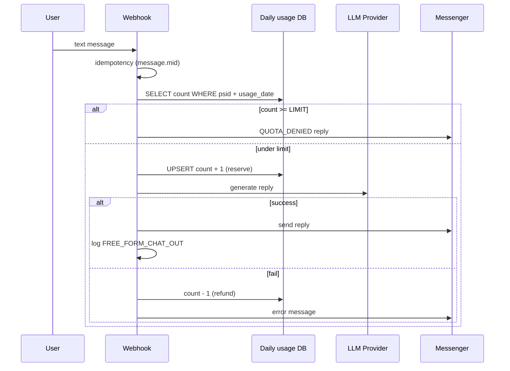
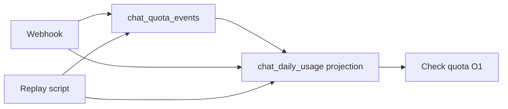
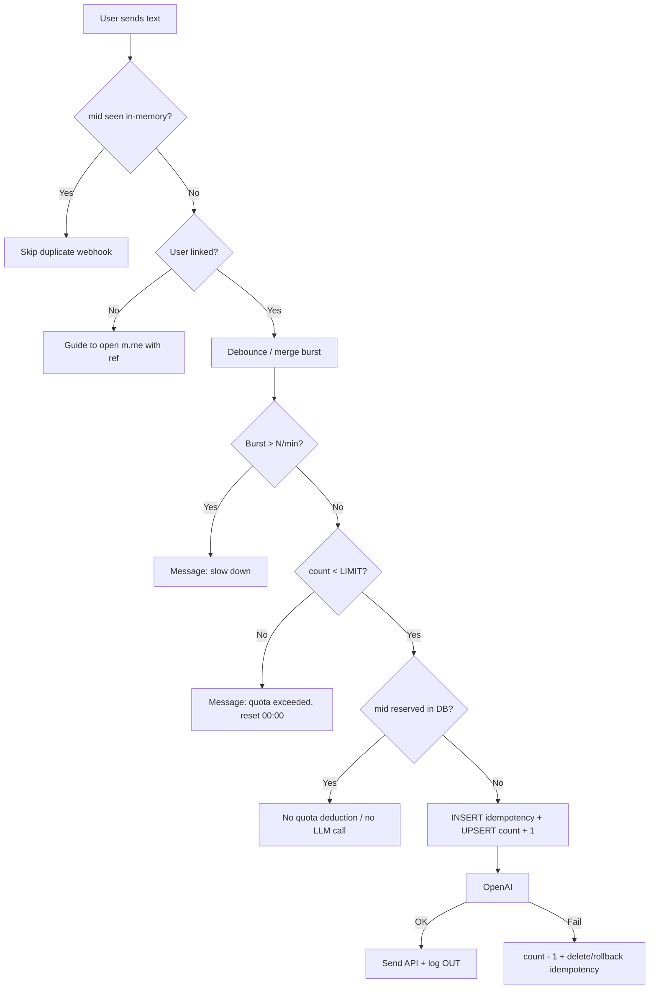
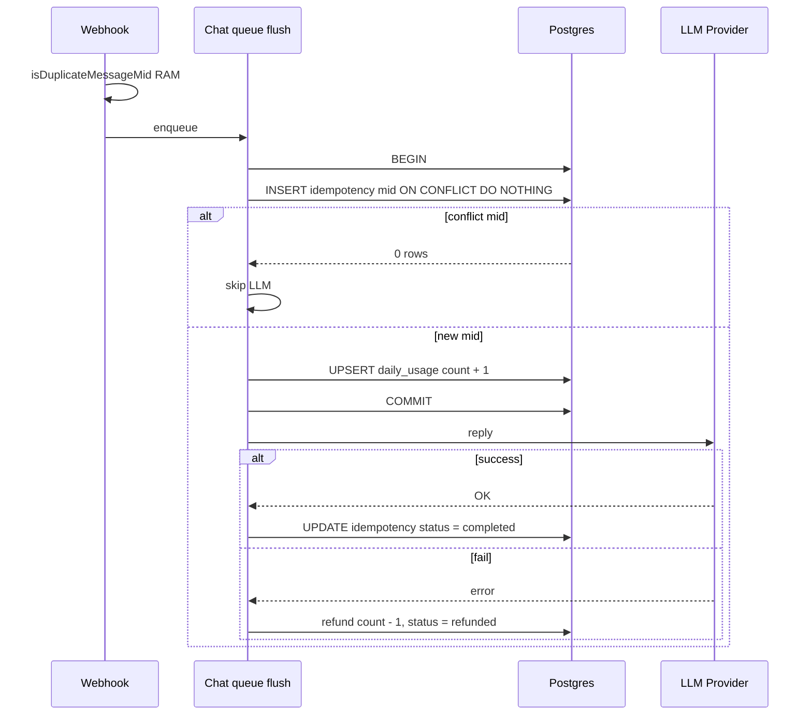
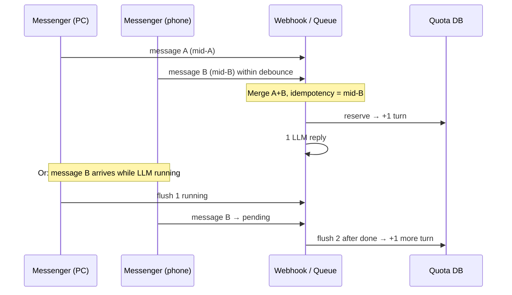
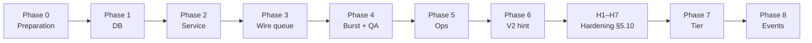
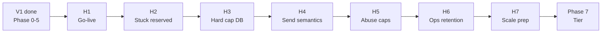

# Messenger Chat Rate Limit — Quota Storage & Message Throttling

Research document covering **3 quota storage approaches** for enabling two-way chatbot (user messages ↔ bot replies via LLM), analyzing trade-offs and **proposed implementation** for WISPACE.

Related: [project-overview.md](../../../docs/project-overview.md), [study-session-reminder.md](./study-session-reminder.md) (similar outbox pattern to `study_reminder_jobs`).

---

## 1. Context

### 1.1. Feature

- WISPACE-linked users can send free-form text → bot replies via LLM agent (`MessengerChatEnqueueService` debounce → `MessengerChatProcessorService` → LLM).
- Each debounced flush (merging consecutive messages) = **1 turn** when `CHAT_RATE_LIMIT_ENABLED=true`.
- Cost control: daily quota, burst/min, PSID QA whitelist, "X remaining" hint.

### 1.2. Code Status (V1 + hardening H1–H7 ✓)

| Component | Status |
|-----------|--------|
| Webhook dedupe \message.mid\ | Durable inbox \webhook_inbound_events\ (unique \platform+event_id\) — no RAM/Redis dedupe store |
| Webhook dedupe `message.mid` | ✓ RAM (default) or Redis when `CHAT_DEDUPE_STORE=redis` |
| Postback dedupe (`psid:payload`, TTL 15s) | ✓ |
| Rate limit / `chat_daily_usage` | ✓ `ChatRateLimitModule` |
| DB idempotency quota (`message.mid`) | ✓ `chat_idempotency` |
| Hard cap daily in transaction (H3) | ✓ |
| Stuck `reserved` / retry `mid` (H2) | ✓ |
| LLM vs Send semantics, abuse caps (H4–H5) | ✓ |
| Ops retention + logs (H6) | ✓ |
| Shared queue/history cross-pod (H7) | ✓ when `CHAT_QUEUE_SHARED=true` |

Chat text flow:

```
webhook → dedupe mid → enqueue (RAM or DB buffer)
  → debounce flush → reserve quota (DB) → LLM → Send API
  → markCompleted; error before send → refund
```

Enable enforcement: `CHAT_RATE_LIMIT_ENABLED=true`. Quick disable: `false` or `CHAT_RATE_LIMIT_WHITELIST_PSIDS`.

The `message_logs` table already exists — used for sent/received message audit (`message_type`, `external_user_id`, `user_id`, `created_at`).

### 1.3. What Does Meta (Facebook) Limit?

Meta does **not** provide a "max X bot messages per user per day" API. Platform limits are primarily on the **outbound bot side**:

| Limit | Description |
|-------|-------------|
| Send API (text) | ~300 messages/sec / Page |
| Rolling 24h | `200 × Engaged Users` (total app calls) |
| Per-thread | May throttle if sending too many into **one** conversation |
| 24h messaging window | User must message bot within last 24h for bot to reply with `RESPONSE` type |

→ **Daily chat quota is self-implemented** by the application on Postgres (or cache), not relying on Meta.

Meta docs: [Messenger Platform rate limits](https://developers.facebook.com/docs/messenger-platform/overview/rate-limiting).

---

## 2. Quota Scope — Separate Buckets

Not merging all interactions into one counter. Proposal:

| Bucket | Example | Counts toward chat quota? |
|--------|---------|--------------------------|
| **FREE_FORM_CHAT** | User types text → LLM replies | **Yes** (strictest) |
| **MENU_POSTBACK** | Reminders, View Progress, Register Report | **No** (or separate bucket, generous limit) |
| **PROACTIVE** | T-30 reminders, cron reports | **No** — system-initiated |
| **SYSTEM_REPLY** | Welcome, quota exceeded, errors | **No** |

**Proposed time window:** calendar day in `Asia/Ho_Chi_Minh` (matching `STUDY_REMINDER_TIMEZONE`), reset at midnight — easy to explain to students.

**Burst (fast anti-spam):** max N messages/min (e.g. `3`) — checked before daily quota.

**Suggested env:**

```env
CHAT_FREE_FORM_DAILY_LIMIT=15
CHAT_BURST_PER_MINUTE=3
CHAT_USAGE_TIMEZONE=Asia/Ho_Chi_Minh
```

---

## 3. Three Quota Storage Approaches

### Option A — Daily Counter Table `chat_daily_usage` (Proposed)

#### Concept

Each user (`psid`) has **one row per ICT day** with a `free_form_count` column. Each successful free-form chat → `+1` via atomic UPSERT. New day → new row (lazy insert on first message).

#### Proposed Schema

```sql
CREATE TABLE chat_daily_usage (
  id               SERIAL PRIMARY KEY,
  psid             VARCHAR(64) NOT NULL,
  user_id          INT NULL,
  usage_date       DATE NOT NULL,           -- date in CHAT_USAGE_TIMEZONE
  free_form_count  INT NOT NULL DEFAULT 0,
  created_at       TIMESTAMPTZ NOT NULL DEFAULT now(),
  updated_at       TIMESTAMPTZ NOT NULL DEFAULT now(),
  CONSTRAINT uq_chat_daily_usage_psid_date UNIQUE (psid, usage_date)
);

CREATE INDEX idx_chat_daily_usage_user_date
  ON chat_daily_usage (user_id, usage_date)
  WHERE user_id IS NOT NULL;
```

| Column | Meaning |
|--------|---------|
| `psid` | Primary key — always available from Messenger webhook |
| `user_id` | Copied from `user_platform_mappings` when linked (reports, ops) |
| `usage_date` | ICT date as `2026-06-15` — do **not** use UTC arbitrarily |
| `free_form_count` | Number of FREE_FORM turns consumed today |

#### Processing Flow



#### Atomic UPSERT (race protection)

```sql
INSERT INTO chat_daily_usage (psid, user_id, usage_date, free_form_count)
VALUES ($1, $2, $3, 1)
ON CONFLICT (psid, usage_date)
DO UPDATE SET
  free_form_count = chat_daily_usage.free_form_count + 1,
  user_id = COALESCE(EXCLUDED.user_id, chat_daily_usage.user_id),
  updated_at = now()
RETURNING free_form_count;
```

**Note:** UPSERT ensures the **counter is correct** when multiple requests write concurrently. **H3 ✓** adds `WHERE free_form_count < limit` in the same transaction as idempotency — daily cap doesn't exceed on multi-instance. **H7 ✓** persists debounce + history via Redis when `CHAT_QUEUE_SHARED=true`.

#### Meta Webhook Idempotency

Facebook may send **duplicate** webhooks with the same \message.mid\. The durable inbox (\webhook_inbound_events\, unique \platform+event_id\) makes redeliveries idempotent + **quota idempotency** at reserve � details [�5.3](#53-idempotency--already-implemented-v1--h2).

Summary: reserve attaches `idempotency_key = message.mid` (unique) before LLM; conflict → skip or recover (H2). Multi-pod: `CHAT_QUEUE_SHARED=true`.

#### Reserve vs Refund

| Strategy | Description | When |
|----------|-------------|------|
| **Reserve before LLM** | `+1` before calling OpenAI | Anti-abuse cost — **recommended** |
| **Refund on fail** | `-1` if LLM or Send API errors | Fair UX |
| **Only +1 after success** | User doesn't lose turns on error | Easy for spam to consume LLM |

#### Calculating `usage_date` (ICT)

```ts
function todayUsageDate(timezone: string, now = new Date()): string {
  return new Intl.DateTimeFormat('en-CA', {
    timeZone: timezone,
    year: 'numeric',
    month: '2-digit',
    day: '2-digit',
  }).format(now); // "2026-06-15"
}
```

Quota resets naturally when `usage_date` changes — **no cron needed to clear counters**.

#### Sample Data

User `psid=27291166300574332` (user 143), limit 15:

| psid | usage_date | free_form_count |
|------|------------|-----------------|
| 27291166300574332 | 2026-06-15 | 7 |
| 27291166300574332 | 2026-06-16 | 2 |

#### Suggested Module Code

```
src/modules/chat-rate-limit/
  chat-rate-limit.module.ts
  chat-rate-limit.service.ts       # check(), reserve(), refund()
  chat-daily-usage.repository.ts
  chat-daily-usage.entity.ts
```

> **Note:** Core rate-limit logic (`ChatRateLimitCore`, `ChatRateLimitRepository`, `MemoryBurstCounter`, `PostgresBurstCounter`) now lives in `@wispace/chat-metering` package, shared across Messenger, Discord, and Zalo bots.

Hook: **`MessengerChatProcessorService.flush()`** — before LLM; webhook keeps RAM dedupe. Postback does **not** go through rate limit.

#### Integration with Existing Logs

Counter = **fast reads** for quota. `message_logs` = **audit** of content:

| message_type | When |
|--------------|------|
| `FREE_FORM_CHAT_IN` | User sends (optional, before LLM) |
| `FREE_FORM_CHAT_OUT` | Bot LLM reply successful |
| `CHAT_QUOTA_DENIED` | Quota exceeded / burst |

---

### Option B — Event Sourcing + Replay

#### Concept

Not storing `free_form_count = 7` directly. Storing an **immutable event stream** (append-only). Quota state = **projection** from events (replay).

#### Minimum Event Types

```ts
type ChatEventType =
  | 'FREE_FORM_MESSAGE_RECEIVED'
  | 'CHAT_QUOTA_RESERVED'
  | 'CHAT_QUOTA_DENIED'
  | 'CHAT_QUOTA_RELEASED'      // LLM / Send fail → refund turn
  | 'LLM_REPLY_SENT'
  | 'MENU_POSTBACK_RECEIVED'; // optional, no quota deduction
```

#### Event Store Schema

```sql
CREATE TABLE chat_quota_events (
  id              BIGSERIAL PRIMARY KEY,
  aggregate_id    VARCHAR(64) NOT NULL,   -- psid
  aggregate_type  VARCHAR(32) NOT NULL DEFAULT 'chat_quota',
  event_type      VARCHAR(64) NOT NULL,
  payload         JSONB NOT NULL,
  occurred_at     TIMESTAMPTZ NOT NULL DEFAULT now(),
  idempotency_key VARCHAR(128) NULL UNIQUE
);

CREATE INDEX idx_chat_events_aggregate_time
  ON chat_quota_events (aggregate_id, occurred_at);
```

#### Replay (derive state)

```ts
function projectDailyUsage(events: ChatEvent[], usageDate: string): number {
  let count = 0;
  for (const e of events) {
    if (e.occurredDateIct !== usageDate) continue;
    if (e.type === 'CHAT_QUOTA_RESERVED') count += 1;
    if (e.type === 'CHAT_QUOTA_RELEASED') count -= 1;
  }
  return count;
}
```

#### Practical Architecture (no replay per request)



Runtime **still needs projection** (Option A) for O(1) quota checks. Event store = source of truth for audit and rebuild when rules change.

#### When Replay is Useful

- Debug: "why did the user hit the limit?"
- Rule change (15 → 20, weekly reset) → rebuild projection from old events
- Billing / compliance needs to prove each grant/deny decision

---

### Option C — Count from `message_logs`

#### Concept

No counter table. Each chat message logged with a fixed `message_type`. Today's quota = `COUNT(*)` on logs.

#### Example Query

```sql
SELECT COUNT(*)::int AS used_today
FROM message_logs
WHERE psid = $1
  AND message_type = 'FREE_FORM_CHAT_IN'
  AND status = 'SENT'
  AND (created_at AT TIME ZONE 'Asia/Ho_Chi_Minh')::date = $2::date;
```

1-minute burst:

```sql
SELECT COUNT(*) FROM message_logs
WHERE psid = $1
  AND message_type = 'FREE_FORM_CHAT_IN'
  AND created_at > NOW() - INTERVAL '1 minute';
```

#### Flow

```
Webhook → COUNT today's logs → if < LIMIT → LLM → INSERT log IN + OUT
```

No UPSERT counter — each action only appends a log.

---

## 4. Trade-off Comparison

### 4.1. Summary Table

| Criterion | **A. `chat_daily_usage`** | **B. Event sourcing** | **C. Count from logs** |
|-----------|-------------------------------------|------------------------|------------------------|
| **Implementation complexity** | Low | High (store + projection + replay) | Lowest (no new migration) |
| **Operational complexity** | Low | High — team must understand replay | Medium — log grows over time |
| **Read performance** | O(1) — 1 row | O(1) with projection; O(n) if replay per request | O(n) — COUNT per message |
| **Write performance** | 1 UPSERT | 1 INSERT event + update projection | 1 INSERT log (×2 for IN+OUT) |
| **Race condition / concurrent** | Good — atomic UPSERT | Good if event+projection transactional | Poor — double COUNT before INSERT |
| **Detailed audit** | Medium — needs accompanying log | Excellent — full event history | Good — if log has enough types |
| **Replay / rebuild state** | Not native | **Main strength** | Can re-COUNT — slow, no reserve/release semantics |
| **Storage over time** | ~1 row/user/day | N event/action — largest | 1+ row/message — large |
| **Changing quota rules later** | Only applies forward | Rebuild projection from events | Hard — old logs lack reserve semantics |
| **Matches current stack** | Like `study_reminder_jobs` (snapshot state) | New pattern, learning curve | Leverages existing table |
| **Fits IELTS student scale** | **Very well** | Overkill for early stage | OK for < 50 active chat users |

### 4.2. Actual Cost Bottleneck

The main bottleneck is **not** Postgres reads — it's **OpenAI + Send API**. Therefore:

- Need **reserve before LLM** (atomic) → Options A and B (with projection) work well; Option C is prone to race.
- Event sourcing doesn't reduce LLM costs — it only helps audit/rebuild.

### 4.3. When to Upgrade from A to B

Only when **at least two** of the following:

1. Per-token billing / Premium packages / different quotas per `user_id`
2. Need frequent rebuild after changing business rules
3. Compliance requires proving each deny/grant decision

Then: add `chat_quota_events` **alongside** `chat_daily_usage`, don't change the hot path.

### 4.4. Why Not C for Production

- Each chat message = `COUNT(*)` on a growing log table → latency increases over time.
- Index `(psid, message_type, created_at)` helps but still heavier than reading 1 counter row.
- Hard to model **reserve / refund** when LLM fails (count IN or OUT?).
- Meta webhook retries can double-count without separate idempotency.

**C is still OK** for quick demo spikes (< 1 week, few users) before migrating to Option A.

---

## 5. Official Proposal: Option A — `chat_daily_usage`

### 5.1. Decision Summary

| Decision | Choice |
|----------|--------|
| Quota storage | **`chat_daily_usage`** table |
| Key | `(psid, usage_date)` unique |
| Timezone | `CHAT_USAGE_TIMEZONE` = `Asia/Ho_Chi_Minh` |
| Counter | `free_form_count` — FREE_FORM bucket only |
| Write | Atomic UPSERT; reserve before LLM, refund on fail |
| Idempotency | **DB** — `message.mid` unique at reserve (§5.3); keep RAM dedupe at webhook |
| Audit | Keep `message_logs` with standard `message_type` |
| Event sourcing | **Not** in phase 1; may add later |
| Count from logs | **Not** on hot path |

### 5.2. Proposed End-to-End Flow



**Menu postback** (`VIEW_UPCOMING_STUDY_SESSION`, …) takes a separate branch — does **not** go through `ChatRateLimitService`.

Hook reserve: **`MessengerChatProcessorService.processChatBatch()`** (called from `flush`) — after debounce, **before** `MessengerAgentService.reply()`. Webhook dedupe + enqueue; reserve at flush.

### 5.3. Idempotency — Already Implemented (V1 + H2)

Meta may **retry webhooks** with the same payload (same `message.mid`). The system prevents double quota deduction / duplicate LLM calls via **two layers**:

| Layer | When | Mechanism |
|-------|------|-----------|
| Webhook dedupe | Before enqueue | Durable inbox \webhook_inbound_events\ (unique \platform+event_id\) |
| Quota idempotency | At flush | `chat_idempotency` — unique `idempotency_key = message.mid` |

Postback: separate dedupe `psid:payload` (15s) — **not** related to chat quota.

| Dedupe | Single instance (`CHAT_QUEUE_STORE=memory`) | Multi-pod (`CHAT_QUEUE_STORE=redis` or `CHAT_QUEUE_SHARED=true`) |
|--------|---------------------------------------------|------------------------------------------------------------------|
| Webhook `mid` | RAM Map | Redis `dedupe:mid:*` |
| Debounce queue | RAM `Map` per process | Redis `chat:queue:buffer:{psid}` |
| Chat history LLM | RAM 30 minutes | Redis `chat:history:{psid}` |
| Quota reserve | DB idempotency + hard cap H3 | Same — shared PostgreSQL |

#### Schema — Idempotency Table (migrated)

```sql
CREATE TABLE chat_idempotency (
  idempotency_key  VARCHAR(128) PRIMARY KEY,  -- message.mid from Meta
  psid             VARCHAR(64) NOT NULL,
  user_id          INT NULL,
  usage_date       DATE NOT NULL,
  reserved_at      TIMESTAMPTZ NOT NULL DEFAULT now(),
  status           VARCHAR(16) NOT NULL DEFAULT 'reserved'
                   CHECK (status IN ('reserved', 'completed', 'refunded'))
);

CREATE INDEX idx_chat_idempotency_psid_date
  ON chat_idempotency (psid, usage_date);
```

| Column | Meaning |
|--------|---------|
| `idempotency_key` | `message.mid` — globally unique |
| `status` | `reserved` → LLM running; `completed` → reply sent; `refunded` → turn returned after error |

**Simpler approach:** unique `(idempotency_key)` on `message_logs` when `message_type = 'FREE_FORM_CHAT_IN'` — reserve + insert log in one transaction. Insert failure → mid already processed, skip LLM.

#### Reserve Flow with Idempotency



#### Debounce vs Idempotency

`MessengerChatEnqueueService` merges consecutive messages (`CHAT_DEBOUNCE_MS`) into **one** LLM call.

| Convention | Description |
|------------|-------------|
| **Recommended** | **1 quota turn / 1 flush** (one bot reply), not per `mid` in burst |
| Idempotency key on merge | `mid` of the **last message** in debounce batch (implemented in `MessengerChatProcessorService.flush()`) |
| User sends 5 messages / 2s burst | User receives 1 reply → deducts **1** turn (fair UX) |

Document this convention in code + tests to avoid disputes about "5 messages = 5 turns or 1 turn".

#### Keep RAM Dedupe in Parallel

| Layer | Role |
|-------|------|
| **RAM** (`isDuplicateMessageMid`) | Fast path — drops duplicate webhooks immediately, no enqueue |
| **DB** (idempotency + reserve) | Source of truth for quota — survives restart, multi-instance |

The two layers **complement** each other, not replace.

#### Multiple Devices — Same Messenger Account

Students typically message the bot from **computer** (Messenger web / desktop) and **phone** (Messenger app) **simultaneously** or alternating. Meta assigns **one PSID** per person ↔ Page — **no** device-based quota splitting. Computer and phone **share** the `(psid, usage_date)` bucket and the same debounce queue in-process.

**How code handles this currently (V1):**

| Layer | Behavior |
|-------|----------|
| **Webhook** | Each message = one unique `message.mid` (PC and phone always have different `mid`). RAM dedupe only drops **duplicate retries** with same `mid`, doesn't merge two devices. |
| **Queue** (`MessengerChatProcessorService`) | One `Map` entry **per PSID** — no device source distinction. `processing` flag ensures **at most one flush** (one reserve + LLM) runs for that PSID on the **same instance**. |
| **Debounce** | Messages from PC + phone arriving **within** `CHAT_DEBOUNCE_MS` (before flush) → merge `texts[]` → **one** bot reply → **deducts 1 turn**. |
| **Pending while processing** | Message arrives **while** bot is calling LLM (`processing = true`) → enters `pendingWhileProcessing` → after flush completes, **flushes again** → **deducts 1 more turn** (two legitimate messages). |
| **Quota DB** | Reserve by `idempotency_key` = `mid` of last message in flush batch; counter `free_form_count` by PSID + ICT day. |
| **Burst** | Counts `chat_idempotency` records with `reserved_at` in last 60 seconds — **all devices** combined for same PSID. |

**Illustrative scenario:**



| Scenario | UX / quota result (1 instance) |
|----------|-------------------------------------|
| Typing on PC + phone **almost simultaneously** (within debounce) | 1 reply (merged content), **1 turn** |
| Typing on phone **while** bot is replying to PC message | 2 replies sequentially, **2 turns** |
| Same PSID, **daily quota exhausted** | Next message (from any device) → `CHAT_QUOTA_DENIED` |
| Exceeding **burst** (3/min default) | Next message → burst deny; applies per PSID, not per device |

**Race condition — practical impact:**

- **Single process (`CHAT_QUEUE_SHARED=false`):** Same PSID flushes **queue up** (`processing` + `pendingWhileProcessing`). Daily overshoot rare.
- **Multiple instances:** Enable **`CHAT_QUEUE_SHARED=true`** (H7) — debounce/history via Redis (`REDIS_ENABLED=true` required); claim buffer `FOR UPDATE`. Daily cap: **H3** hard cap in transaction — doesn't exceed limit on concurrent reserve.

**Not done in V1:**

- Per-device / per-session quota — Meta doesn't expose stable device IDs for this use case.
- Merging quota by `user_id` instead of PSID — PSID↔user mapping exists but counter hot path still keyed by PSID (correct per webhook).

### 5.4. Internal API Service (Suggestion)

```ts
interface ChatQuotaCheckResult {
  allowed: boolean;
  used: number;
  limit: number;
  remaining: number;
  reason?: 'DAILY_LIMIT' | 'BURST_LIMIT' | 'NOT_LINKED';
  usageDate: string;
}

class ChatRateLimitService {
  async checkQuota(psid: string, userId?: number): Promise<ChatQuotaCheckResult>;
  /** Returns allowed=false if mid already reserved (idempotency conflict). */
  async reserveFreeFormSlot(
    psid: string,
    params: { userId?: number; idempotencyKey: string },
  ): Promise<ChatQuotaCheckResult>;
  async refundFreeFormSlot(
    psid: string,
    usageDate: string,
    idempotencyKey: string,
  ): Promise<void>;
  async markCompleted(idempotencyKey: string): Promise<void>;
}
```

### 5.5. Quota Exceeded Message (UX)

> Today you've used all **15 chat turns** with WISPACE. New turns reset at **00:00** (Vietnam time).
> Reports and reminders are still sent automatically. Prod menu only has **Register Report**.

`message_type`: `CHAT_QUOTA_DENIED`.

### 5.6. Suggested Parameters

| Tier | FREE_FORM / day | Burst |
|------|-----------------|-------|
| Demo | 15–20 | 3/min |
| Light production | 30 | 5/min |
| QA whitelist | unlimited (configured `psid` list) | — |

### 5.7. Implementation Checklist (V1 — done)

- [x] Migration `chat_daily_usage`
- [x] Migration `chat_idempotency` (or unique `message.mid` on log IN)
- [x] Entity + repository + `ChatRateLimitService` (`reserve` / `refund` / `markCompleted`)
- [x] Wire **`MessengerChatProcessorService.flush()`** — reserve + idempotency **before** LLM; refund in `catch`
- [x] Keep RAM dedupe `isDuplicateMessageMid` at webhook (fast path)
- [x] Debounce convention: **1 turn / 1 flush**; document idempotency key when merging burst
- [x] Document **multiple devices** same account (§5.3) — shared PSID/quota, debounce vs pending
- [x] New `message_type`: `FREE_FORM_CHAT_IN`, `FREE_FORM_CHAT_OUT`, `CHAT_QUOTA_DENIED`
- [x] Env: `CHAT_FREE_FORM_DAILY_LIMIT`, `CHAT_BURST_PER_MINUTE`, `CHAT_USAGE_TIMEZONE`
- [x] Ops scripts: `npm run chat-quota:status` — query usage + idempotency by `psid` / `user_id` / date
- [x] Tests: retry webhook with same `mid` → count doesn't increase; LLM fail → refund
- [x] Update [project-overview.md](../../../docs/project-overview.md) on merge

### 5.8. Post-V1 Roadmap (optional — after V1 production)

| Phase | Work | Status |
|-------|------|--------|
| **V2 UX** | Hint "X remaining" when `remaining ≤ threshold` | ✓ Phase 6 (code) |
| **V3 Tier** | Limit by `user_id` / WISPACE package | Not yet |
| **V4 Event store** | `chat_quota_events` + replay / billing | ✓ `chat_quota_events` table + `ChatQuotaEventRecorderService` dual-write + cleanup cron |
| **H1–H7** | Operational edge case hardening (§5.10, after §5.9) | H1 ✓; H2 ✓; H4 ✓; H5 ✓; **H3 ✓**; **H6 ✓**; **H7 ✓** |

**V4 details:** `chat_quota_events` entity (from `@wispace/chat-metering`) dual-writes events alongside the counter. `ChatQuotaEventCleanupCronService` runs monthly cleanup (`CHAT_QUOTA_EVENTS_CLEANUP_ENABLED`). Env: `CHAT_QUOTA_EVENTS_ENABLED`, `CHAT_QUOTA_EVENTS_RETENTION_DAYS`.

### 5.9. Phased Implementation Plan (full rate limit)

Implementation roadmap for **V1 (Phase 0–5 ✓)** and hardening **H1–H7 ✓** — kept as historical / onboarding documentation. V2 and V4 are implemented; only tiered quotas (V3 / Phase 7) remain deferred.



#### Phase 0 — Preparation (≈ 0.5 days)

**Goal:** Configuration and module skeleton, not blocking users.

| Task | Done when |
|------|-----------|
| Add env to `.env.example`: `CHAT_FREE_FORM_DAILY_LIMIT`, `CHAT_BURST_PER_MINUTE`, `CHAT_USAGE_TIMEZONE` | Dev knows required vars |
| Create module `src/modules/chat-rate-limit/` (module + service stub) | Nest boots, injection works |
| `readRequiredPositiveNumber` / config reader like `StudyReminderScheduleService` | Limit read from env, no hardcoding |
| (Optional) `CHAT_RATE_LIMIT_ENABLED=true` — quick disable for debugging | Rollback without code revert |

**Don't do:** wire queue, migration.

---

#### Phase 1 — Schema & Repository (≈ 1 day)

**Goal:** Postgres ready, repository tests pass independently.

| Task | Done when |
|------|-----------|
| Migration `chat_daily_usage` | `npm run migration:run` OK |
| Migration `chat_idempotency` | Unique `idempotency_key` |
| TypeORM entity + repository (UPSERT daily, INSERT idempotency) | Spec: concurrent UPSERT → correct count |
| Index `(psid, usage_date)` | Explain query fast |

**Don't do:** chat queue calls.

---

#### Phase 2 — `ChatRateLimitService` Core (≈ 1–1.5 days)

**Goal:** Quota + idempotency logic in transaction, no UI hook yet.

| Task | Done when |
|------|-----------|
| `todayUsageDate(timezone)` — ICT `en-CA` | Matches `STUDY_REMINDER_TIMEZONE` |
| `checkQuota(psid)` → `{ allowed, used, limit, remaining, usageDate }` | Unit test under/at/over limit |
| `reserveFreeFormSlot(psid, { idempotencyKey, userId })` in **one transaction**: INSERT idempotency → UPSERT count +1 | Conflict `mid` → `allowed: false`, count unchanged |
| `refundFreeFormSlot(psid, usageDate, idempotencyKey)` | count -1, status `refunded` |
| `markCompleted(idempotencyKey)` | status `completed` |
| Reserve **before** LLM; refund on LLM/Send fail | Documented in service |

**Required tests:**

- Two `reserve` with same `mid` → one succeeds, one conflicts.
- Reserve → refund → count back to original.

---

#### Phase 3 — Chat Queue Integration (≈ 1 day)

**Goal:** Real users blocked when quota exhausted; normal chat still works.

| Task | Done when |
|------|-----------|
| Hook `MessengerChatProcessorService.flush()`: after debounce, **before** `MessengerAgentService.reply()` | Reserve called in right place |
| Pass `idempotencyKey` = `message.mid` of **last** message in debounce batch (convention §5.3) | 5-message burst → 1 turn |
| Quota exhausted → `sendTextViaPsid` message §5.5, `message_type=CHAT_QUOTA_DENIED` | No OpenAI call |
| Success → `markCompleted`; `catch` → `refund` | LLM error doesn't waste turns |
| Log `FREE_FORM_CHAT_IN` (optional) before LLM | Audit in `message_logs` |
| Keep `isDuplicateMessageMid` RAM at webhook | Fast path unchanged |

**Manual tests:**

- Unlinked user → guidance message (no reserve or skip — pick one).
- Normal chat under limit → OK.
- Postback / reminder cron → does **not** increase `free_form_count`.

---

#### Phase 4 — Burst, Edge Cases & Hardening (≈ 1 day)

**Goal:** Fast anti-spam + production stability.

| Task | Done when |
|------|-----------|
| `CHAT_BURST_PER_MINUTE` — check before daily reserve | "Slow down" message on spam |
| Retry webhook with same `mid` (simulate) → no double LLM / double count | QA pass |
| Server restart + retry `mid` → DB idempotency still blocks | Different from RAM-only |
| `CHAT_RATE_LIMIT_ENABLED=false` bypass (if Phase 0 flag exists) | Ops quick disable |
| QA PSID whitelist (env list, optional) | Team tests without limits |

**Don't do:** tier per package, event store.

---

#### Phase 5 — Ops, Docs & V1 Sign-off (≈ 0.5–1 day)

**Goal:** Operations and handoff.

| Task | Done when |
|------|-----------|
| Script `npm run chat-quota:status` (psid / userId / date) | Ops query usage |
| Update [project-overview.md](../../../docs/project-overview.md), gap `AGENTS.md` | Docs match code |
| Checklist §5.7 all V1 items ticked | Review merge |
| Document recommended prod limits (15–20/day, burst 3) in runbook | Wispace knows the numbers |

**V1 definition of done:** Chat text → reserve → LLM → send; quota exhausted / burst / duplicate `mid` / LLM fail all handled correctly; postback & proactive don't deduct quota.

---

#### Phase 6 — V2 UX (optional, ≈ 0.5 days) — ✓ done

| Task | Done when |
|------|-----------|
| After successful reply, send hint "X remaining" when `remaining ≤ CHAT_QUOTA_REMAINING_HINT_THRESHOLD` | `CHAT_QUOTA_REMAINING_HINT` |
| Don't show when unlimited / whitelist / enforcement off | Spec queue pass |

**Next (optional):** Phase 7 WISPACE tier, Phase 8 event store — §5.8.

---

#### Phase 7 — V3 Tier & WISPACE (optional, ≈ 2+ days)

| Task | Done when |
|------|-----------|
| Limit by `user_id` / package (Premium vs free) | Config or WISPACE API |
| Sync tier on user upgrade | No redeploy needed |

---

#### Phase 8 — Event Store / Billing (optional, V4)

| Task | Done when |
|------|-----------|
| `chat_quota_events` table + replay rebuild projection | Audit & quota rule changes |
| Per-token billing (if product requires) | Outside scope |

---

#### V1 Effort Summary (Phase 0–5)

| Phase | Estimated Effort | Can ship independently? |
|-------|------------------|------------------------|
| 0 Preparation | 0.5 days | ✓ |
| 1 DB | 1 day | ✓ (not blocking users) |
| 2 Service | 1–1.5 days | ✓ (not blocking users) |
| 3 Wire queue | 1 day | ✓ **enables real rate limit** |
| 4 Hardening | 1 day | Recommended before prod |
| 5 Ops | 0.5–1 days | V1 sign-off |
| **Total V1** | **~5–6 dev days** | |

Phase **6** (V2 hint) ✓. **H1–H7** (§5.10) ✓. **Next optional:** Phase **7–8** (tier, event store) when product needs it.

---

### 5.10. Real Edge Cases — Hardening Roadmap (H1–H7)

After V1 (Phase 0–5 ✓), remaining gaps when running real users — separated into phases for small PR merges. **H** = hardening (doesn't overlap with Phase 7 tier above).



#### Map — Issue → Phase

| Real Issue | Severity | Phase | Current Note |
|------------|----------|-------|--------------|
| `CHAT_RATE_LIMIT_ENABLED=false` — forgotten in prod | High | **H1** | No cost cap |
| Crash/restart mid-flush → `reserved` stuck, `mid` retry silent | High | **H2** | User loses turn, no reply |
| Multi-instance / concurrent reserve exceeds daily cap | High | **H3** | Pre-check outside transaction |
| LLM OK, Send API fails mid-bubble → refund all | Medium | **H4** | UX: split reply + turn refund |
| Rich follow-up / hint fails after main bubble → refund | Medium | **H4** | Similar to H4 |
| Debounce merges many long messages → 1 turn, high LLM tokens | Medium | **H5** | Quota counts turns, not length |
| Burst counts `refunded` in 60s | Medium | **H5** | User retry after error easily hits burst |
| Webhook missing `message.mid` → skip reserve, still LLM | Medium | **H5** | Gap if Meta doesn't send `mid` |
| `chat_idempotency` grows forever, no retention | Low | **H6** | Ops / storage |
| Queue + history RAM not shared across pods | Low | **H7** | Only on horizontal scale |
| Multiple devices same PSID | — | *(doc §5.3)* | Documented; H3 if multi-pod |
| Exactly midnight ICT, pending when quota exhausted, sticker-only | Low | **H1** (runbook) | Document QA, no code needed |

#### H1 — Go-live & QA Production (≈ 0.5 days)

**Goal:** Safe enforcement enable; team knows how to verify before deep hardening.

| Task | Done when |
|------|-----------|
| `CHAT_RATE_LIMIT_ENABLED=true` on prod/staging env | Counter increments on chat |
| QA checklist: under limit, day expired, burst, postback no deduction, whitelist | Documented in runbook §12 `project-overview.md` |
| `npm run chat-quota:status` before/after user test | Ops can query |
| Document: quota reset 00:00 ICT, `usage_date` calculated at **reserve** time | Support can answer users |
| Document: pending + quota exhausted → next flush may deny | Clear UX expectations |

**Don't do:** fix stuck reserved, hard cap transaction.

#### H2 — Stuck `reserved` & Retry `mid` (≈ 1–1.5 days) — ✓ done

**Goal:** Crash/restart or timeout between reserve and `markCompleted` doesn't permanently lose user turns.

| Task | Done when |
|------|-----------|
| Env `CHAT_IDEMPOTENCY_STUCK_RESERVED_MS` (default 600000) | `.env.example` |
| `ChatRateLimitService`: conflict → `recoverIdempotencyForRetry` → re-reserve if `reopened` | `reserveSlotOrRecoverOnConflict` |
| `refunded` row → delete → Meta retry same `mid` calls LLM again | Repository transaction |
| `reserved` exceeds TTL → refund count + delete → retry | Repository + service |
| `reserved` within TTL → `in_flight` → skip (flush running) | Log + `IDEMPOTENCY_CONFLICT` |
| `completed` → skip duplicate webhook | Log |
| Ops `npm run chat-quota:recover-stuck` (+ `--dry-run`) | Script |
| `chat-quota:status` prints `stuckReserved` | Ops |

**Tests:** `chat-rate-limit.service.spec.ts`, `chat-rate-limit.repository.spec.ts`.

**Implementation note:** TypeORM returns raw `UPDATE`/`DELETE` results as `[rows, affected]`; unwrap this tuple before processing `RETURNING` rows in the shared `packages/chat-metering` repository.

**Depends on:** H1.

#### H3 — Hard Cap Daily in Transaction (≈ 1 day) — ✓ done

**Goal:** Never exceed `CHAT_FREE_FORM_DAILY_LIMIT` on concurrent reserve (multi-pod).

| Task | Done when |
|------|-----------|
| `reserveFreeFormSlotInTransaction` + `dailyLimit` | UPSERT `WHERE free_form_count < $limit` |
| 0 rows → `daily_limit_exceeded`, transaction rollback (no stuck idempotency) | `DailyLimitExceededError` |
| Service map → `DAILY_LIMIT` deny | `ChatRateLimitService.reserveFreeFormSlot` |
| Pre-check `usedBefore` kept as fast-path | Transaction is source of truth |
| Concurrent test at limit−1 → only 1 reserve | `chat-rate-limit.repository.spec.ts` |

**Related:** §5.3 multi-device on horizontal scale. **H7 ✓** persists cross-pod debounce (`CHAT_QUEUE_SHARED=true`).

#### H4 — LLM vs Send Semantics (≈ 1 day) — ✓ done

**Goal:** Avoid unfair refunds when user received most of the reply; handle Meta 24h window.

| Task | Done when |
|------|-----------|
| `markCompleted` immediately after **first main bubble** sent successfully | `deliverMainReplyBubbles` + `finalizeQuota` |
| Send fails **before** any bubble → refund + `FREE_FORM_CHAT_ERROR` | `catch` when `!mainReplyDelivered` |
| `MessengerPartialSendError` (bubble 1 OK, bubble 2 fails) → **no** refund | `MessengerOutboundService.sendTextBubblesViaPsid` |
| Rich follow-up / hint fails → log warn, **no** refund / no error message to user | `deliverOptionalChatExtras` |
| Meta 24h window → separate user-facing message | `chat-delivery.messages.ts` |

**Policy:** Quota = 1 turn when LLM finishes **and** at least one `FREE_FORM_CHAT_OUT` bubble sent (or LLM returns empty text → still finalize as before).

**Tests:** `messenger-chat-queue.service.spec.ts`, `chat-delivery.messages.spec.ts`.

#### H5 — Abuse Caps & Burst Refinement (≈ 0.5–1 days) — ✓ done

| Task | Done when |
|------|-----------|
| `CHAT_MERGED_TEXT_MAX_CHARS` — `capMergedChatUserText` before LLM | `messenger-text.utils.ts` + flush |
| Webhook missing `mid` + enforcement → don't enqueue, `CHAT_MISSING_MID` | `MessengerService` + flush guard |
| Burst default **doesn't** count `refunded` (`CHAT_BURST_COUNT_REFUNDED=false`) | `countRecentReservations` |
| Debounce merge still 1 turn / flush | Regression spec preserved |

**Env:** `CHAT_MERGED_TEXT_MAX_CHARS`, `CHAT_BURST_COUNT_REFUNDED`.

#### H6 — Ops Retention & Observability (≈ 0.5 days) — ✓ done

| Task | Done when |
|------|-----------|
| Idempotency retention (delete completed/refunded > N days) | `npm run chat-quota:cleanup` (+ `--dry-run`) |
| `chat-quota:status` + stuck `reserved` + idempotency stats | Debug H2/H6 |
| Log grep: `CHAT_QUOTA_DENY`, `CHAT_QUOTA_REFUND`, `CHAT_QUOTA_RECOVERED` | Ops grep |

**Env:** `CHAT_IDEMPOTENCY_RETENTION_DAYS` (default 90). Script does **not** delete `status=reserved`.

#### H7 — Horizontal Scale (≥ 2 instances, ≈ 2+ days) — ✓ done (Option C)

| Option | When |
|--------|------|
| **A** — 1 instance | Default `CHAT_QUEUE_SHARED=false` |
| **B** — sticky webhook / external queue | Not implemented — use C |
| **C** — persist cross-pod debounce | `CHAT_QUEUE_STORE=redis` or `CHAT_QUEUE_SHARED=true` + `REDIS_ENABLED=true` |

| Task | Done when |
|------|-----------|
| Redis `chat:queue:buffer:{psid}` | Cross-pod debounce merge |
| Redis `chat:history:{psid}` | Shared LLM context |
| Redis `dedupe:mid:*` | Cross-pod `mid` dedupe |
| Cron poll flush (2s) + stuck processing recovery | `MessengerChatQueueWorkerService` |
| Claim buffer (Redis lock) | One pod flushes / PSID |

**Env:** \CHAT_QUEUE_SHARED\, \CHAT_QUEUE_PROCESSING_STUCK_MS\, \CHAT_HISTORY_TTL_MS\, \CHAT_HISTORY_MAX_MESSAGES\.

**Depends on:** H3 before scaling; H2 recommended.

#### Hardening Effort Summary

| Phase | Effort | Priority |
|-------|--------|-------------------------|
| H1 Go-live | 0.5 days | **Required** |
| H2 Stuck reserved | 1–1.5 days | **High** |
| H3 Hard cap DB | 1 day | When >1 pod |
| H4 Send semantics | 1 day | Medium |
| H5 Abuse caps | 0.5–1 days | Medium |
| H6 Ops retention | 0.5 days | Low–Medium |
| H7 Scale | 2+ days | When ≥2 pods — enable `CHAT_QUEUE_SHARED` |
| **Total H1–H7** | **~4–6 days** | ✓ Done |

**Implementation order:** H1 → H2 → H5 → H4 → H3 → H6 → H7. **Next:** Phase 7 tier.

---

## 6. References

| Resource | Link / path |
|----------|-------------|
| Meta rate limits | https://developers.facebook.com/docs/messenger-platform/overview/rate-limiting |
| Current message log | `src/infrastructure/database/entities/messenger-message-log.entity.ts` |
| Webhook handler + dedupe | `src/modules/messenger/application/services/messenger.service.ts` |
| Chat queue + reserve hook | `src/modules/messenger/application/services/messenger-chat-queue.service.ts` |
| Shared queue worker (H7) | `src/modules/messenger/application/services/messenger-chat-queue-worker.service.ts` |
| Redis queue store (R4) | `src/modules/messenger/infrastructure/persistence/redis-chat-queue.store.ts` |
| Quota service | `src/modules/chat-rate-limit/application/services/chat-rate-limit.service.ts` |
| Ops scripts | `scripts/chat-quota-status.mjs`, `chat-quota-recover-stuck.mjs`, `chat-quota-cleanup-idempotency.mjs` |
| Message sending (Send API) | `src/modules/messenger/application/services/messenger-outbound.service.ts` |
| Similar outbox pattern | `study_reminder_jobs` — [study-session-reminder.md](./study-session-reminder.md) |

---

*This document records architectural decisions; implement code per checklist §5.7, roadmap §5.9, hardening edge cases §5.10.*
