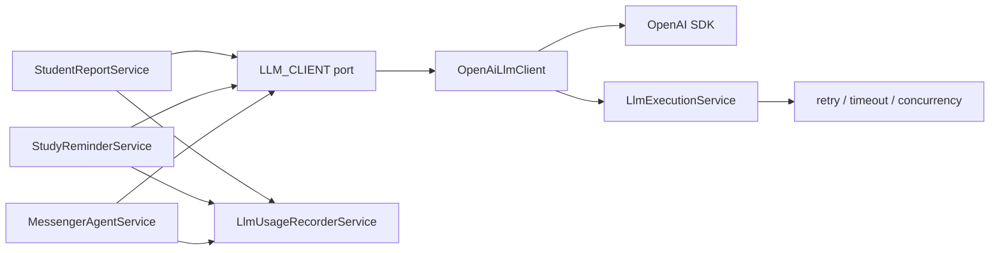

# LLM Provider Abstraction Plan

> **Status:** ✅ Phase 0–6 fully implemented (see PR [#32](https://github.com/lengocanh2005it/messenger-ai-for-student/pull/32)).
> Adapter pattern: `LlmProviderAdapter` interface, OpenAI adapter, OpenAI-compatible adapter, factory. All consumers (messenger-bot, discord-bot) have migrated.

## 1. Document Purpose

This document analyzes the codebase's current hard dependency on the OpenAI SDK and proposes an intermediary interface to enable switching to other LLM providers later with minimal changes.

Primary goals:

- Reduce direct coupling between business services and the OpenAI SDK.
- Preserve current chatbot, study report, and study reminder behavior in the initial phase.
- Separate "model calling" from Messenger, Student Report, and Study Reminder business logic.
- Prepare the path to use OpenAI-compatible endpoints or other providers like Anthropic, Gemini, local LLM, or internal gateways.
- Don't break existing Clean Architecture layers.

## 1b. Locked Design Decisions

These three points have been analyzed and locked — **no need to re-discuss during implementation**:

| # | Issue | Decision |
|---|-------|----------|
| 1 | `LlmFeature` / `LlmUsageFeature` / `LlmExecutionFeature` — 3 types with same values | Consolidate in Phase 1: canonical `LlmFeature` in `llm-execution/domain`, two old types become backward-compat aliases, delete after full migration |
| 2 | `LlmExecutionService.run()` signature | Keep `run<T>(fn, context?)` unchanged — don't modify to avoid changing all callers. Pseudo code in the document has been updated to match |
| 3 | Where `OpenAiLlmClient` reads config from | Inject `LlmExecutionConfigService`, add `getApiKey()` / `getModel()` / `getBaseUrl()` to it — single source of truth, don't inject separate `ConfigService` in adapter |

## 2. Problem Statement

The project currently uses OpenAI at multiple points in application services. This works well for POC, but switching providers later would require changing many places:

- Change SDK initialization.
- Change message format.
- Change tool/function calling format.
- Change response parsing.
- Change token usage tracking.
- Change retry/error detection.
- Change test mocks because tests use OpenAI response shapes.

In short: business logic knows too much about OpenAI.

The biggest problem isn't just `new OpenAI(...)`. The harder part is that services depend on OpenAI's "communication language":

- `chat.completions.create(...)`
- `response_format: { type: 'json_object' }`
- `tools: [{ type: 'function', function: ... }]`
- `choice.message.tool_calls`
- `toolCall.function.arguments`
- `ChatCompletionMessageParam`
- `ChatCompletionToolMessageParam`
- `ChatCompletion`
- `usage.prompt_tokens`, `usage.completion_tokens`, `usage.total_tokens`

If switching to a model that only supports text completion, or a provider with different function calling format, the agent portion would require the most changes.

## 3. Current Coupling in Codebase

### 3.1. Student Report

Main file:

- `src/modules/student-report/application/services/student-report.service.ts`

Current service:

- Directly imports `OpenAI` from the `openai` package.
- Reads `OPENAI_API_KEY`.
- Reads `OPENAI_MODEL`.
- Creates client with `new OpenAI({ apiKey })`.
- Calls `client.chat.completions.create(...)`.
- Uses `response_format: { type: 'json_object' }`.
- Parses `response.choices[0]?.message?.content`.
- Calls `llmUsageRecorder.recordFromCompletion(...)` with raw OpenAI completion.

Coupling level: medium.

Reason: service only needs JSON output. If there were a `generateJson(...)` interface, this part would separate quite easily.

### 3.2. Study Reminder

Main file:

- `src/modules/study-reminder/application/services/study-reminder.service.ts`

Current service is similar to Student Report:

- Directly imports `OpenAI`.
- Reads `OPENAI_API_KEY`, `OPENAI_MODEL`.
- Creates OpenAI client.
- Calls Chat Completions with JSON mode.
- Logs usage from raw completion.
- Falls back to template when API key missing or LLM errors.

Coupling level: medium.

Reason: like Student Report, this is a JSON generation use case, less complex than an agent with tools.

### 3.3. Messenger Agent

Main files:

- `src/modules/messenger/application/agent/messenger-agent.service.ts`
- `src/modules/messenger/application/agent/messenger-agent.tools.ts`

Current agent:

- Directly imports `OpenAI`.
- Imports OpenAI message types:
  - `ChatCompletionMessageParam`
  - `ChatCompletionToolMessageParam`
- Caches `OpenAI` client in service.
- Builds messages in OpenAI role format.
- Calls `client.chat.completions.create(...)`.
- Passes `tools: MESSENGER_AGENT_TOOLS`.
- Uses `tool_choice: 'auto'`.
- Reads `choice.tool_calls`.
- Reads `toolCall.function.name`.
- Reads `toolCall.function.arguments`.
- Pushes assistant message and tool message in OpenAI format.
- Logs usage per tool round using raw OpenAI completion.

Coupling level: high.

Reason: agent doesn't just call LLM once. It has a multi-round tool calling loop, using OpenAI message shapes to maintain conversation state. This is the part requiring the most careful design.

### 3.4. Tool Schema

Main file:

- `src/modules/messenger/application/agent/messenger-agent.tools.ts`

Current tool schema exports typed:

```ts
import type { ChatCompletionTool } from 'openai/resources/chat/completions';

export const MESSENGER_AGENT_TOOLS: ChatCompletionTool[] = [
  {
    type: 'function',
    function: {
      name: 'get_user_profile',
      description: '...',
      parameters: { ... },
    },
  },
];
```

This causes the application layer to be tied to OpenAI types even though tool definitions are fundamentally domain/application concepts.

Coupling level: high but easy to fix via adapter approach.

Solution: define tools in provider-neutral form:

```ts
export interface LlmToolDefinition {
  name: string;
  description: string;
  parameters: Record<string, unknown>;
}
```

OpenAI adapter maps to:

```ts
{
  type: 'function',
  function: {
    name,
    description,
    parameters,
  },
}
```

### 3.5. LLM Usage Tracking

Main file:

- `src/modules/llm-usage/application/services/llm-usage-recorder.service.ts`

Current service imports:

```ts
import type { ChatCompletion } from 'openai/resources/chat/completions';
```

And main method:

```ts
recordFromCompletion(input: {
  response: Pick<ChatCompletion, 'id' | 'usage'>;
})
```

Coupling level: medium.

Issues:

- Usage recorder currently knows raw OpenAI completion.
- DB field is named `openaiResponseId`.
- Cost config has wording "OpenAI invoice".

Phase 1 solution:

- Keep `recordFromCompletion(...)` to avoid large diffs.
- Add new method `recordFromLlmUsage(...)` or use existing `recordUsage(...)`.
- Adapter returns normalized usage.
- New services call `recordUsage(...)` with normalized data.

Later phase solution:

- Rename semantic field in domain to `providerResponseId`.
- Keep old DB column if migration not desired yet, or add separate migration if data normalization needed.

### 3.6. Retry/Error Utils

Main files:

- `src/shared/utils/openai-error.utils.ts`
- `src/modules/llm-execution/application/services/llm-execution.service.ts`

Current `LlmExecutionService` uses:

```ts
isOpenAiRetryableError(error)
```

Coupling level: medium.

If using OpenAI-compatible provider, this may still work short-term since HTTP errors are usually similar. But if switching to a different provider, retry logic should be based on normalized errors:

- rate limit
- timeout
- server error
- network error
- provider overloaded

Later phase solution:

- Rename `openai-error.utils.ts` to `llm-error.utils.ts`.
- Adapter can expose `normalizeError(error): LlmProviderError`.
- `LlmExecutionService` retries based on `LlmProviderError.retryable`.

### 3.7. Metrics Wording

Main file:

- `src/modules/metrics/metrics.service.ts`

Current comments/help text uses OpenAI wording:

- `Raw OpenAI API call duration`
- `OpenAI API call duration per feature, model, and tool round`

Coupling level: low.

This is mainly naming/observability. Can change to "LLM provider API call duration" in cleanup phase.

### 3.8. Env Config

Main files:

- `.env.example`
- `AGENTS.md`
- `docs/project-overview.md`

Current env:

- `OPENAI_API_KEY`
- `OPENAI_MODEL`
- `OPENAI_MAX_TOOL_ROUNDS`
- `OPENAI_MAX_CONTEXT_CHARS`
- `LLM_OPENAI_RETRY_MAX_ATTEMPTS`
- `LLM_OPENAI_RETRY_BACKOFF_MS`

Coupling level: medium.

Solution should be incremental:

- Phase 1 doesn't change env to avoid breaking deploy.
- Later phases add generic env:
  - `LLM_PROVIDER=openai`
  - `LLM_API_KEY=...`
  - `LLM_MODEL=...`
  - `LLM_BASE_URL=...`
  - `LLM_MAX_TOOL_ROUNDS=...`
  - `LLM_MAX_CONTEXT_CHARS=...`
  - `LLM_RETRY_MAX_ATTEMPTS=...`
  - `LLM_RETRY_BACKOFF_MS=...`
- Keep `OPENAI_*` aliases for a while.
- Proposed precedence: `LLM_*` takes priority over `OPENAI_*`, but if `LLM_*` is missing, fall back to `OPENAI_*`.

## 4. Design Goals

### 4.1. Separate Application from Provider SDK

After completing the main phases, business services should not import the `openai` package.

Goals:

- `StudentReportService` only calls `LlmClientPort.generateJson(...)`.
- `StudyReminderService` only calls `LlmClientPort.generateJson(...)`.
- `MessengerAgentService` only calls `LlmClientPort.chatWithTools(...)`.
- `messenger-agent.tools.ts` doesn't import OpenAI types.

### 4.2. Preserve Current Behavior

Phase 1 should preserve:

- Current prompts.
- Current JSON parsing and validation.
- Current template fallback.
- Current tool execution flow.
- Current safety checks.
- Current rate limit/quota flow.
- Current LLM usage tracking or equivalent.

Don't change prompt content or model behavior while doing abstraction. That would make debugging harder if output changes.

### 4.3. Small Interface, Right Use Cases

Don't design an overly broad "support everything" interface. The codebase has 2 use case groups:

1. Generate JSON for proactive content:
   - Student Report
   - Study Reminder

2. Chat agent with tool calling:
   - Free-form Messenger chat

So the initial interface only needs to cover 2 operations:

- `generateJson(request)`
- `chatWithTools(request)`

If embeddings, images, streaming, reranking, or speech are needed later, add separate interfaces.

### 4.4. Adapter Handles Provider-Specific Mapping

OpenAI adapter should be the only place that knows:

- OpenAI SDK object.
- OpenAI Chat Completion request shape.
- OpenAI tool schema shape.
- OpenAI response shape.
- OpenAI token usage shape.
- OpenAI retryable error shape if needed.

Application services only see normalized types.

### 4.5. Don't Lose Safety Boundaries

Current code has important safety boundaries:

- `sanitizeUntrustedTextForLlm`
- `sanitizeToolResultContent`
- JSON output validation
- template fallback
- grounding check for free-form chat
- prompt injection detection before calling model

New interface must not bypass these steps.

Principles:

- Input sanitization stays in application service or existing helpers.
- Adapter doesn't sanitize business data itself.
- Adapter only maps request to provider.
- Business JSON parse/validate stays in service or existing parser helpers.

## 5. Non-Goals

Things not to do in the initial abstraction phase:

- Don't change provider immediately.
- Don't change default model.
- Don't change prompts.
- Don't change Messenger reply format.
- Don't change rate limit flow.
- Don't add new queues.
- Don't refactor entire LLM usage schema immediately.
- Don't change DB migration unless needed.
- Don't delete `OPENAI_*` env immediately.
- Don't build complex multi-provider routing from the start.

## 6. Proposed Architecture

### 6.1. Overview

Proposal adds a provider port in the existing LLM module, preferring to extend `LlmExecutionModule` since it already handles concurrency, timeout, retry for LLM calls.

Diagram:



Two design options:

### 6.2. Option A: Adapter Only Calls Provider, Service Wraps Execution/Usage

Flow:

- Service builds request.
- Service calls `llmExecution.run(...)`.
- In callback, service calls `llmClient.generateJson(...)` or `llmClient.chatWithTools(...)`.
- Service logs usage from normalized response.

Pros:

- Small diff.
- Keeps current control in service.
- Easy to migrate service by service.
- Less risk of module circular dependencies.

Cons:

- Each service still duplicates some execution/usage code.
- Adapter isn't fully a gateway.

Suitable for phase 1.

### 6.3. Option B: Create Full LlmGatewayService Orchestration

Flow:

- Service calls `llmGateway.generateJson(...)`.
- Gateway handles execution, retry, metrics, usage.
- Adapter only maps provider.

Pros:

- Cleaner business services.
- Centralized metrics/usage/error handling.
- Easy to add provider routing later.

Cons:

- Larger diff.
- Easy to create circular dependency with `LlmUsageModule`, `MetricsModule`.
- Requires more careful module boundary design.

Suitable for later phases after adapter is successfully separated.

### 6.4. Recommendation

Start with Option A, then gradually upgrade to Option B if logic duplication is found.

Reasons:

- Codebase already has working `LlmExecutionService`.
- `LlmUsageRecorderService` exists and is already injected into each service.
- Phase 1 needs to reduce lock-in, not rewrite orchestration.
- Less regression risk.

## 7. Proposed Interfaces

### 7.1. Provider Token

Proposed file:

- `src/modules/llm-execution/application/ports/llm-client.port.ts`

```ts
export const LLM_CLIENT = Symbol('LLM_CLIENT');

export interface LlmClientPort {
  isConfigured(): boolean;
  getDefaultModel(): string;
  generateJson(request: LlmJsonRequest): Promise<LlmJsonResponse>;
  chatWithTools(request: LlmToolChatRequest): Promise<LlmToolChatResponse>;
}
```

### 7.2. Common Types

Proposed file:

- `src/modules/llm-execution/domain/entities/llm.types.ts`

```ts
export type LlmProvider = 'openai' | 'openai-compatible' | 'anthropic' | 'gemini' | 'local';

export type LlmFeature =
  | 'FREE_FORM_CHAT'
  | 'STUDENT_REPORT'
  | 'STUDY_REMINDER';

export interface LlmUsage {
  promptTokens: number;
  completionTokens: number;
  totalTokens: number;
}

export interface LlmProviderMetadata {
  provider: LlmProvider | string;
  model: string;
  responseId?: string;
  usage?: LlmUsage;
}
```

**Decision on `LlmFeature` / `LlmUsageFeature` / `LlmExecutionFeature` — consolidate in Phase 1:**

Codebase currently has **3 types with same values**:

| Type | Current File |
|------|-------------|
| `LlmExecutionFeature` | `llm-execution/application/services/llm-execution.service.ts` |
| `LlmUsageFeature` | `llm-usage/domain/entities/llm-usage.types.ts` |
| `LlmFeature` (new) | `llm-execution/domain/entities/llm.types.ts` |

To avoid having 3 types coexist, **Phase 1 consolidates immediately**:

1. Define canonical at `src/modules/llm-execution/domain/entities/llm.types.ts`:

```ts
export type LlmFeature =
  | 'FREE_FORM_CHAT'
  | 'STUDENT_REPORT'
  | 'STUDY_REMINDER';
```

2. `llm-execution.service.ts` — delete `LlmExecutionFeature`, alias:

```ts
import type { LlmFeature } from '../../domain/entities/llm.types';
export type LlmExecutionFeature = LlmFeature; // backward compat alias, delete later
```

3. `llm-usage/domain/entities/llm-usage.types.ts` — delete `LlmUsageFeature`, alias:

```ts
import type { LlmFeature } from '../../../llm-execution/domain/entities/llm.types';
export type LlmUsageFeature = LlmFeature; // backward compat alias, delete later
```

4. Current callers (`llm-usage-recorder.service.ts`, `student-report.service.ts`, etc.) don't need immediate changes because aliases maintain type compatibility. Clean up alias names after full migration.

Acceptable dependency direction: `llm-usage/domain` → `llm-execution/domain` (type-only import, no NestJS DI pull). If these two modules need separate deployment later, extract to `src/shared/llm/`.

### 7.3. JSON Generation Request/Response

```ts
export interface LlmJsonRequest {
  feature: LlmFeature;
  model?: string;
  correlationId?: string;
  systemPrompt: string;
  userContent: string;
  temperature?: number;
  maxOutputTokens?: number;
}

export interface LlmJsonResponse {
  content: string;
  metadata: LlmProviderMetadata;
}
```

OpenAI mapping:

```ts
client.chat.completions.create({
  model,
  response_format: { type: 'json_object' },
  messages: [
    { role: 'system', content: request.systemPrompt },
    { role: 'user', content: request.userContent },
  ],
});
```

Other providers may map differently:

- Anthropic: separate system, separate messages, JSON instruction in prompt or tool schema.
- Gemini: JSON response mime type if supported.
- Local LLM: prompt instruction + parser fallback.

### 7.4. Tool Chat Types

```ts
export type LlmMessageRole = 'system' | 'user' | 'assistant' | 'tool';

export interface LlmToolDefinition {
  name: string;
  description: string;
  parameters: Record<string, unknown>;
}

export interface LlmToolCall {
  id: string;
  name: string;
  argumentsJson: string;
}

export interface LlmMessage {
  role: LlmMessageRole;
  content?: string;
  toolCalls?: LlmToolCall[];
  toolCallId?: string;
}

export interface LlmToolChatRequest {
  feature: LlmFeature;
  model?: string;
  correlationId?: string;
  messages: LlmMessage[];
  tools: LlmToolDefinition[];
  toolChoice?: 'auto' | 'none';
  temperature?: number;
  maxOutputTokens?: number;
}

export interface LlmToolChatResponse {
  /**
   * Full assistant message for caller to push into history for next round.
   * message.toolCalls contains the tool call list if present.
   * Caller should not read tool calls from two places — only use message.toolCalls.
   */
  message: LlmMessage;
  /** Final text reply from model if no tool call. */
  content?: string;
  metadata: LlmProviderMetadata;
}
```

**Why top-level `toolCalls` was removed:**

Previous response had two redundant fields: `message.toolCalls` and `toolCalls` at top level. Callers didn't know which to read — especially error-prone in multi-round loops. This design locks: tool calls only read from `response.message.toolCalls`. The `message` field is also what callers push into `messages[]` for the next round, so no need for separation.

Usage pattern in agent loop:

```ts
// round ends with tool call
if (response.message.toolCalls?.length) {
  messages.push(response.message);
  for (const tc of response.message.toolCalls) { ... }
}

// round ends with text
if (!response.message.toolCalls?.length) {
  return this.finalizeAssistantContent(response.content);
}
```

OpenAI mapping:

- `LlmMessage.role = 'tool'` maps to OpenAI tool message.
- `LlmToolDefinition` maps to `ChatCompletionTool`.
- `LlmToolCall.argumentsJson` maps from `toolCall.function.arguments`.
- `LlmToolCall.name` maps from `toolCall.function.name`.
- `LlmToolCall.id` maps from `toolCall.id`.

### 7.5. Error Model

Phase 1 can keep `isOpenAiRetryableError`.

Later phase should have:

```ts
export interface LlmProviderError {
  provider: string;
  status?: number;
  code?: string;
  retryable: boolean;
  reason:
    | 'rate_limit'
    | 'timeout'
    | 'server_error'
    | 'network'
    | 'auth'
    | 'bad_request'
    | 'unknown';
}
```

Adapter can have helper:

```ts
normalizeLlmError(error: unknown): LlmProviderError;
```

Then `LlmExecutionService` retries based on `retryable`.

## 8. Detailed File Plan

### 8.1. Add Neutral LLM Types

New file:

- `src/modules/llm-execution/domain/entities/llm.types.ts`

Contents:

- `LlmProvider`
- `LlmFeature` or reuse `LlmUsageFeature`
- `LlmUsage`
- `LlmProviderMetadata`
- `LlmJsonRequest`
- `LlmJsonResponse`
- `LlmMessage`
- `LlmToolDefinition`
- `LlmToolCall`
- `LlmToolChatRequest`
- `LlmToolChatResponse`

Implementation notes:

- Types don't import OpenAI.
- Types don't import NestJS.
- Types don't contain mandatory provider-specific fields.
- For raw debugging, optional `raw?: unknown` can be used, but limit exposure to application.

### 8.2. Add LLM Client Port

New file:

- `src/modules/llm-execution/application/ports/llm-client.port.ts`

Contents:

- `LLM_CLIENT` token.
- `LlmClientPort` interface.

Reason for placing in `application/ports`:

- Business services inject port.
- Concrete implementation lives in infrastructure.
- Correct Clean Architecture: application depends on abstraction, infrastructure implements.

### 8.3. Add OpenAI Adapter

New file:

- `src/modules/llm-execution/infrastructure/openai/openai-llm-client.service.ts`

Responsibilities:

- Read config from `LlmExecutionConfigService` — **don't inject `ConfigService` directly**.
- Create and cache OpenAI client.
- Implement `isConfigured()`, `getDefaultModel()`, `generateJson(...)`, `chatWithTools(...)`.
- Map neutral tools/messages to OpenAI request via mapper.
- Map OpenAI response to neutral response.
- No business prompts, no self-sanitization, no self-validation of JSON output.

**Why use `LlmExecutionConfigService` instead of `ConfigService`:**

`LlmExecutionConfigService` is the single source of truth for LLM config in this module (retry, timeout, concurrency). If `OpenAiLlmClient` injects its own `ConfigService`, there would be 2 places reading the same env, prone to drift when new env is added. Adding `getApiKey()` and `getModel()` to `LlmExecutionConfigService` centralizes this.

**Add to `LlmExecutionConfigService`:**

```ts
getApiKey(): string | undefined {
  return (
    this.configService.get<string>('LLM_API_KEY')?.trim() ||
    this.configService.get<string>('OPENAI_API_KEY')?.trim() ||
    undefined
  );
}

getModel(): string {
  return (
    this.configService.get<string>('LLM_MODEL')?.trim() ||
    this.configService.get<string>('OPENAI_MODEL')?.trim() ||
    'gpt-4o'
  );
}

getBaseUrl(): string | undefined {
  return this.configService.get<string>('LLM_BASE_URL')?.trim() || undefined;
}
```

Precedence: `LLM_*` takes priority over `OPENAI_*`, defaults if both missing.

**Adapter pseudo code:**

```ts
@Injectable()
export class OpenAiLlmClient implements LlmClientPort {
  private client: OpenAI | null = null;

  constructor(private readonly config: LlmExecutionConfigService) {}

  isConfigured(): boolean {
    return Boolean(this.config.getApiKey());
  }

  getDefaultModel(): string {
    return this.config.getModel();
  }

  private getClientOrThrow(): OpenAI {
    if (!this.client) {
      const apiKey = this.config.getApiKey();
      if (!apiKey) throw new Error('LLM provider not configured: missing API key');
      this.client = new OpenAI({
        apiKey,
        baseURL: this.config.getBaseUrl(),
      });
    }
    return this.client;
  }

  async generateJson(request: LlmJsonRequest): Promise<LlmJsonResponse> {
    const client = this.getClientOrThrow();
    const model = request.model ?? this.getDefaultModel();

    const response = await client.chat.completions.create({
      model,
      response_format: { type: 'json_object' },
      messages: [
        { role: 'system', content: request.systemPrompt },
        { role: 'user', content: request.userContent },
      ],
    });

    const content = response.choices[0]?.message?.content;
    if (!content) {
      throw new Error('LLM returned empty content');
    }

    return {
      content,
      metadata: {
        provider: 'openai',
        model,
        responseId: response.id,
        usage: fromOpenAiUsage(response.usage),
      },
    };
  }
}
```

### 8.4. Add Mapper for OpenAI Messages/Tools

New file, optional but recommended for isolated testing:

- `src/modules/llm-execution/infrastructure/openai/openai-llm.mapper.ts`

Contents:

- `toOpenAiMessages(messages: LlmMessage[])`
- `toOpenAiTools(tools: LlmToolDefinition[])`
- `fromOpenAiMessage(message)`
- `fromOpenAiUsage(usage)`

Reason for separating mapper:

- Tool calling mapping is error-prone.
- Can unit test without mocking OpenAI SDK.
- Clear pattern when adding other providers.

### 8.5. Update LlmExecutionModule Provider Binding

Modified file:

- `src/modules/llm-execution/llm-execution.module.ts`

Add provider and export:

```ts
import { OpenAiLlmClient } from './infrastructure/openai/openai-llm-client.service';
import { LLM_CLIENT } from './application/ports/llm-client.port';

@Module({
  providers: [
    LlmExecutionConfigService,
    LlmExecutionService,
    OpenAiLlmClient,
    {
      provide: LLM_CLIENT,
      useClass: OpenAiLlmClient,
    },
  ],
  exports: [LlmExecutionService, LlmExecutionConfigService, LLM_CLIENT],
})
export class LlmExecutionModule {}
```

`OpenAiLlmClient` is declared in `providers` so NestJS DI injects `LlmExecutionConfigService` into it — no manual instance creation in factory.

Later phases for multi-provider via config:

```ts
{
  provide: LLM_CLIENT,
  useFactory: (config: LlmExecutionConfigService, openai: OpenAiLlmClient) => {
    const provider = config.getProvider(); // 'openai' | 'openai-compatible'
    return openai; // currently only one adapter
  },
  inject: [LlmExecutionConfigService, OpenAiLlmClient],
}
```

Factory injects NestJS-resolved instances — preserves DI chain. When `AnthropicLlmClient` is added, inject into factory without changing business code.

### 8.6. Update StudentReportService

Modified file:

- `src/modules/student-report/application/services/student-report.service.ts`

Changes:

- Remove `OpenAI` import.
- Inject `@Inject(LLM_CLIENT) private readonly llmClient: LlmClientPort`.
- Check `this.llmClient.isConfigured()` instead of reading `OPENAI_API_KEY` directly.
- Get model from `this.llmClient.getDefaultModel()` or let adapter default.
- Call `this.llmExecution.run(...)` as before.
- In callback call `this.llmClient.generateJson(...)`.
- Log usage with `recordUsage(...)` from normalized response.

Pseudo code — keep current `run<T>(fn, context?)` signature unchanged:

```ts
if (!this.llmClient.isConfigured()) {
  this.logger.warn('LLM provider missing, using fallback report content');
  return this.buildFallbackReport(...);
}

const response = await this.llmExecution.run(
  () =>
    this.llmClient.generateJson({
      feature: 'STUDENT_REPORT',
      systemPrompt,
      userContent,
      correlationId,
    }),
  { feature: 'STUDENT_REPORT', correlationId },
);

this.recordLlmUsage({
  feature: 'STUDENT_REPORT',
  userId,
  psid,
  response,
});
```

Tests to change:

- Don't mock OpenAI SDK directly.
- Mock `LlmClientPort`.
- Assert service calls `generateJson(...)`.
- Assert fallback when `isConfigured()` is false.
- Assert usage recorder receives normalized usage.

### 8.7. Update StudyReminderService

Modified file:

- `src/modules/study-reminder/application/services/study-reminder.service.ts`

Changes similar to Student Report.

Tests to change:

- Mock `LlmClientPort`.
- Keep fallback test.
- Keep output parse/validate test.
- Keep usage test.

### 8.8. Update Messenger Agent Tools

Modified file:

- `src/modules/messenger/application/agent/messenger-agent.tools.ts`

Changes:

- Remove `ChatCompletionTool` import.
- Export `LlmToolDefinition[]`.

Before:

```ts
export const MESSENGER_AGENT_TOOLS: ChatCompletionTool[] = [...]
```

After:

```ts
export const MESSENGER_AGENT_TOOLS: LlmToolDefinition[] = [
  {
    name: 'get_user_profile',
    description: '...',
    parameters: { ... },
  },
];
```

OpenAI adapter responsible for wrapping as:

```ts
{
  type: 'function',
  function: tool,
}
```

### 8.9. Update MessengerAgentService

Modified file:

- `src/modules/messenger/application/agent/messenger-agent.service.ts`

This is the highest-risk phase.

Changes:

- Remove `OpenAI` import.
- Remove OpenAI-specific message types.
- Inject `LLM_CLIENT`.
- Build messages as `LlmMessage[]`.
- Call `llmClient.chatWithTools(...)`.
- Read `response.toolCalls`.
- When tool call completes, push:
  - assistant message from `response.message`
  - tool message `{ role: 'tool', toolCallId, content }`
- Log usage from `response.metadata.usage`.

Pseudo flow:

```ts
const messages: LlmMessage[] = [
  { role: 'system', content: systemPrompt },
  ...historyMessages,
  { role: 'user', content: sanitizedUserText },
];

for (let round = 1; round <= maxToolRounds; round += 1) {
  const response = await this.llmExecution.run(
    () =>
      this.llmClient.chatWithTools({
        feature: 'FREE_FORM_CHAT',
        messages,
        tools: MESSENGER_AGENT_TOOLS,
        toolChoice: 'auto',
      }),
    { feature: 'FREE_FORM_CHAT', correlationId },
  );

  this.recordLlmUsage(response, round);

  // Tool calls only read from response.message.toolCalls — no top-level toolCalls.
  const toolCalls = response.message.toolCalls ?? [];

  if (toolCalls.length === 0) {
    return this.finalizeAssistantContent(response.content);
  }

  messages.push(response.message);

  for (const toolCall of toolCalls) {
    const toolResult = await this.executeToolCall(toolCall);
    messages.push({
      role: 'tool',
      toolCallId: toolCall.id,
      content: sanitizeToolResultContent(toolResult),
    });
  }
}
```

Points to be careful about:

- OpenAI requires assistant message containing `tool_calls` to appear before corresponding tool messages. Neutral messages should also maintain this invariant.
- `toolCall.id` must be preserved exactly.
- `argumentsJson` stays as string to preserve current parsing logic.
- If other provider returns arguments as object, adapter stringifies to JSON string.
- If provider doesn't support native tool calling, needs separate phase to emulate tool calling via JSON protocol. Don't do in this phase.

### 8.10. Update LlmUsageRecorderService

Modified file:

- `src/modules/llm-usage/application/services/llm-usage-recorder.service.ts`

Phase 1 adds new method:

```ts
recordFromLlmResponse(input: {
  feature: LlmFeature;
  psid?: string;
  userId?: number;
  model: string;
  responseId?: string;
  usage?: LlmUsage;
  correlationId?: string;
  toolRound?: number;
}): void
```

This method calls `recordUsage(...)` internally.

Keep `recordFromCompletion(...)` temporarily so unmigrated parts still pass.

**Cleanup deadline:** `recordFromCompletion(...)` must be deleted **before Phase 3 ends**. If two usage-logging paths run in parallel indefinitely, debugging usage discrepancies between migrated and unmigrated services becomes difficult. Add `@deprecated` JSDoc to the method immediately when adding the new method so IDEs warn.

After full migration:

- Remove OpenAI import from usage recorder.
- Delete `recordFromCompletion(...)`.

### 8.11. Update Tests

Tests currently importing OpenAI types need changes:

- `src/modules/student-report/application/services/student-report.service.spec.ts`
- `src/modules/study-reminder/application/services/study-reminder.service.spec.ts`
- `src/modules/messenger/application/agent/messenger-agent.service.spec.ts`
- `src/modules/llm-usage/application/services/llm-usage-recorder.service.spec.ts`

New tests to add:

- `src/modules/llm-execution/infrastructure/openai/openai-llm.mapper.spec.ts`
- `src/modules/llm-execution/infrastructure/openai/openai-llm-client.service.spec.ts`

**Why `OpenAiLlmClient` needs isolated tests:**

Service tests (student-report, study-reminder, messenger-agent) mock `LlmClientPort` — they don't test the adapter. If `OpenAiLlmClient.chatWithTools(...)` is missing `type: 'function'` wrapper in tool schema, or maps message order incorrectly, service tests still pass because they're mocking the port. Bugs only appear at runtime. Need adapter-level tests to catch early.

**Test split:**

`openai-llm.mapper.spec.ts` — tests pure mapping functions, no SDK mocking:

- `toOpenAiMessages(...)` preserves correct role/content/toolCallId
- `toOpenAiTools(...)` wraps correctly as `{ type: 'function', function: tool }`
- `fromOpenAiMessage(...)` maps correctly to `LlmMessage`
- `fromOpenAiUsage(...)` maps correctly when usage is `null` or `undefined`
- Tool call id preserved exactly through round trip

`openai-llm-client.service.spec.ts` — mocks OpenAI SDK client (doesn't mock `LlmClientPort`):

```ts
const mockCreate = jest.fn();
jest.mock('openai', () => ({
  default: jest.fn().mockImplementation(() => ({
    chat: { completions: { create: mockCreate } },
  })),
}));
```

Test cases to cover:

- `isConfigured()` returns false when API key missing
- `generateJson(...)` returns `LlmJsonResponse` with complete metadata
- `generateJson(...)` throws when content is empty
- `chatWithTools(...)` with tool call response → `message.toolCalls` has all `id/name/argumentsJson` fields
- `chatWithTools(...)` with text response → `message.toolCalls` is `undefined` or empty array
- Fallback model when `LLM_MODEL` and `OPENAI_MODEL` not set
- `fromOpenAiUsage` doesn't crash when SDK returns `usage: null`

Prioritize mapper tests first since they don't need SDK mocking. Add client spec tests after mapper is stable.

### 8.12. Update Docs/Env

When code actually changes env or behavior, update:

- `.env.example`
- `AGENTS.md`
- `docs/project-overview.md`
- Possibly `docs/llm-usage-tracking-plan.md` if usage field/provider semantics change.

For phases that only add interface and still use `OPENAI_*`, no need to change `.env.example` yet.

## 9. Proposed Implementation Phases

> **Status:** All Phase 0–6 implemented. Code in `packages/llm-agent/src/provider/`.

### Phase 0: Design Document ✅ DONE

Goal:

- Document current coupling state.
- Lock interface direction.
- Lock implementation phases.

Deliverable:

- `docs/llm-provider-abstraction-plan.md`

Risk:

- No runtime risk since no code changed.

### Phase 1: Separate JSON Generation for Student Report and Study Reminder ✅ DONE

Goal:

- Create `LlmClientPort`.
- Create `OpenAiLlmClient`.
- Support `generateJson(...)`.
- Migrate `StudentReportService`.
- Migrate `StudyReminderService`.

Files:

- Add `src/modules/llm-execution/domain/entities/llm.types.ts`
- Add `src/modules/llm-execution/application/ports/llm-client.port.ts`
- Add `src/modules/llm-execution/infrastructure/openai/openai-llm-client.service.ts`
- Modify `src/modules/llm-execution/llm-execution.module.ts`
- Modify `src/modules/student-report/application/services/student-report.service.ts`
- Modify `src/modules/study-reminder/application/services/study-reminder.service.ts`
- Modify corresponding specs.

Acceptance criteria:

- `student-report.service.ts` doesn't import `OpenAI`.
- `study-reminder.service.ts` doesn't import `OpenAI`.
- Fallback behavior unchanged.
- JSON validation unchanged.
- Usage tracking still logs tokens.
- Tests pass.

Risks:

- Usage tracking may lose response id if mapping is incomplete.
- Old test error messages may need wording update from "OpenAI" to "LLM provider".
- Some tests mocking OpenAI SDK need rewriting.

Estimate:

- Small to medium.
- Should do first because less risky than agent.

### Phase 2: Separate Tool Schema and Messenger Agent ✅ DONE

Goal:

- Convert `MESSENGER_AGENT_TOOLS` to provider-neutral `LlmToolDefinition[]`.
- Implement `chatWithTools(...)` in OpenAI adapter.
- Migrate `MessengerAgentService` to neutral `LlmMessage[]`.
- No more OpenAI types in Messenger agent application code.

Files:

- Modify `src/modules/messenger/application/agent/messenger-agent.tools.ts`
- Modify `src/modules/messenger/application/agent/messenger-agent.service.ts`
- Add or extend OpenAI mapper.
- Modify `messenger-agent.service.spec.ts`.

Acceptance criteria:

- `messenger-agent.service.ts` doesn't import `OpenAI`.
- `messenger-agent.tools.ts` doesn't import `ChatCompletionTool`.
- Multi-round tool calling tests still pass.
- Grounding warning logic still works.
- Tool result sanitization still works.
- Context truncation still works.
- Usage tracking still logs per tool round.

Risks:

- Wrong assistant/tool message order.
- Lost `tool_call_id`.
- Arguments parsed differently due to incorrect adapter stringification.
- Different provider response empty handling wording.
- Many existing agent tests, rewrite needs care.

Estimate:

- Medium to large.
- Should do after Phase 1 to reduce blast radius.

### Phase 3: Normalize Usage, Retry, Metrics Wording ✅ DONE

Goal:

- Remove OpenAI type from `LlmUsageRecorderService`.
- Change retry utility from OpenAI-specific to LLM provider generic.
- Change metrics help/comment to provider-neutral.
- Maintain compatibility with current DB.

Files:

- Modify `src/modules/llm-usage/application/services/llm-usage-recorder.service.ts`
- Modify `src/shared/utils/openai-error.utils.ts` or add `llm-error.utils.ts`
- Modify `src/modules/llm-execution/application/services/llm-execution.service.ts`
- Modify `src/modules/metrics/metrics.service.ts`
- Modify corresponding specs.

Acceptance criteria:

- No more OpenAI imports in `llm-usage` application service.
- Retry still covers 429 and 5xx.
- Metrics name can stay to avoid breaking dashboards, but help text is more generic.
- Existing tests pass.

Risks:

- Dashboard/alert if metric name changes. Recommend not changing metric name in this phase, only description/comment.
- DB column `openaiResponseId` still uses old naming. Renaming needs separate migration, not urgent.

### Phase 4: Add OpenAI-Compatible Provider Config ✅ DONE

Goal:

- Allow using providers with OpenAI-compatible API via config.
- No business code changes.

Proposed env:

```env
LLM_PROVIDER=openai
LLM_API_KEY=...
LLM_MODEL=gpt-5.4
LLM_BASE_URL=
```

OpenAI-compatible:

```env
LLM_PROVIDER=openai-compatible
LLM_API_KEY=...
LLM_MODEL=...
LLM_BASE_URL=https://...
```

Compatibility:

- If `LLM_API_KEY` missing, falls back to `OPENAI_API_KEY`.
- If `LLM_MODEL` missing, falls back to `OPENAI_MODEL`.
- If `LLM_PROVIDER` missing, defaults to `openai`.

Acceptance criteria:

- Current OpenAI still works without changing env.
- OpenAI-compatible endpoint can work when `LLM_BASE_URL` is set.
- Docs clearly document env precedence.

Risks:

- Some OpenAI-compatible providers don't support tool calling correctly.
- Some providers don't support JSON mode.
- Usage tokens may be missing or have different fields.

Suggestions:

- Adapter should degrade gracefully:
  - If provider doesn't return usage, log warning and log 0 tokens or skip usage per current policy.
  - If JSON mode unsupported, can configure `LLM_JSON_MODE=prompt` in later phase.

### Phase 5: Add Non-OpenAI-Compatible Providers (Future)

Goal:

- Add real adapter for different provider.
- No business service changes.

Examples:

- `AnthropicLlmClient`
- `GeminiLlmClient`
- `LocalHttpLlmClient`

Issues to resolve:

- Message mapping.
- System prompt mapping.
- Tool calling mapping.
- JSON output mode.
- Usage mapping.
- Retry/error mapping.

Acceptance criteria:

- Provider selected via `LLM_PROVIDER`.
- Business services unchanged.
- Adapter tests cover mapping.
- Manual smoke test with separate env.

Risks:

- Native tool calling differs per provider.
- Local model may not comply with JSON/tool protocol.
- Token usage/cost estimates not comparable.
- Different model behavior may affect Vietnamese quality.

Suggestions:

- Providers without native tool support should be a separate phase.
- May need `ToolCallingStrategy`:
  - `native`
  - `json-protocol`
  - `disabled`

## 10. Important Implementation Details

### 10.1. Don't Let Raw Provider Types Leak into Application

Desired rule after migration:

```bash
rg "from 'openai'|from \"openai\"|openai/resources" src/modules/*/application src/modules/*/domain
```

Desired result:

- No OpenAI imports in application/domain, unless file is in adapter infrastructure.

Adapter infrastructure allowed:

```bash
src/modules/llm-execution/infrastructure/openai/**
```

### 10.2. Preserve Correlation ID

Current LLM calls use correlation for log/debug usage.

New interface should pass:

```ts
correlationId?: string;
```

Adapter doesn't need to send correlation to provider, but response metadata/logging should keep correlation at caller.

### 10.3. Preserve Model in Usage

Usage cost currently estimated by model.

Normalized response must have:

```ts
metadata.model
```

Service shouldn't guess model after calling, because adapter may choose fallback model or provider may rewrite model name.

### 10.4. Preserve Response ID

OpenAI has `response.id`. Other providers may have different id or none.

Normalized metadata:

```ts
responseId?: string;
```

Phase 1 usage recorder can map to `openaiResponseId` DB field temporarily.

DB field name doesn't need immediate change since DB renaming is a separate scope.

### 10.5. JSON Mode Not Universal

OpenAI supports:

```ts
response_format: { type: 'json_object' }
```

Other providers may:

- Have their own JSON mode.
- Have schema mode.
- Have no JSON mode.

Therefore interface should say "generateJson" at contract level, not "response_format".

Adapter responsible for using provider's best approach.

If provider doesn't guarantee JSON, adapter still returns text, and current service parses/validates and falls back if invalid.

**Markdown fence contract:**

Adapter does **not** strip markdown fences (` ```json ... ``` `) from output before returning. Reason: current parser helpers in application services already handle fences, and stripping at adapter creates hidden transformations hard to debug. Service knows expected format, so service handles it.

If a specific adapter needs to pre-process output (e.g. provider always returns fence even when JSON mode used), handle in that adapter and document clearly in adapter class.

### 10.6. Tool Calling Not Universal

OpenAI tool calling has shape:

```ts
tool_calls: [
  {
    id,
    type: 'function',
    function: {
      name,
      arguments,
    },
  },
]
```

Other providers may use:

- `tool_use`
- `functionCall`
- JSON block
- Plain text protocol

Neutral `LlmToolCall` should keep minimum fields:

```ts
id: string;
name: string;
argumentsJson: string;
```

If provider has no id, adapter generates fallback id by position in current response: `tool_call_${index}` with `index` counting from 0 in the `tool_calls` array of **that response**, not a global counter. Global counter causes id mismatch if request is retried because adapter continues counting while agent loop has reset messages to prior state.

```ts
// Correct — index in current response
const toolCalls = rawToolCalls.map((tc, index) => ({
  id: tc.id ?? `tool_call_${index}`,
  ...
}));
```

Caller ensures tool result message uses correct id from returned response, doesn't regenerate.

### 10.7. Fallback Behavior

Current fallback when API key missing:

- Student Report: fallback report content.
- Study Reminder: fallback reminder.
- Messenger Agent: fallback chat reply.

After abstraction, wording should change from:

- `OPENAI_API_KEY missing`

To:

- `LLM provider missing`

But need to consider tests asserting message. For small diff, can keep old message in Phase 1 then clean up later.

### 10.8. Config Precedence

When adding generic env, proposed:

1. `LLM_*`
2. `OPENAI_*`
3. code defaults

Example:

```ts
const model =
  config.get<string>('LLM_MODEL')?.trim()
  || config.get<string>('OPENAI_MODEL')?.trim()
  || 'gpt-5.4';
```

Reasons:

- Don't break current deploy.
- Allow gradual migration.
- When changing provider, no need to change service.

### 10.9. Module Dependency

Current services already use:

- `LlmExecutionModule`
- `LlmUsageModule`
- `MetricsModule`

Should avoid `LlmExecutionModule` importing `LlmUsageModule` in phase 1, as it easily creates circular dependency.

Therefore Phase 1 should let services call usage recorder directly as before.

If `LlmGatewayService` is created later, need module design:

```text
LlmGatewayModule
  imports:
    LlmExecutionModule
    LlmUsageModule
    MetricsModule
  exports:
    LlmGatewayService
```

Business modules import `LlmGatewayModule` instead of importing multiple individual services.

### 10.10. Test Strategy

Tests should shift from "mock OpenAI completion" to "mock LlmClientPort response".

JSON response example:

```ts
const llmJsonResponse = {
  content: '{"message":"..."}',
  metadata: {
    provider: 'openai',
    model: 'gpt-5.4',
    responseId: 'chatcmpl_test',
    usage: {
      promptTokens: 10,
      completionTokens: 5,
      totalTokens: 15,
    },
  },
};
```

Tool response test (tool calls only in `message.toolCalls`, no top-level `toolCalls`):

```ts
const toolResponse: LlmToolChatResponse = {
  message: {
    role: 'assistant',
    toolCalls: [
      {
        id: 'call_1',
        name: 'get_user_profile',
        argumentsJson: '{"userId":123}',
      },
    ],
  },
  content: undefined,
  metadata: {
    provider: 'openai',
    model: 'gpt-5.4',
    responseId: 'chatcmpl_test',
    usage: {
      promptTokens: 20,
      completionTokens: 8,
      totalTokens: 28,
    },
  },
};
```

Mapper tests should assert:

- Neutral tool maps correctly to OpenAI tool.
- OpenAI tool call maps correctly to neutral tool call.
- Tool arguments preserved as string.
- Missing usage doesn't crash.
- Empty content handled in adapter or service per chosen contract.

## 11. Migration Checklist

### After Phase 1

```bash
rg "import OpenAI|openai/resources" src/modules/student-report src/modules/study-reminder
```

Desired result:

- No direct OpenAI imports in these two modules.

Run:

```bash
npm run format:check
npm run lint
npm run typecheck
npm run test
npm run build
```

### After Phase 2

```bash
rg "import OpenAI|openai/resources|ChatCompletion" src/modules/messenger/application
```

Desired result:

- No OpenAI imports/types in Messenger application layer.

Run with attention:

```bash
npm run test -- messenger-agent.service.spec.ts
```

Then run full gate:

```bash
npm run format:check
npm run lint
npm run typecheck
npm run test
npm run build
```

### After Phase 3

```bash
rg "openai/resources|ChatCompletion" src/modules/llm-usage src/modules/llm-execution src/shared
```

Desired result:

- Only in OpenAI adapter or adapter tests.

### After Phase 4

Manual smoke test needs env:

```env
LLM_PROVIDER=openai-compatible
LLM_API_KEY=...
LLM_MODEL=...
LLM_BASE_URL=...
```

Smoke test use cases:

- Send free-form chat text without tool.
- Send free-form chat text requiring tool.
- Generate student report.
- Generate study reminder.
- Check usage log has records.
- Check fallback when provider errors.

## 12. Overall Acceptance Criteria

Abstraction can be considered complete when:

- No OpenAI SDK imports in business application services.
- OpenAI SDK only in `src/modules/llm-execution/infrastructure/openai/**`.
- Tool definitions in Messenger agent don't use OpenAI types.
- Usage recorder can receive normalized usage.
- Old `OPENAI_*` env still works.
- Generic `LLM_*` config path exists for new providers.
- Existing tests pass.
- Build passes.
- Docs updated.

Check command:

```bash
rg "from 'openai'|from \"openai\"|openai/resources|ChatCompletion" src
```

Final desired result:

- Only in:
  - `src/modules/llm-execution/infrastructure/openai/**`
  - adapter specs
  - possibly legacy tests if final cleanup phase not yet done

## 13. Key Risks and Mitigations

### 13.1. Tool Calling Behavior Changes Slightly

Risk:

- Agent doesn't call tool when needed.
- Agent calls tool with wrong arguments.
- Agent loop exceeds round count.
- Tool result message doesn't match call id.

Mitigation:

- Migrate tool calling in separate phase.
- Multi-round unit tests.
- Test cases with missing/invalid tool arguments.
- Test case where model gives final answer after tool.
- Keep `OPENAI_MAX_TOOL_ROUNDS` alias.

### 13.2. JSON Output Less Stable with Other Providers

Risk:

- Provider doesn't support JSON mode.
- Output has markdown fences.
- Output missing fields.

Mitigation:

- Phase 1 still uses OpenAI JSON mode.
- Current parser/validator preserved.
- For other providers, add adapter-specific JSON strategy.
- Don't trust output if validation fails, use fallback.

### 13.3. Usage Tracking Missing Tokens

Risk:

- Provider doesn't return usage.
- Usage field has different name.
- Cost estimate wrong if model name differs.

Mitigation:

- `LlmUsage` optional in metadata.
- If usage missing, log warning.
- Cost config by normalized model key.
- Don't block user-facing flow due to usage tracking errors.

### 13.4. Retry Wrong Provider

Risk:

- Retrying auth errors causes spam.
- Doesn't retry 429/5xx from new provider.

Mitigation:

- Normalize error by status/code.
- Test 429/5xx/401/400.
- Keep backoff env.

### 13.5. Module Circular Dependency

Risk:

- `LlmExecutionModule` imports `LlmUsageModule`, while other services import both causing circular dependency.

Mitigation:

- Phase 1 adapter doesn't depend on usage.
- Usage stays at caller.
- If gateway needed, create separate module.

## 14. Specific Implementation Order Recommendation

Recommended order:

1. Add neutral types and `LLM_CLIENT` port.
2. Add OpenAI adapter supporting only `generateJson(...)`.
3. Bind `LLM_CLIENT` in `LlmExecutionModule`.
4. Migrate `StudentReportService`.
5. Migrate `StudyReminderService`.
6. Update tests for both services.
7. Run full verify.
8. Add tool/chat types and OpenAI mapper.
9. Migrate `MESSENGER_AGENT_TOOLS`.
10. Migrate `MessengerAgentService`.
11. Update agent tests.
12. Run full verify.
13. Normalize usage recorder.
14. Clean up retry/metrics naming.
15. Add generic `LLM_*` env and docs.
16. Add OpenAI-compatible baseURL config.
17. After stabilization, add other providers.

## 15. Implementation Recommendation for Current Repo

For the current codebase, the most reasonable approach is:

- Do Phase 1 first because it's low risk and proves the interface works.
- Don't touch Messenger agent in same PR as Phase 1.
- Keep `OPENAI_*` env in Phase 1 to avoid breaking deploy.
- Add `recordFromLlmResponse(...)` but don't delete `recordFromCompletion(...)` yet.
- Write mapper tests before migrating agent in Phase 2.
- Only rename OpenAI wording to LLM after application services have no direct OpenAI imports.

If optimizing speed, can merge Phase 1 and a small part of Phase 3:

- Add `recordFromLlmResponse(...)`.
- Have Student Report/Study Reminder use new method.

But shouldn't merge Phase 2 at same time because agent tool-calling is a large blast radius area.

## 16. Conclusion

The project does have significant coupling to OpenAI, especially in Messenger agent because function calling directly uses OpenAI message/tool shapes.

However, lock-in can be reduced incrementally:

- Separate JSON generation first.
- Separate tool calling later.
- Normalize usage/retry/metrics last.
- Keep OpenAI adapter as first implementation so behavior doesn't change.

This approach enables switching to other providers later primarily by adding new adapters and config, rather than modifying each business service.
