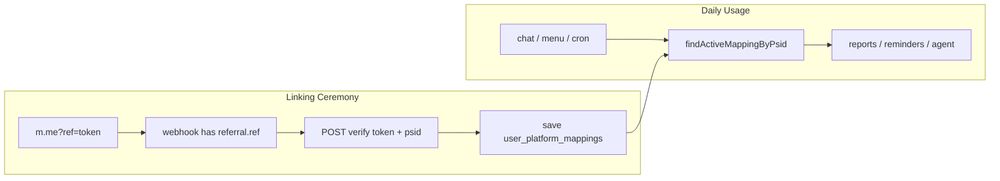

# Messenger ↔ WISPACE Linking — Token-Verified Flow & WISPACE API

Documenting the current token-verified linking flow, the WISPACE API contract, and the ownership boundary between WISPACE and the Messenger bot. The raw `ref=userId` flow below is retained only as a historical threat model.

Related: [messenger-link-security.md](./messenger-link-security.md) (solution trade-offs), [edge-cases-roadmap.md §1](../../../docs/edge-cases-roadmap.md#1-messenger--wispace-linking) (phase **L4**).

---

## Example Characters

| Character   | Role                                                         |
| ----------- | ------------------------------------------------------------ |
| **Lan**     | WISPACE student, `userId = 143`                              |
| **Hung**    | Someone trying to map their PSID to another person's account |
| **Bot**     | Messenger Bot (`demo_send_message_fb`)                       |
| **WISPACE** | Student app + backend                                        |

---

## 1. Current Flow (Token-Verified)

The bot is already in token-only mode. WISPACE issues an opaque token in the `m.me` URL; the bot never derives `userId` from that token. On a webhook carrying a new referral token, `MessengerLinkContextService` calls `WispaceMessengerTokenVerifyService`, which posts `{ token, value: psid, platform: 'messenger' }` to `WISPACE_API_VERIFY_TOKEN_URL` with `X-Internal-Key`. Only a successful response can produce the `userId` used to save the mapping.

Webhook relinking to a different `userId` is rejected. Support can change a mapping only through the protected ops relink flow with `allowRelink`.

### 1.1 Historical raw-ref flow (reference only)

### Step 1 — WISPACE Creates Link

```text
https://m.me/Page?ref=143&topic=IELTS&cadence=WEEKLY
                      ^^^
                      userId exposed directly on URL
```

### Step 2 — Lan Opens Link → Meta Sends Webhook to Bot

```json
{
  "sender": { "id": "PSID_LAN" },
  "referral": { "ref": "143" }
}
```

### Step 3 — Bot Trusts Immediately, No Further Checks

```typescript
// src/shared/config/poc.constants.ts — current
parseUserIdFromRef("143") → 143  // only parses number

// src/modules/messenger/application/services/messenger.service.ts
linkPsidFromContext("PSID_LAN", { userId: 143, ... })
// → INSERT user_platform_mappings: PSID_LAN ↔ 143
```

### Problem

Hung changes URL to `ref=999`, opens in Hung's Messenger → Bot maps **PSID_HUNG ↔ 999** (someone else's account).

Consequences may include: victim's reminders / reports reaching Hung's Messenger, chat agent misunderstanding account ownership.

---

## 2. Security Invariants

> **Bot no longer trusts `ref` as `userId`.**
> `ref` is just a **temporary pass (token)** issued by WISPACE to **exactly one logged-in user**.
> Bot **asks WISPACE**: "who does this belong to?" **before** saving the mapping.

---

## 3. New Flow — Step by Step

### Part A — WISPACE (User Taps Button in App)

Lan is logged into WISPACE, taps **「Connect Messenger」**.

```text
WISPACE App
    │
    ▼
POST /api/messenger/link-token    ← Lan's session; backend knows userId=143
    │
    ▼
WISPACE DB:
  token     = "abc-xyz-random"
  user_id   = 143
  expires_at = now + 30 minutes
  used_at   = NULL
    │
    ▼
Return to app:
  url = "https://m.me/Page?ref=abc-xyz-random&topic=IELTS&cadence=WEEKLY"
```

**Key point:** `ref` is **no longer `143`** — it's a random string. Changing `ref=999` on the URL will **no longer** map to a different userId (verify fails). Guessing a UUID token is practically impossible.

---

### Part B — User Opens Messenger (Meta Handles)

Lan taps link → opens Facebook Messenger → Meta sends webhook to Bot (same as before), but `ref` is now a **token**:

```json
{
  "sender": { "id": "PSID_LAN" },
  "referral": { "ref": "abc-xyz-random" }
}
```

---

### Part C — Bot Verifies BEFORE Saving Mapping (Main Change)

**Historical pre-token flow:**

```text
ref "143" → parseInt → userId=143 → save to DB (removed from the active linking path)
```

**Current code:**

```text
ref "abc-xyz-random"
    │
    ▼
POST WISPACE_API_VERIFY_TOKEN_URL
Body: { "token": "abc-xyz-random", "value": "PSID_LAN", "platform": "messenger" }
Header: X-Internal-Key: {WISPACE_INTERNAL_KEY}
    │
    ▼
WISPACE checks:
  ✓ token exists?
  ✓ not expired (expires_at)?
  ✓ used_at = NULL? (not yet used — one-time)
    │
    ▼
Return: { "success": true, "userId": 143 }
    │
    ▼
Bot: linkPsidFromContext("PSID_LAN", { userId: 143, ... })
     → save user_platform_mappings
```

**Current implementation shape:**

```typescript
async function resolveLinkFromRef(ref: string, psid: string) {
  const result = await linkContextService.resolveFromRef(psid, { ref });
  if (!result.context) {
    return undefined; // don't link; guide the user to create a new WISPACE link
  }
  return result.context;
}
```

This runs through `MessengerLinkContextService` for webhook referral/opt-in events before `linkPsidFromContext` persists the mapping.

---

### Part D — Block Relink (Additional Layer)

Even with valid token, if **PSID is already mapped to user A** but token is from **user B**:

```text
PSID_HUNG already mapped to user 100
New token from user 999 → verify OK → userId=999
    │
    ▼
MessengerMappingService: REJECT
  "This PSID is already linked to another account"
  (only ops relink via POST /messenger/mapping/relink + API key)
```

Modify `relinkPsidToUserId` — **don't** upsert freely when `previousUserId !== newUserId`.

---

## 4. What If Hung Attacks?

| Attack Method                    | Result                                                    |
| -------------------------------- | --------------------------------------------------------- |
| Change `ref=999` (userId number) | Bot doesn't parse number → verify `NOT_FOUND`             |
| Guess random token               | Practically impossible (UUID/CSPRNG)                      |
| Steal Lan's forwarded link       | Token is **one-time** — Lan uses first → Hung gets `USED` |
| Token older than 30 minutes      | `EXPIRED` → message to reopen from WISPACE app            |

---

## 5. Who Does What

```text
┌─────────────────────────────────────────────────────────────┐
│  WISPACE (external contract)                                 │
│  • Issue an opaque token when the user is authenticated       │
│  • Verify token + Messenger value + platform                 │
│  • Return the owning userId                                  │
│  • App: don't build ref=userId on frontend                   │
└─────────────────────────────────────────────────────────────┘
                            ▲
                            │ POST verify { token, value, platform }
                            │
┌─────────────────────────────────────────────────────────────┐
│  Messenger Bot (our side)                                    │
│  • Webhook receives the opaque ref token                     │
│  • Call WISPACE verify API before linking                    │
│  • Block webhook relink PSID to different user               │
│  • Save mapping psid ↔ userId after verification              │
└─────────────────────────────────────────────────────────────┘
```

Messenger **doesn't** issue tokens itself — it doesn't know who's logged into WISPACE. It only **asks WISPACE back** when webhook has `referral.ref`.

---

## 6. Comparison with Current Code

|                                             | Historical raw-ref flow | Current token-verified flow                |
| ------------------------------------------- | ----------------------- | ------------------------------------------ |
| What does `ref` mean?                       | `userId`                | Opaque WISPACE-issued token                |
| Who decides `userId`?                       | Bot `parseInt` itself   | **WISPACE** returns after verify           |
| What does Bot send to WISPACE when linking? | Nothing                 | `{ token, value, platform }`               |
| When is verify API called?                  | —                       | **Once** when webhook has a referral token |
| Chat / reports / reminders after that       | Read DB mapping         | **No change**                              |

---

## 7. End-to-End Example

1. Lan logs into WISPACE → taps 「Connect Messenger」
2. WISPACE creates token `t1`, associates `userId=143`
3. Lan opens `m.me?ref=t1`
4. Meta webhook: `ref=t1`, `psid=111`
5. Bot → WISPACE: `{ "token": "t1", "psid": "111" }`
6. WISPACE: OK, `userId=143`, marks `t1` as used
7. Bot saves: `psid 111 ↔ user 143`
8. Lan chats 「view progress」→ bot reads mapping, **no** more verify calls

---

## 8. WISPACE Requirements — New APIs

WISPACE needs **2 APIs**: one for the **app** (create link), one for **Messenger Bot** (verify). Same `messenger_link_tokens` table.

### 8.1 Data Table (WISPACE DB)

```sql
CREATE TABLE messenger_link_tokens (
  token       VARCHAR(64) PRIMARY KEY,
  user_id     INTEGER NOT NULL,
  topic       VARCHAR(32) NOT NULL DEFAULT 'IELTS',
  cadence     VARCHAR(16) NOT NULL DEFAULT 'WEEKLY',
  expires_at  TIMESTAMPTZ NOT NULL,
  used_at     TIMESTAMPTZ,
  created_at  TIMESTAMPTZ NOT NULL DEFAULT now()
);

CREATE INDEX idx_messenger_link_tokens_user_id ON messenger_link_tokens (user_id);
CREATE INDEX idx_messenger_link_tokens_expires ON messenger_link_tokens (expires_at)
  WHERE used_at IS NULL;
```

| Column       | Notes                                       |
| ------------ | ------------------------------------------- |
| `token`      | UUID v4 or CSPRNG 32+ bytes, opaque         |
| `user_id`    | From session — **not** received from client |
| `expires_at` | Recommended `now() + 30 minutes`            |
| `used_at`    | Set on successful verify (one-time)         |

---

### 8.2 API 1 — Create Link Token (Called by WISPACE App)

Used when student taps 「Connect Messenger」in a **logged-in** app.

|                   |                                                                               |
| ----------------- | ----------------------------------------------------------------------------- |
| **Method / path** | `POST /api/messenger/link-token`                                              |
| **Auth**          | Session cookie or `Authorization: Bearer {user_jwt}` — user must be logged in |
| **Who calls**     | WISPACE frontend → WISPACE backend                                            |
| **Messenger Bot** | Does **not** call this API                                                    |

#### Request Body (Optional)

```json
{
  "topic": "IELTS",
  "cadence": "WEEKLY"
}
```

| Field     | Required | Description                                        |
| --------- | -------- | -------------------------------------------------- |
| `topic`   | No       | Default `"IELTS"`                                  |
| `cadence` | No       | `DAILY` \| `WEEKLY` \| `MONTHLY`, default `WEEKLY` |

**Don't send `userId`** — backend gets it from session.

#### Response `200 OK`

```json
{
  "token": "a1b2c3d4-e5f6-7890-abcd-ef1234567890",
  "expiresAt": "2026-06-14T15:30:00+07:00",
  "url": "https://m.me/YourFacebookPageId?ref=a1b2c3d4-e5f6-7890-abcd-ef1234567890&topic=IELTS&cadence=WEEKLY"
}
```

| Field       | Type     | Description                      |
| ----------- | -------- | -------------------------------- |
| `token`     | string   | Value placed in `ref` on `m.me`  |
| `expiresAt` | ISO 8601 | Token expiration                 |
| `url`       | string   | Full link for app to open / copy |

#### Error Responses

| HTTP  | Example Body                  | When                              |
| ----- | ----------------------------- | --------------------------------- |
| `401` | `{ "error": "UNAUTHORIZED" }` | Not logged in                     |
| `429` | `{ "error": "RATE_LIMITED" }` | Token created too fast (optional) |

---

### 8.3 API 2 — Verify Link Token (Called by Messenger Bot)

Used **once** when Meta webhook reports user just opened link (`referral.ref`).

|                   |                                          |
| ----------------- | ---------------------------------------- |
| **Method / path** | `POST WISPACE_API_VERIFY_TOKEN_URL`      |
| **Auth**          | `X-Internal-Key: {WISPACE_INTERNAL_KEY}` |
| **Who calls**     | **Messenger Bot**                        |
| **Content-Type**  | `application/json`                       |

#### Request Body — **This is the Payload Messenger Sends**

```json
{
  "token": "a1b2c3d4-e5f6-7890-abcd-ef1234567890",
  "value": "1234567890123456",
  "platform": "messenger"
}
```

| Field      | Required | Source (Messenger side)                                                         |
| ---------- | -------- | ------------------------------------------------------------------------------- |
| `token`    | Yes      | `event.referral.ref` (or `optin.ref`, `message.referral.ref`) from Meta webhook |
| `value`    | Yes      | `event.sender.id` from Meta webhook                                             |
| `platform` | Yes      | Constant `messenger`                                                            |

**Messenger doesn't send `userId`** — WISPACE looks it up from the token table.

#### Success Response `200 OK` (Current WISPACE Contract)

```json
{
  "success": true,
  "userId": 143,
  "username": "Tab Valenskyeee",
  "email": "billbonny29@gmail.com"
}
```

| Field      | Type    | Description                                |
| ---------- | ------- | ------------------------------------------ |
| `success`  | boolean | `true` when token is valid                 |
| `userId`   | number  | Account owner associated with token        |
| `username` | string  | Display name (optional, bot doesn't store) |
| `email`    | string  | Email (optional, bot doesn't store)        |

Messenger Bot maps default `topic` / `cadence` (`IELTS` / `WEEKLY`) when API doesn't return these fields.

#### Success Response (Old L4 Draft — Reference)

```json
{
  "valid": true,
  "userId": 143,
  "topic": "IELTS",
  "cadence": "WEEKLY"
}
```

**Side effect (required):** within same transaction, set `used_at = now()` for the token — **one-time**.

#### Failure Response

HTTP `400 Bad Request` or `409 Conflict` — unified body:

```json
{
  "valid": false,
  "reason": "NOT_FOUND"
}
```

| `reason`         | Meaning                                               |
| ---------------- | ----------------------------------------------------- |
| `NOT_FOUND`      | Token doesn't exist or `ref` is an old numeric userId |
| `EXPIRED`        | `now() > expires_at`                                  |
| `USED`           | `used_at` already set — token consumed                |
| `INVALID_FORMAT` | Token empty / wrong format                            |

Messenger Bot maps `reason` → user-facing message (e.g. 「Link expired, please reopen from WISPACE app」).

#### Auth Error Response

| HTTP          | Body                                                       |
| ------------- | ---------------------------------------------------------- |
| `401` / `403` | `{ "error": "UNAUTHORIZED" }` — wrong `X-Internal-Api-Key` |

---

### 8.4 Messenger Bot Configuration (Reference)

```env
MESSENGER_LINK_MODE=token
WISPACE_API_VERIFY_TOKEN_URL=https://testbackend.aihubproduction.com/api/User/verify-bot-token
WISPACE_INTERNAL_KEY=...
```

Bot calls verify through `MessengerLinkContextService` before `linkPsidFromContext`.

---

### 8.5 Two-Team Communication Checklist

**WISPACE (external system):**

- [ ] `POST /api/messenger/link-token` (session auth)
- [ ] `messenger_link_tokens` table
- [ ] WISPACE exposes `WISPACE_API_VERIFY_TOKEN_URL` with `{ token, value, platform }`
- [ ] App uses the URL from WISPACE — doesn't build `ref={userId}` client-side
- [ ] Issues `INTERNAL_API_KEY` to Messenger service (or separate secret)

**Messenger Bot (implemented):**

- [x] HTTP client calls verify with `{ token, value, platform }`
- [x] Token-only startup validation rejects missing verification configuration
- [x] Block webhook relink PSID → different userId
- [x] `MESSENGER_LINK_MODE=token` is enforced

---

## 9. Operational Decisions (Discussion)

Team alignment notes — detailed security policy: [messenger-link-security.md §7](./messenger-link-security.md#7-design-decisions-discussion).

### 9.1 One-Time Binding — Don't Verify Every Message



After step 7 in [§7](#7-end-to-end-example) (mapping `psid ↔ userId` saved), all subsequent interactions **only read DB** — no more `verify-link-token` calls.

### 9.2 Webhook Event Matrix — Who Verifies, Who Reads DB

| Event                              | Has `referral.ref`?               | Calls WISPACE Verify?        | `userId` Source              | Code (Reference)                                           |
| ---------------------------------- | --------------------------------- | ---------------------------- | ---------------------------- | ---------------------------------------------------------- |
| Open `m.me?ref=token` first time   | Yes                               | **Yes** (L4)                 | WISPACE returns after verify | `handleEvent` → `linkPsidFromContext`                      |
| `optin` with ref                   | Yes                               | **Yes** (L4)                 | Same as above                | `event.optin` branch                                       |
| Get Started right after linking    | Usually yes (`postback.referral`) | **Yes** if ref still present | Same as above                | `handlePostbackEvent`                                      |
| Get Started later (already linked) | Usually **no**                    | **No**                       | `resolveLinkContext` → DB    | `handlePostbackEvent`                                      |
| Menu "Register Report"             | **No**                            | **No**                       | DB mapping                   | `REGISTER_LEARNING_REPORT` → `registerForScheduledReports` |
| Free-form chat                     | **No**                            | **No**                       | `resolveUserId` → DB         | `MessengerChatEnqueueService.enqueue`                      |
| Report cron / reminder dispatch    | —                                 | **No**                       | Mapping by `psid` / `userId` | `ReportCronService`, `StudyReminderDispatchService`        |

**Get Started** is usually the moment user taps for first time after `m.me`, but verify trigger is **`ref` in webhook**, not the `GET_STARTED` payload.

### 9.3 Menu "Register Report" — Expected Behavior

Persistent menu (`messenger-profile.service.ts` — payload `REGISTER_LEARNING_REPORT`):

1. `handlePostbackEvent` calls `resolveLinkContext(psid, event)`.
2. Postback **doesn't** carry `referral` → falls back to `findActiveMappingByPsid`.
3. Mapping exists → `registerForScheduledReports` (upsert subscription topic/cadence).
4. No mapping → hướng dẫn user mở link từ WISPACE app (missing-user-ref message, inlined trong router).

**No** verify call at menu tap: no token available; menu is an action on a PSID **already bound** previously. Same for chat, reports, reminders.

### 9.4 Relink — Current vs L4

|                                               | Historical L3 behavior                     | Current token-only behavior                             |
| --------------------------------------------- | ------------------------------------------ | ------------------------------------------------------- |
| PSID mapped to A, webhook ref/token of user B | **Upsert** to B + `MAPPING_USER_ID_RELINK` | **Reject** + log `MAPPING_RELINK_BLOCKED`               |
| Support changing account                      | Not available through webhook              | `POST /messenger/mapping/relink` with ops authorization |
| User self-change (production)                 | Not safe                                   | WISPACE app: unlink → new token → re-link               |

See [messenger-link-security.md §7.4](./messenger-link-security.md#74-relink-policy--current-l3-vs-l4) for three relink approaches (ops / self-service / confirm).

### 9.5 Token TTL & Expiration UX

| Phase      | Suggested `expires_at`                               |
| ---------- | ---------------------------------------------------- |
| Pilot      | `now() + 30 minutes`                                 |
| Production | **15–30 minutes** + 「Create New Link」button in app |

| Situation                                    | Result                                                                          |
| -------------------------------------------- | ------------------------------------------------------------------------------- |
| Lan forwards link, Hung opens **before** Lan | Hung gets token; Lan gets `USED` on verify                                      |
| Token `EXPIRED` before first webhook         | Bot reports expired; user creates new link — **can't** fix via menu/Get Started |
| Token `USED`, PSID already mapped            | Re-open old URL → verify `USED`; chat/menu **still OK** via DB mapping          |

One-time (`used_at`) is more important than very short TTL — TTL mainly reduces window for **unused** forwarded links.

### 9.6 Decision Matrix (Summary)

```text
Webhook event
│
├─ Has referral.ref (new token, unused)?
│   ├─ PSID unmapped → verify WISPACE → link
│   ├─ PSID mapped to same userId → idempotent (topic/cadence)
│   └─ PSID mapped to different userId → REJECT (except ops relink)
│
└─ No ref
    ├─ Has ACTIVE mapping → userId from DB
    └─ No mapping → MISSING_USER_REF
```

---

## 10. One-Line Summary

**WISPACE** issues a pass (`token`) when user logs in; **Messenger** receives `ref` from Meta then sends `{ token, value, platform }` to WISPACE for verification — **once at link time**; afterwards chat / menu / cron only read DB mapping.
