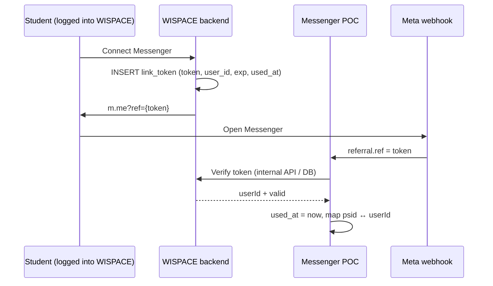

# Messenger ↔ WISPACE Link Security (`ref` / `userId`)

Document describing the **vulnerability** when passing raw `userId` via the `ref` parameter on `m.me` links, possible **solutions**, **trade-offs**, and **recommended roadmap** for production use.

Related: [project-overview.md](../../docs/project-overview.md) (link flow), [edge-cases-roadmap.md §1](../../docs/edge-cases-roadmap.md#1-messenger--wispace-linking), code `src/shared/config/poc.constants.ts`, `MessengerMappingService`.

---

## 1. Problem

### 1.1 Current POC State

Messenger links from WISPACE have this format:

```text
https://m.me/{pageId}?ref={userId}&topic=IELTS&cadence=WEEKLY
```

Meta webhook sends `referral.ref` → POC parses integer → saves to `user_platform_mappings` (`external_user_id` ↔ `user_id`).

```typescript
// poc.constants.ts — treats ref as valid userId if a positive integer parses
parseUserIdFromRef(ref) → Number.parseInt(ref, 10)
```

**No verification step** that the person opening the link owns that `userId`.

### 1.2 Risk (IDOR on Account Linking)

| Scenario | Consequence |
|----------|-------------|
| Change `ref=143` → `ref=999` on `m.me` URL, open in own Messenger | Attacker's PSID maps to **victim's account** |
| PSID already linked to user A, opens link with `ref` of user B | **Relink** to user B (L3 — `MAPPING_USER_ID_RELINK`) |
| Forward / leak link with valid `ref` | Someone else opens first → takes mapping |

**Data that could be exposed or misdirected:**

- **Study reminders:** schedule jobs synced by `userId`, proactive messages sent to mapped `psid` → student B's schedule could reach a stranger's Messenger.
- **AI reports:** cron sends via mapping; `userId` context wrong across entire pipeline.
- **Chat agent:** tool/context misunderstands account owner (name, goals, schedule operations).
- Some WISPACE APIs use `x-psid` — **not sufficient** to consider safe; POC + shared DB still couples by `user_id` in many places.

### 1.3 Encoding / Obfuscation is **Not** a Solution

| Method | Prevents userId change? |
|--------|------------------------|
| `ref=143` (current) | No |
| Base64 / hex `userId` | No — decodable, or copy entire string |
| Hash `userId` (unsigned) | No — unverifiable, small numbers brute-forceable |

Need **proof of issuance from WISPACE** (server-side signature or token), not just "hiding" `userId`.

---

## 2. Solutions & Trade-offs

### 2.1 Keep `ref = userId` (Status Quo)

**Description:** No change; trusts all positive `ref` numbers from webhook.

| Pros | Cons |
|------|------|
| Simplest | **Not safe** for production |
| No WISPACE coordination needed | userId enumeration, account takeover via relink |
| Easy debugging | No audit/revoke for links |

**Verdict:** Only acceptable for internal demos; **not** for real user go-live.

---

### 2.2 HMAC Signed Ref

**Description:** WISPACE (logged-in user) signs payload; Messenger POC verifies before linking.

```text
ref = {userId}.{expUnix}.{signature}
signature = HMAC-SHA256("{userId}.{expUnix}", MESSENGER_LINK_SIGNING_SECRET)
```

**Flow:**

1. User logs into WISPACE → backend creates `ref` with `exp` (e.g. 24h).
2. User opens `m.me?ref=...`.
3. POC verifies signature + not expired → then `upsertPsidUserLink`.

| Pros | Cons |
|------|------|
| Fast to implement (~0.5–1 days) | `userId` still **exposed** on URL |
| No DB token table needed immediately | Link can be **shared/forwarded** within TTL |
| Shared secret — simple 2-service sync | Hard to **revoke** individual links (wait for `exp`) |
| Prevents userId change without secret | Need additional **block relink** policy for already-mapped PSID |

**Verdict:** **Temporary bridge** for POC / urgent pilots; should not be the final production target.

---

### 2.3 Opaque One-Time Token (Recommended for Production)

**Description:** `ref` is a random string (UUID / CSPRNG). `userId` does **not** appear on URL. WISPACE stores token server-side; POC verifies via internal API or shared DB.



**Suggested Schema (WISPACE DB):**

```sql
CREATE TABLE messenger_link_tokens (
  token         VARCHAR(64) PRIMARY KEY,
  user_id       INTEGER NOT NULL,
  expires_at    TIMESTAMPTZ NOT NULL,
  used_at       TIMESTAMPTZ,
  created_at    TIMESTAMPTZ NOT NULL DEFAULT now()
);
CREATE INDEX idx_messenger_link_tokens_user ON messenger_link_tokens (user_id);
```

**Required Rules:**

| Rule | Reason |
|------|--------|
| Token is **one-time** (`used_at` set after successful link) | Prevents reuse / forwarding |
| Short TTL (15–30 minutes) | Reduces attack window |
| Only create token when WISPACE session is valid | Ensures account ownership |
| PSID already mapped to user A + token of user B → **reject** | Prevents unauthorized relink |
| Ops relink via `POST /messenger/mapping/relink` + `INTERNAL_API_KEY` | Support cases |

| Pros | Cons |
|------|------|
| No userId exposure; per-token revoke | Needs table + verify API (WISPACE implements) |
| One-time + TTL — strongest for go-live | Adds 1 verify round-trip when webhook links |
| Clear audit (`created_at`, `used_at`) | POC depends on Wispace (or shared DB) |
| Better fit for GDPR / privacy than signed ref | Slightly higher effort than HMAC (~1–2 days total across 2 teams) |

**Verdict:** **Final target** for real user deployment.

---

### 2.4 Short-Lived JWT in `ref` (Optional, Future Phase)

**Description:** `ref` = JWT (claims: `sub=userId`, `exp`, `jti`), signed by secret or JWKS.

| Pros | Cons |
|------|------|
| Stateless verify (POC needs no token DB) | Meta `ref` limited to ~250 chars — JWT is long |
| Industry standard | Still needs `jti` blacklist for one-time / revoke |
| | `userId` may still be in payload (if not encrypted) |

**Verdict:** Consider when JWKS infra exists; for current POC **opaque token + DB** is simpler and clearer.

---

## 3. Overall Comparison

| Criterion | Raw `userId` | HMAC Signed | One-Time Token |
|-----------|-------------|-------------|----------------|
| Prevents switching to another user | ✗ | ✓ | ✓ |
| No userId exposure | ✗ | ✗ | ✓ |
| One-time / anti-forward | ✗ | ✗ | ✓ |
| Revoke individual links | ✗ | △ (wait for exp) | ✓ |
| WISPACE effort | — | Low | Medium |
| Messenger POC effort | — | Low | Medium |
| Production-ready | ✗ | △ (temporary) | ✓ |

---

## 4. Recommended Roadmap

### Phase L4 — Link Security (Not Yet Implemented)

| Step | Work | Owner |
|------|------|-------|
| **L4.1** | `messenger_link_tokens` table + token creation API (login required) | WISPACE |
| **L4.2** | `POST /internal/messenger/verify-link-token` or shared DB query | WISPACE / POC |
| **L4.3** | POC: replace `parseUserIdFromRef` → verify token; reject raw numeric ref (feature flag) | POC |
| **L4.4** | Block relink PSID → different userId (except ops endpoint) | POC |
| **L4.5** | Log `LINK_TOKEN_OK` / `LINK_TOKEN_REJECT` / `MAPPING_RELINK_BLOCKED`; alert ops | POC |

**Emergency hotfix (before L4):** HMAC signed ref + block relink — max 1 day, with plan to remove when L4 is complete.

### Suggested Feature Flag

```env
MESSENGER_LINK_MODE=token
WISPACE_API_VERIFY_TOKEN_URL=...
WISPACE_INTERNAL_KEY=...
```

POC **only** supports `token` — `legacy` / `signed` already removed; startup fails if verify URL is missing or `MESSENGER_LINK_MODE` differs from `token`.

---

## 5. POC Code Changes (When Implementing L4)

| File / Module | Change |
|---------------|--------|
| `src/shared/config/poc.constants.ts` | `parseMessengerLinkContext` calls verify token instead of `parseInt(ref)` |
| `MessengerMappingService` | Reject relink if PSID is ACTIVE and `userId` differs |
| `MessengerService.handleEvent` | Link only when verify OK; message `MISSING_USER_REF` / `LINK_TOKEN_INVALID` |
| `.env.example` | `MESSENGER_LINK_*` variables |
| WISPACE app | Generate `m.me` only via backend API, not client-side `userId` URL building |

**Internal verify API (suggestion):**

```http
POST /internal/messenger/verify-link-token
Authorization: Bearer {INTERNAL_API_KEY}
Content-Type: application/json

{ "token": "8f3c...", "psid": "1234567890" }
```

```json
// 200
{ "valid": true, "userId": 143 }

// 400 / 409
{ "valid": false, "reason": "EXPIRED|USED|NOT_FOUND|PSID_ALREADY_LINKED" }
```

---

## 6. QA Checklist (Before Go-Live)

- [ ] Open correct user link → mapping `psid` ↔ `userId` correct
- [ ] Change `ref` / use another user's token → **no** link (or no relink)
- [ ] Reuse token with `used_at` set → rejected
- [ ] Expired token → rejected + guidance to create new link from app
- [ ] PSID linked to A, token of B → rejected + log `MAPPING_RELINK_BLOCKED`
- [ ] Ops relink via API key still works
- [ ] Reminders / reports only reach correct PSID after valid link
- [ ] Tap menu "Register Report" when already linked → uses DB mapping, **no** verify call
- [ ] Tap Get Started after linking (no `referral.ref` anymore) → uses DB mapping
- [ ] Token `USED` but PSID already mapped → chat/menu still OK; only rejects if attempting to re-link with old token

---

## 7. Design Decisions (Discussion)

Team alignment notes after reviewing link flow — supplementing sections above, **not yet implemented** (L4).

### 7.1 Two Phases: Binding vs Daily Behavior

| Phase | Purpose | Calls WISPACE Verify? |
|-------|---------|----------------------|
| **Binding** (linking ceremony) | Proves Meta PSID belongs to which WISPACE user | **Yes — once** when webhook has `referral.ref` / unused token |
| **Daily behavior** | Chat, menu, report cron, reminders | **No** — reads `user_platform_mappings` |

**Don't** verify every chat message: high latency, WISPACE dependency, no added security if mapping is already correct. Model similar to OAuth — login once, then trust session (mapping) persisted.

Other WISPACE APIs (e.g. `UserCalendar` via `x-psid`) are **data APIs**, not replacements for **link verify**.

### 7.2 When to Trigger Verify? (Not Just Get Started)

Meta may send `referral.ref` in various webhook types — POC calls verify at **every location** that would `linkPsidFromContext` when `ref` is a new token:

| Webhook Source | Can Have `ref`? |
|----------------|-----------------|
| `event.optin` | Yes (`optin.ref`) |
| `event.referral` alone | Yes |
| `event.message` + `message.referral` | Yes |
| `event.postback` (including `GET_STARTED`) + `postback.referral` | Yes — commonly first thread open from `m.me` |

Get Started **usually** coincides with first-time binding, but the correct boundary is **「webhook carrying unconsumed token」**, not the `GET_STARTED` payload itself. On subsequent visits Meta typically **doesn't** send `referral.ref` again → bot falls back to `findActiveMappingByPsid`.

### 7.3 Menu / Postback After Linking — **No** Re-verification

Persistent menu "Register Report" (`REGISTER_LEARNING_REPORT`) and other postbacks **don't** carry `referral.ref`. Current code: `resolveLinkContext` → if event has no ref, reads DB mapping (`MessengerService.resolveLinkContext`).

| Behavior | `userId` Source | Calls WISPACE Verify? |
|----------|----------------|----------------------|
| Report registration menu (already linked) | DB mapping | **No** |
| Menu when not linked | — | **No** (no token) → `MISSING_USER_REF`, guide to open app link |
| Free-form chat | DB mapping | **No** |

Verifying at menu tap **doesn't help** users who never linked — there's no token to send. If concerned about stale mapping ownership: handle via **block relink (7.4)** + **revoke/unlink** on WISPACE, not per-menu verify.

*Optional future phase:* stale mapping (too old) → send message to re-open app link — still **no** verify call from postback menu.

### 7.4 Relink Policy — Current L3 vs L4

**Current (L3):** `MessengerMappingService.relinkPsidToUserId` **allows** changing `userId` for same PSID when webhook carries `ref`/new token → logs `MAPPING_USER_ID_RELINK`. This is an IDOR vector when `ref=userId` is raw.

**L4 (recommended):**

| Situation | Behavior |
|-----------|----------|
| PSID unmapped + valid token | Link OK |
| PSID mapped to user A + token of user A (re-open link / update topic) | **Idempotent** — allow metadata update; token with `used_at` set skips verify, trusts mapping |
| PSID mapped to user A + token of user B | **Reject** — `PSID_ALREADY_LINKED` / `MAPPING_RELINK_BLOCKED` |
| True account change (support) | `POST /messenger/mapping/relink` + `INTERNAL_API_KEY` (already exists) |

**Three valid relink approaches (choose by phase):**

| Approach | Description | When to Use |
|----------|-------------|-------------|
| **A — Ops-only** | Support verifies out-of-band → calls `mapping/relink` | Pilot / POC → first prod |
| **B — Self-service** | WISPACE app: "Disconnect" → revoke mapping → new token → re-link | Production scale |
| **C — Confirm on Messenger** | Postback confirmation before relink | Rare; complex UX — **not** default recommendation |

### 7.5 Token TTL — Trade-offs

Docs recommend **15–30 minutes**. Balance:

| | Short TTL (5–15 min) | TTL 15–30 min (recommended) | Long TTL (HMAC bridge ~24h) |
|--|----------------------|-----------------------------|-----------------------------|
| Forward window for unused link | Small | Medium | Large |
| UX (user opens link then does something else) | Easy `EXPIRED` | Balanced | Comfortable |
| One-time (`used_at`) | Blocks reuse even with long TTL | Same | Not present — only temporary HMAC |

**Note:** Meta doesn't send `referral.ref` forever. Token expires **before** first webhook → verify `EXPIRED` → user must create new link in app; **can't** fix with Get Started/menu alone.

Token `USED` but user re-opens old URL: verify rejects, but if PSID is already mapped → chat/menu/cron **still uses DB mapping**.

WISPACE app should have a **「Create New Link」** button on expiration.

### 7.6 Webhook Decision Matrix (POC)

```text
Webhook event
│
├─ Has referral.ref (new token, unused)?
│   ├─ PSID unmapped → verify WISPACE → link
│   ├─ PSID mapped to same userId → update topic/cadence if needed (idempotent)
│   └─ PSID mapped to different userId → REJECT (except ops relink)
│
└─ No ref (chat / menu / Get Started later)
    ├─ Has ACTIVE mapping → userId from DB
    └─ No mapping → MISSING_USER_REF / guide to open app link
```

Detailed event flow per webhook type: [messenger-link-integration.md §9](./messenger-link-integration.md#9-operational-decisions-discussion).

---

## 8. One-Line Summary

**Production:** use **opaque one-time tokens** issued by WISPACE when user is logged in, POC verifies before mapping; **don't** trust `ref=userId` and **don't** allow free relinking. **HMAC** is only a bridge if fast shipping is needed before L4.
