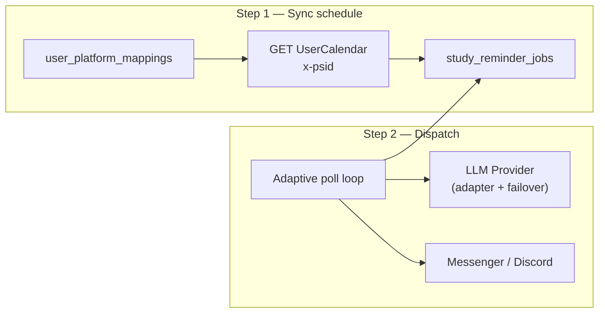
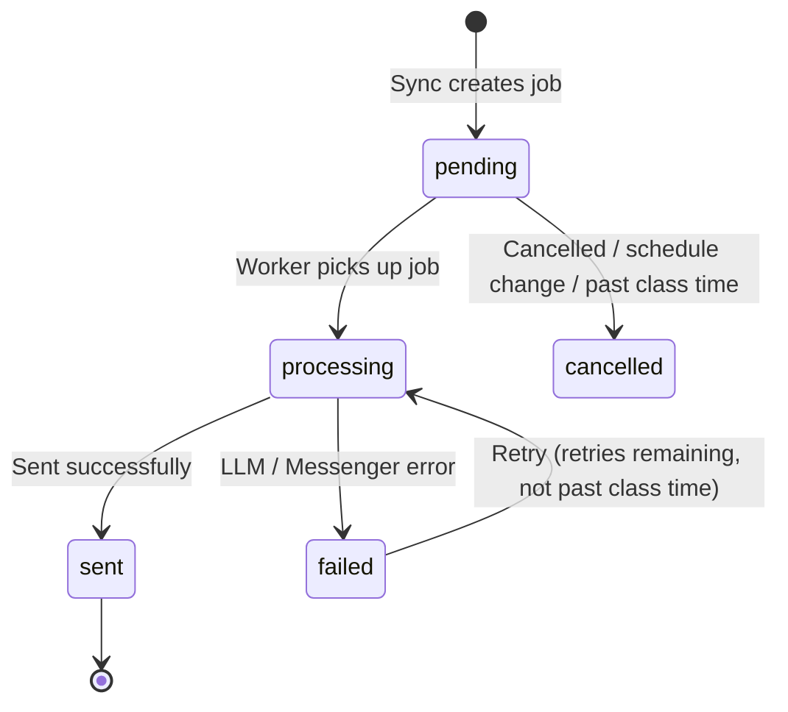
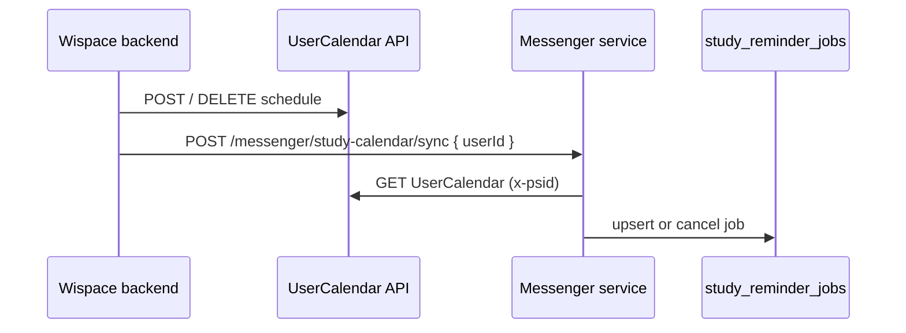
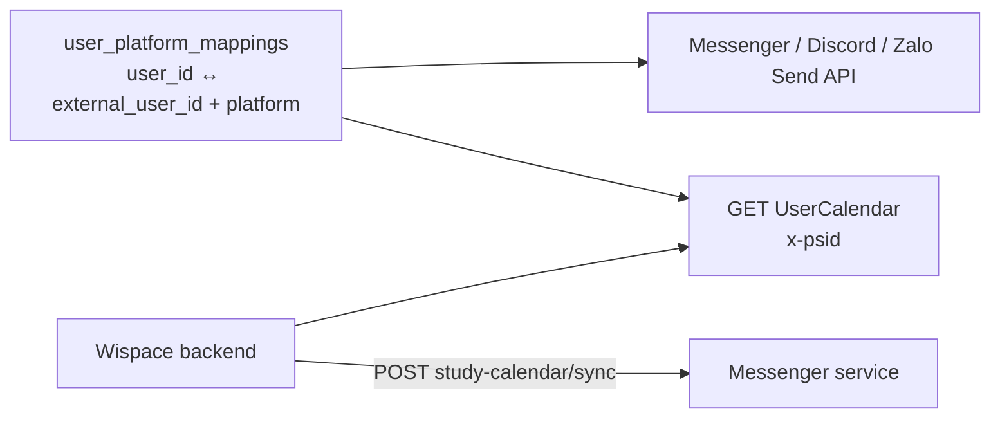
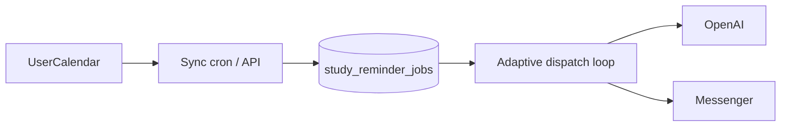

# Study Session Reminder via Messenger

Document describing the solution for **sending friendly study session reminders** to IELTS students via Facebook Messenger, with content generated by LLM.

---

## 1. Goals

- Automatically remind students before class time (`STUDY_REMINDER_MINUTES_BEFORE` in `.env`, default 30 minutes).
- Personalized content: name, class time, suggested tasks, band targets…
- Only send to users who have **linked Messenger** with a WISPACE account.
- Support **quick testing** via bot menu, without waiting for the automatic schedule.

---

## 2. Approach — Overview

Idea: **write reminder jobs to DB first**, then when the time comes, **send messages via Messenger**. If sending fails → **retry** — the job remains in DB, not lost.



| Step                 | Frequency                                                                               | Work                                                                                |
| -------------------- | --------------------------------------------------------------------------------------- | ----------------------------------------------------------------------------------- |
| **Sync**             | **API on schedule change** + 30-min cron (fallback) + server start + **23:00 rollover** | Scan 14-day horizon → write/update `study_reminder_jobs`                            |
| **Dispatch**         | **Adaptive** 30s–3.5min (`STUDY_REMINDER_POLL_*`)                                       | Job reaches `remind_at` → LLM generates content → send via Messenger                |
| **Evening rollover** | **23:00** (`STUDY_REMINDER_TIMEZONE`)                                                   | Delete **`sent`** jobs → re-sync 14-day horizon                                     |
| **Cleanup**          | Daily at 03:00                                                                          | Delete `cancelled` / `failed` jobs that exhausted retries past `JOB_RETENTION_DAYS` |
| **Preview**          | On demand (bot menu)                                                                    | Read schedule directly from API/DB — send immediately, bypassing job queue          |

> **Outbound action safety (#633):** Discord report/reminder sends use the shared `DiscordOutboundService` guard, which disables platform-wide mentions and neutralizes model-generated mention tokens before delivery. The Zalo and Messenger outbound audits found no equivalent action markup.

---

## 3. Detailed Flow

### 3.1. Sync — Create Jobs from Schedule

There are **two sync modes** (same internal logic):

| Mode          | Trigger                                                           | Scope                                          |
| ------------- | ----------------------------------------------------------------- | ---------------------------------------------- |
| **Per-user**  | `POST /messenger/study-calendar/sync` `{ userId }`                | One user — WISPACE calls after schedule change |
| **All users** | 30-min cron, server start, `POST /messenger/sync-study-reminders` | All ACTIVE mappings with `external_user_id`    |

For each synced user:

1. Fetch upcoming classes from **`UserCalendar` API** (header `x-psid`) — no more DB fallback.
2. For each class in the horizon (`STUDY_REMINDER_SYNC_HORIZON_HOURS`, default 14 days):
   - Calculate `remind_at = scheduled_at - STUDY_REMINDER_MINUTES_BEFORE`
   - UPSERT into `study_reminder_jobs` (`status = pending`)
3. Cancelled / no longer in schedule → `status = cancelled`

> **Integration note (required):** The 30-minute cron is only a safety net. Every time a schedule changes (POST/DELETE `UserCalendar` or DB write) — the WISPACE system **calls the sync API** below immediately after commit. If only waiting for cron, students may receive reminders at wrong times or not receive reminders until 30 minutes after the change.

**Cross-platform ownership (#718):** Messenger, Discord, and Zalo full-sync providers resolve each mapping through the required `CanonicalPlatformService`. An active mapping is preferred; otherwise the fallback order is `zalo > discord > messenger`. A noncanonical provider never upserts new jobs and cancels only its `pending` / `failed` jobs; `processing` jobs are left untouched. An undefined result may cancel those actionable jobs without an upsert, while a resolver error leaves rows unchanged and marks that sync as failed. The next full sync converges jobs after ownership changes.

**Learner consistency (#637):** `userId` is the canonical owner and each
`session_key` has at most one actionable job across platforms. When the
canonical platform changes, the old platform's `pending` / `failed` owner is
cancelled and the new canonical provider creates or retains one job. A send
failure retries that same canonical job; the dispatcher does not immediately
fan out to another linked channel. A mapping without a WISPACE `userId` is
not eligible for automatic scheduled work. Unlinking one channel cancels only
that channel's local jobs; learner-level report claims are not channel-local,
and explicit user erasure is cross-platform. See
[issue #637](https://github.com/lengocanh2005it/wispace-bot/issues/637) and
[project-overview.md](../../../docs/project-overview.md#111-cross-platform-learner-consistency-637).

**First-time bootstrap** (empty jobs table but DB has old schedules):

```bash
npm run study-reminder:sync
```

### 3.2. Dispatch — Send Messages on Time

On each adaptive poll tick (30s–3.5min, S2 — see §11.6), fetch jobs matching:

- `status` = `pending` or `failed` (still has retries)
- `remind_at <= now`
- `scheduled_at` still before class time (`> now + MIN_LEAD_MINUTES`)
- `next_retry_at` reached (if retrying)

For each job:



- Generate LLM content (`StudyReminderService`) → send via port `MESSAGE_SENDER` (`MessengerOutboundService`)
- Success → `status = sent`
- Error → `retry_count++`, `next_retry_at = now + RETRY_BACKOFF_MINUTES` (max `MAX_RETRIES`)
- Past class time → `cancelled`, don't send

**Delivery crash safety (#294):** A stable `delivery_key` is persisted to the job before calling the provider. The sender returns `OutboundDeliveryOutcome` (`sent` | `ambiguous` | `not_sent`). On `sent`, the job is marked with the key. On `ambiguous` (provider may have accepted), the job is terminal — no auto-resend. On `not_sent`, existing retry logic applies. `resetStuckProcessingJobs` sets `delivery_status = 'ambiguous'` on stuck rows so a re-claim does not blind-resend.

**Outbound rate-limit backstop (#622):** The shared limiter admits each
learner-facing provider attempt (including retry/chunk units) before send. A
`rate_limited` result is terminal for the reminder: persist
`outbound_rate_limited`, do not schedule another retry, and investigate the
upstream fan-out/retry source before replaying. See
[outbound-rate-limit.md](../../../docs/outbound-rate-limit.md).

### 3.3. Cleanup & Evening Rollover

The `study_reminder_jobs` table is a **snapshot outbox** (send queue), not a history store. Message audit is in `message_logs`.

#### Evening Rollover (23:00, timezone `STUDY_REMINDER_TIMEZONE`)

Default sync horizon is **14 days** (`STUDY_REMINDER_SYNC_HORIZON_HOURS=336`). At end of day:

1. **Delete all `sent` jobs** (already sent today).
2. **Re-sync** all ACTIVE mappings → create `pending` jobs for classes in the next 14 days.

Cron runs automatically; or call manually:

```http
POST /messenger/study-reminder/evening-rollover
X-Internal-Api-Key: ...
```

Rollover hour configured via `STUDY_REMINDER_EVENING_ROLLOVER_HOUR` (default **23**).

#### Deep Cleanup (03:00)

Delete terminal **`cancelled`** / **`failed`** (retries exhausted) jobs older than `STUDY_REMINDER_JOB_RETENTION_DAYS` (default 7 days). `pending` / `processing` / `failed` jobs with remaining retries are **not** touched.

#### When User Changes Schedule (WISPACE)

| Flow               | Update Method                                                                               |
| ------------------ | ------------------------------------------------------------------------------------------- |
| **Outbox (T-30)**  | `POST /messenger/study-calendar/sync` `{ "userId": 143 }` immediately after schedule commit |
| **Preview (menu)** | Read directly from the UserCalendar API — always sees the new schedule, no job sync needed  |

Per-user sync will upsert `pending` jobs, cancel stale jobs, and **reopen `pending` jobs** when:

- a class was `sent` but **class time changed** (same `session_key`);
- a class was `cancelled` but **reappears** in the sync schedule (even at same time).

Keep `sent` if class time unchanged — avoid duplicate reminders.

### 3.4. Content Generation — LLM

`StudyReminderService` gathers context (schedule, goals, band Task 1/2, **name from `Users.DisplayName`**) → calls **OpenAI** → formats message.

Display name: reads `Users` table by `user_id` (or maps `psid` → `user_id`). Fallback order: `DisplayName` → `Username` → `"Chào bạn nha"`.

Both automatic dispatch and menu preview use this same service. Without `OPENAI_API_KEY` → fallback to template.

**Reminder time is server-derived (#123):** the model never controls the displayed time — `formatReminder` always renders `scheduledTimeLabel` computed from the trusted `session.scheduledAt` (`StudyReminderScheduleService.formatScheduledTimeLabel`). The LLM output contract has **no** `scheduledTime` field (5 keys: greeting, intro, tasks, motivation, signoff); if a model emits one anyway it is ignored (mismatch vs the server label is logged). LLM prose is bound to the label via `buildReminderOutput(prose, scheduledTimeLabel)`.

### 3.5. Quick Testing

| Method                                 | Description                                           |
| -------------------------------------- | ----------------------------------------------------- |
| Menu **"Upcoming Study Reminders"**    | Send preview of next upcoming class immediately       |
| `POST /messenger/study-calendar/sync`  | **WISPACE calls after schedule change** (by `userId`) |
| `POST /messenger/sync-study-reminders` | Sync all users (ops / fallback)                       |
| `POST /messenger/send-study-reminders` | Sync + dispatch due jobs                              |
| `npm run study-reminder:jobs`          | View job list in DB                                   |

### 3.5.1. Chat reschedule scope (#627)

Calendar IDs supplied by the chat model or learner are **untrusted**. The bot
must list upcoming entries first and only stage a reschedule for an ID returned
by that caller-scoped list. Calendar reads include the linked WISPACE
`userId`; the internal `ownerUserId` proof is stripped before tool results are
returned to the model.

The shared confirmation stage and the write command both validate ownership.
If ownership is mismatched or cannot be proven, the bot returns a generic
Vietnamese error, performs no WISPACE write, does not retry, and emits
`RESCHEDULE_SCOPE_BLOCKED` plus `*_llm_tool_policy_denied_total` with reason
`scope_mismatch` or `scope_unverified`. External IDs and calendar IDs are
masked in logs.

The WISPACE backend must also confirm, per endpoint, that a calendar resource
in the request body is authorized for the identity header (`x-psid`,
`x-discordid`, or `x-zaloid`). Record that confirmation in the issue
conversation; it is an external integration prerequisite, not a runtime code
dependency.

### 3.6. Sync API on Schedule Change

`study_reminder_jobs` reflects the schedule **snapshot** at sync time. When schedule changes without timely sync, old jobs remain `pending` → wrong-time reminders or reminders for cancelled classes.

**Requirement:** After each create / update / delete schedule operation (`POST` / `DELETE` `UserCalendar`), **WISPACE calls the Messenger service API**:

```http
POST /messenger/study-calendar/sync
Content-Type: application/json

{ "userId": 2597 }
```

| Schedule Action      | WISPACE Does                | Sync Service Does                         |
| -------------------- | --------------------------- | ----------------------------------------- |
| Create / change time | Call sync API with `userId` | GET `UserCalendar` (x-psid) → UPSERT jobs |
| Delete class         | Call sync API with `userId` | Class no longer in API → `cancelled`      |

Sample response:

```json
{
  "scope": "user",
  "userId": 2597,
  "linked": true,
  "mappings": 1,
  "upserted": 2,
  "cancelled": 1,
  "skipped": 0,
  "failures": []
}
```

`linked: false` — user has no Messenger mapping → no jobs (200 OK, not an error).

Sync is **per `userId`** — does not scan all mappings. 30-min cron + `POST /messenger/sync-study-reminders` still used for fallback / ops. The full sync (cron + `sync-study-reminders`) is **keyset-paged** (100 mappings/page, cursor by id) and processed with bounded concurrency (5) — memory and duration stay flat as the account population grows; per-batch progress and total duration are logged.

**Example call from WISPACE (after POST/DELETE `/api/UserCalendar`):**

```bash
curl -X POST https://{messenger-service}/messenger/study-calendar/sync \
  -H "Content-Type: application/json" \
  -H "X-Internal-Api-Key: ${INTERNAL_API_KEY}" \
  -d '{"userId": 2597}'
```

Or `Authorization: Bearer ${INTERNAL_API_KEY}`. Key value from `.env` (`INTERNAL_API_KEY`) — **same secret** WISPACE backend configures when calling this service.



---

## 4. Data Sources

### 4.1. `UserCalendar` API (primary)

All requests use header **`x-psid`** (Messenger PSID). Base URL: `WISPACE_API_USER_CALENDAR_URL`.

**GET** — schedule list:

```http
GET /api/UserCalendar
x-psid: {messenger_psid}
```

```json
{
  "data": [
    {
      "id": 12,
      "userId": 2597,
      "eventDate": "2026-06-10T00:00:00Z",
      "time": "08:30",
      "createdAt": "2026-06-09T15:00:00Z"
    }
  ],
  "count": 1
}
```

**POST** — create class:

```http
POST /api/UserCalendar
x-psid: {messenger_psid}
Content-Type: application/json

{ "eventDate": "2026-06-10T00:00:00Z", "time": "08:30" }
```

**DELETE** — delete class:

```http
DELETE /api/UserCalendar/{id}
x-psid: {messenger_psid}
```

Implementation: `UserCalendarApiClient` + `UserCalendarScheduleClient` from `@wispace/wispace-client` package (normalize → `session_key: calendar:{id}`, combine `eventDate` + `time` per `STUDY_REMINDER_TIMEZONE`).

All schedule changes (POST/DELETE) **must call** `POST /messenger/study-calendar/sync` — see section [3.6](#36-api-sync-on-schedule-change).

### 4.2. Data for LLM

| API                          | Purpose                   |
| ---------------------------- | ------------------------- |
| `WISPACE_API_USER_GOALS_URL` | `targetScore`, `examDate` |
| `WISPACE_API_TASK_SCORE_URL` | Band Task 1/2             |

### 4.3. User Linking



Both Messenger and WISPACE API need **`external_user_id`** (was `psid`). The `user_platform_mappings` table is the bridge.

---

## 5. `study_reminder_jobs` Table

```sql
CREATE TABLE study_reminder_jobs (
  id              SERIAL PRIMARY KEY,
  platform        VARCHAR(16) NOT NULL DEFAULT 'messenger',
  external_user_id VARCHAR(64) NOT NULL,
  user_id         INTEGER,
  session_key     VARCHAR(128) NOT NULL,
  scheduled_at    TIMESTAMPTZ NOT NULL,
  remind_at       TIMESTAMPTZ NOT NULL,
  topic           VARCHAR(255),
  status          VARCHAR(20) NOT NULL DEFAULT 'pending',
  retry_count     INTEGER NOT NULL DEFAULT 0,
  max_retries     INTEGER NOT NULL DEFAULT 3,
  next_retry_at   TIMESTAMPTZ,
  last_error      TEXT,
  sent_at         TIMESTAMPTZ,
  created_at      TIMESTAMPTZ NOT NULL DEFAULT NOW(),
  updated_at      TIMESTAMPTZ NOT NULL DEFAULT NOW(),
  UNIQUE (platform, external_user_id, session_key)
);
```

> The table is shared by all 3 bots (multi-platform since migration
> `1751029200001-GeneralizePlatformIdentifiers`): `external_user_id` replaces
> the legacy `psid` column, and `platform` discriminates `messenger` /
> `discord` / `zalo`. Dispatch index: `(status, remind_at)`.

| `status`     | Meaning                                       |
| ------------ | --------------------------------------------- |
| `pending`    | Waiting until `remind_at`                     |
| `processing` | Sending                                       |
| `sent`       | Sent successfully                             |
| `failed`     | Error — waiting to retry                      |
| `cancelled`  | Cancelled / schedule change / past class time |

Terminal jobs (`sent`, `cancelled`, `failed` retries exhausted) are **permanently deleted** after `STUDY_REMINDER_JOB_RETENTION_DAYS` — see section 3.3.

---

## 6. Sample Message (LLM)

**OpenAI input** includes: name, class time, topic, target band, band Task 1/2…

**Output** formatted as:

```
⏰ Time to Study!

Xin chào bạn,

Đây là lời nhắc thân thiện rằng bạn có buổi học sắp diễn ra:

📅 Hôm nay lúc 10:30

Don't forget to:
• Ôn lại các bài essay gần đây
• Luyện viết theo chủ đề IELTS Writing
• ...

Kiên trì luyện tập mỗi ngày sẽ giúp bạn tiến gần hơn tới mục tiêu IELTS.

Cố lên nhé! 💪
```

---

## 7. Code Structure

The reminder core lives in **`@wispace/study-reminder-shared`** (framework-agnostic, shared by Messenger/Discord/Zalo); `apps/messenger-bot` wires it via `StudyReminderModule` and the `MESSAGE_SENDER` port. Clean Architecture — see [AGENTS.md](../../../AGENTS.md#clean-architecture):

```
packages/study-reminder-shared/src/
├── services/
│   ├── study-reminder-sync.service.ts       # Sync schedule → jobs (all | per userId)
│   ├── study-reminder-dispatch.service.ts   # Dispatch + retry (MESSAGE_SENDER port)
│   ├── study-reminder-worker.service.ts     # Cron sync / cleanup / rollover + adaptive poll
│   ├── study-reminder-schedule.service.ts   # Calculate remind_at
│   └── study-reminder-providers.factory.ts  # DI factory for app modules
├── entities/study-reminder-job.entity.ts    # TypeORM entity (shared table)
└── repositories/study-reminder-job.repository.port.ts

apps/messenger-bot/src/
├── modules/study-reminder/                  # thin NestJS wiring (module + providers)
├── modules/study-reminder/application/services/study-reminder.service.ts  # LLM content (app-specific)
├── modules/scheduler/presentation/controllers/
│   └── scheduler.controller.ts              # POST study-calendar/sync, sync-study-reminders, …
├── modules/messenger/
│   ├── application/services/messenger.service.ts          # Webhook + menu preview reminders
│   └── application/services/messenger-outbound.service.ts # Send API (MESSAGE_SENDER)
└── shared/prompts/
    └── study-reminder.system.txt            # OpenAI system prompt
```

**Dispatch:** `StudyReminderDispatchService` (shared) calls `StudyReminderService.generateReminderForSession` (app) then `MESSAGE_SENDER.sendTextViaPsid` — does not import `MessengerService`.

---

## 8. `.env` Configuration

```env
WISPACE_API_USER_CALENDAR_URL=https://testbackend.aihubproduction.com/api/UserCalendar

STUDY_REMINDER_MINUTES_BEFORE=30
STUDY_REMINDER_MIN_LEAD_MINUTES=1
STUDY_REMINDER_SYNC_HORIZON_HOURS=336
STUDY_REMINDER_MAX_RETRIES=3
STUDY_REMINDER_RETRY_BACKOFF_MINUTES=2
STUDY_REMINDER_JOB_RETENTION_DAYS=7
STUDY_REMINDER_EVENING_ROLLOVER_HOUR=23
STUDY_REMINDER_TIMEZONE=Asia/Ho_Chi_Minh

OPENAI_API_KEY=sk-...
OPENAI_MODEL=gpt-5.4

# Ops / Wispace → sync, send-reports (header X-Internal-Api-Key)
INTERNAL_API_KEY=replace-with-a-long-random-secret
```

All time values **must be in `.env`** — no hardcoding in code.

---

## 9. Deployment

```bash
# First time: migration + sync old schedule data into jobs
npm run study-reminder:sync

# View jobs
npm run study-reminder:jobs

# Update bot menu
POST /messenger/profile/setup
```

**Operations:**

- **Required:** WISPACE calls `POST /messenger/study-calendar/sync` after every schedule change (see section 3.6).
- **Fallback:** server sync on startup + 30-min cron.
- **Adaptive dispatch poll** (S2 ✓) — details: section [11.6](#116-worker-dispatch-polling--db-load-concerns--risk-mitigation).
- Evening rollover 23:00 — delete `sent` jobs + re-sync horizon.
- Cleanup cron 03:00 daily — delete terminal jobs older than `JOB_RETENTION_DAYS`.

---

## 10. Messenger Logging

| `message_type`                   | Meaning                         |
| -------------------------------- | ------------------------------- |
| `STUDY_REMINDER:{timestamp}`     | Automatic reminder via dispatch |
| `STUDY_SESSION_REMINDER_PREVIEW` | Menu test                       |
| `STUDY_SESSION_REMINDER_EMPTY`   | No upcoming classes             |

Primary send status: `study_reminder_jobs.status`. `message_logs` used for audit.

---

## 11. Trade-offs — Strengths, Weaknesses & Improvement Directions

The **outbox table (`study_reminder_jobs`) + cron sync/dispatch** approach suits Messenger: dedicated DB **`ai_chat_bot_db`**, small user scale, retry + audit without needing a separate message queue.

### 11.1. Why This Approach Makes Sense Now

| Strength                      | Brief Explanation                                                                        |
| ----------------------------- | ---------------------------------------------------------------------------------------- |
| **Little new infrastructure** | No Redis/RabbitMQ needed; jobs live in the same Postgres as the app                      |
| **Retry & clear state**       | `pending` → `sent` / `failed` / `cancelled` — easy to debug, no lost jobs on send errors |
| **Leverages WISPACE API**     | `UserCalendar` via `x-psid` — API-only (I3 ✓)                                            |
| **Per-user sync**             | WISPACE calls one API after schedule change — no event bus / webhook needed              |
| **Flexible LLM**              | Personalized reminders based on goals/band without maintaining many templates            |
| **Separate sync from send**   | Schedule change only needs job re-sync; no Messenger/LLM calls at write time             |

### 11.2. Weaknesses / Risks to Know

| Issue                                            | Description                                                                                                                  | Current Impact                                                                                                          |
| ------------------------------------------------ | ---------------------------------------------------------------------------------------------------------------------------- | ----------------------------------------------------------------------------------------------------------------------- |
| **Schedule and jobs not instantly synchronized** | Snapshot at last sync. If WISPACE forgets to call sync API → max ~30 min drift (fallback cron)                               | Low — **S0 ✓** wired sync after schedule change                                                                         |
| **Depends on WISPACE integration**               | WISPACE calls `POST /messenger/study-calendar/sync` after every schedule change                                              | **Done (S0)** — keep monitoring if deploying new environments                                                           |
| **Depends on UserCalendar API**                  | Sync/dispatch needs stable WISPACE API; no more reading `UserCalendars` DB                                                   | Medium — monitor 5xx                                                                                                    |
| **Send time accuracy**                           | Adaptive poll: near `remind_at` → min 30s; no jobs → max ~3.5 min                                                            | Low — acceptable for 30-minute advance reminders                                                                        |
| **Horizon limited**                              | Only syncs classes within `SYNC_HORIZON_HOURS` (14 days). Classes further out have no jobs until next sync enters the window | Low for weekly schedules                                                                                                |
| **LLM called at dispatch**                       | Each job = 1 OpenAI call + goals/score API → cost, latency, model errors may delay or fail reminders                         | Medium — has retries and template fallback                                                                              |
| **Content not fixed**                            | Two reminders for same class (preview vs auto) may have different wording due to LLM                                         | Low                                                                                                                     |
| **Messenger channel only**                       | Users without linked `psid` or blocking bot → no reminders                                                                   | High for unmapped users — by design                                                                                     |
| **Full-scan sync (cron)**                        | 30-min cron still scans **all** mappings — just a fallback; primary flow syncs per `userId`                                  | Low with few users; increases at scale                                                                                  |
| **Multiple app instances**                       | `claimJob` via DB prevents duplicate sends, but cron runs on every instance — needs monitoring on horizontal scale           | Low on single instance                                                                                                  |
| **Dispatch polling**                             | ~~Fixed 1 minute~~ → **S2 ✓ adaptive** — fewer queries when no jobs due                                                      | Low at this stage; reduces scale risk — section [11.6](#116-worker-dispatch-polling--db-load-concerns--risk-mitigation) |

### 11.3. Comparison with Other Approaches (Summary)

| Approach                                       | Pros                           | Cons vs Current                                                  |
| ---------------------------------------------- | ------------------------------ | ---------------------------------------------------------------- |
| **Fixed N-minute cron poll, send immediately** | Simple, no jobs table          | No durable retry, hard to audit, high DB/API load scanning users |
| **External queue (BullMQ, SQS…)**              | Good scale, precise delay      | Added infrastructure, operations — overkill at this stage        |
| **Messenger scheduled messages**               | Meta sends on your behalf      | No dynamic LLM, limited policy/templates                         |
| **Push/email multi-channel**                   | Reaches users not on Messenger | Outside current integration scope                                |

### 11.4. Improvement Directions (Priority Order)

1. ~~**WISPACE wire sync API**~~ ✓ (S0) — `POST /messenger/study-calendar/sync` + `X-Internal-Api-Key` header (section 3.6).
2. ~~**Remove DB fallback**~~ ✓ (I3) — single source `UserCalendar` via `x-psid`.
3. **Monitor `failed` jobs** — alert when `retry_count` exhausted or `processing` jobs stuck long.
4. **Pre-generate or cache LLM content** at sync time (optional) — reduce dispatch latency, more stable content.
5. ~~**Adaptive dispatch polling**~~ ✓ (S2) — `StudyReminderWorkerService` + `findNextDueTime` + `STUDY_REMINDER_POLL_*`.
6. **Dedicated queue** (BullMQ, pg_cron by `remind_at`…) — when job/instance count grows significantly.
7. **Expand channels** — email/push in-app for users not linked to Messenger (if product requires).

### 11.6. Worker Dispatch Polling — DB Load Concerns & Risk Mitigation

The dispatch worker (`StudyReminderWorkerService`) runs an **adaptive poll loop** (S2 ✓), no longer a fixed 1-minute cron. Each tick calls `StudyReminderDispatchService.dispatchDueReminders()`, gets `nextDueAt` from `findNextDueTime()`, then `setTimeout` for the next tick.

#### 11.6.1. Adaptive Mechanism (S2 ✓)

```text
delay = clamp(msTilDue - STUDY_REMINDER_POLL_LEAD_MS,
              STUDY_REMINDER_POLL_MIN_MS,
              STUDY_REMINDER_POLL_MAX_MS)
```

| Env                           | Default           | Behavior                                           |
| ----------------------------- | ----------------- | -------------------------------------------------- |
| `STUDY_REMINDER_POLL_MIN_MS`  | 30_000 (30s)      | Fastest poll when job is about due                 |
| `STUDY_REMINDER_POLL_MAX_MS`  | 210_000 (3.5 min) | Slowest poll when no jobs                          |
| `STUDY_REMINDER_POLL_LEAD_MS` | 60_000 (60s)      | Wake 1 minute before `remind_at` / `next_retry_at` |

`findNextDueTime(after)` — SQL `MIN(CASE WHEN next_retry_at > after THEN next_retry_at WHEN remind_at > after THEN remind_at END)` on `pending`/`failed` jobs.

Multi-pod: each instance runs its own loop; `claimJob` (atomic `UPDATE … WHERE status IN (pending, failed)`) ensures only one pod processes each job — **no** advisory lock needed for dispatch.

#### 11.6.2. Outbox vs Worker Polling (Summary)

| Concept             | Current                                                                                                                              |
| ------------------- | ------------------------------------------------------------------------------------------------------------------------------------ |
| **Outbox**          | `study_reminder_jobs` table — snapshot of "T-30 reminder tasks to send"; the dispatch worker sends due jobs through `MESSAGE_SENDER` |
| **Sync worker**     | Writes/updates outbox from `UserCalendar` (30-min cron, API sync, 23:00 rollover)                                                    |
| **Dispatch worker** | **Adaptive poll** reads outbox: any job with `remind_at <= now` gets sent                                                            |

**Menu "Upcoming Study Reminders"** doesn't go through the outbox — reads schedule directly and sends immediately (preview).



#### 11.6.3. What Does Each Poll Actually Query?

**Not** `SELECT * FROM study_reminder_jobs` or a full table scan of all history.

`findDueJobs()` (simplified):

```sql
WHERE status IN ('pending', 'failed')
  AND remind_at <= :now
  AND scheduled_at > :now + MIN_LEAD_MINUTES
  AND (next_retry_at IS NULL OR next_retry_at <= :now)
ORDER BY remind_at ASC
LIMIT 50
```

| Feature                     | Meaning                                               |
| --------------------------- | ----------------------------------------------------- |
| Index `(status, remind_at)` | Postgres only scans **due jobs**, not the whole table |
| `LIMIT 50`                  | Max 50 jobs per poll — caps one dispatch loop's load  |
| `scheduled_at` condition    | Skips jobs past class time                            |

**Frequency:** not a fixed 1 minute. No jobs → max ~**576 queries/day** (3.5min interval × 24h); jobs due → denser polling (min 30s). With proper index and a few hundred `pending` jobs, the cost is minimal on `ai_chat_bot_db`.

The **30-minute sync cron** is **different load** (reads UserCalendar per `psid`, UPSERT outbox) — heavier per run but **fewer** (48 times/day).

#### 11.6.4. When Does Polling Become a Concern?

| Situation                              | Why It's Risky                                                           | Symptoms                                                  |
| -------------------------------------- | ------------------------------------------------------------------------ | --------------------------------------------------------- |
| **Outbox bloat**                       | Hundreds of thousands / millions of `sent`, `cancelled` rows not cleaned | Large index, slow vacuum, slow due queries                |
| **Many `pending` jobs due at once**    | One minute must process > `LIMIT 50`                                     | Late reminders spill to next minute                       |
| **Many Nest instances**                | Each pod runs adaptive dispatch loop                                     | Claim contention; `claimJob` is atomic (already in place) |
| **Dedicated DB**                       | Queries isolated to `ai_chat_bot_db`                                     | No resource contention with WISPACE hub                   |
| **Absolute T-30 accuracy expectation** | Adaptive poll → max late by ~`pollMinMs` + lead when job is close to due | Acceptable for 30-minute advance reminders                |

**Practical conclusion:** S2 reduces idle queries; remaining risk is mainly **outbox size** and **burst of simultaneous due jobs**. With dozens of users, 14-day horizon, evening rollover deleting `sent` → **not yet an issue**.

#### 11.6.5. Already in Code to Mitigate Risk

| Mechanism                  | File / Config                                                                                      |
| -------------------------- | -------------------------------------------------------------------------------------------------- |
| **Adaptive poll (S2)**     | `StudyReminderWorkerService.scheduleNextDispatch`, `computePollDelay`, env `STUDY_REMINDER_POLL_*` |
| `findNextDueTime`          | `StudyReminderJobRepository` — schedules wake by next job                                          |
| Dispatch index             | `idx_study_reminder_jobs_dispatch` on `(status, remind_at)`                                        |
| `LIMIT 50` per loop        | `StudyReminderJobRepository.findDueJobs()`                                                         |
| Claim job                  | `pending`/`failed` → `processing` before send — prevents duplicates (single instance)              |
| Reset stuck jobs           | `resetStuckProcessingJobs` after 10 minutes                                                        |
| Evening rollover **23:00** | Deletes all `sent` jobs + re-syncs horizon                                                         |
| Cleanup **03:00**          | Deletes `cancelled` / `failed` exhausted retries older than `JOB_RETENTION_DAYS`                   |
| 14-day horizon             | Only keeps jobs in sync window — no year-long snapshot                                             |

#### 11.6.6. Load Comparison: Dispatch Poll vs Other Cron Jobs

| Cron / Loop             | Frequency   | Reads                                               | Note                                  |
| ----------------------- | ----------- | --------------------------------------------------- | ------------------------------------- |
| **dispatch (adaptive)** | 30s–3.5 min | Due jobs in outbox (`LIMIT 50`) + `findNextDueTime` | S2 ✓ — fewer queries when idle        |
| **sync**                | 30 min      | UserCalendar API × ACTIVE mappings                  | Heavier **per run**, but 48 times/day |
| **evening rollover**    | 1×/day      | DELETE `sent` + full sync                           | Keeps outbox small                    |
| **cleanup**             | 1×/day      | Delete old terminal                                 | Reduces dead rows                     |

#### 11.6.7. Further Scale Approaches (Not Yet Implemented — Reference)

| Approach                               | Description                                           | Trade-off                                       |
| -------------------------------------- | ----------------------------------------------------- | ----------------------------------------------- |
| ~~**B. Adaptive polling**~~            | ✓ S2 — see 11.6.1                                     | Already done                                    |
| **C. `FOR UPDATE SKIP LOCKED`**        | More workers/pods claim jobs safely                   | `claimJob` UPDATE sufficient for moderate scale |
| **D. Delayed job queue**               | BullMQ / SQS / pg_cron fires at exact `remind_at`     | No polling; added Redis/ops                     |
| **E. Poll schedule instead of outbox** | Every N min read UserCalendar, send if in T-30 window | Poor retry, high WISPACE API load               |

For **IELTS students + 30-minute advance reminders**, the combination of **small outbox + night cleanup of `sent` + index + S2 adaptive** is typically sufficient up to tens of thousands of `pending` jobs. Only need D/E if product requires second-level timing precision or massive volume.

#### 11.6.8. Relation to Chat Rate Limit (Future)

The `chat_daily_usage` table (see [chat-rate-limit-quota.md](./chat-rate-limit-quota.md)) does **not** use dispatch poll — it only reads **1 row** when a user messages. Polling concerns **only apply** to the **automatic reminder dispatch** flow, not menu preview or chat AI.

### 11.7. Short Conclusion

The current solution is **good enough to ship and operate early**: DB job queue, retry, preview, per-user sync API, and fallback cron. The main weaknesses aren't in the dispatch code but in **whether WISPACE calls the sync API on time** and whether users have Messenger mappings. When the product scales or requires higher time precision / multi-channel, improve per section 11.4 rather than changing the architecture from scratch.
