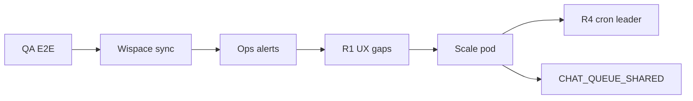

# Edge Cases & Gaps — Remediation Roadmap

Document recording **weaknesses / unhandled items** in the WISPACE bots (all functionality, not just rate limit) and **how to fix them** in **small phases** — independent PR merges.

**Baseline status:** Chat rate limit **V1 + H1–H7 ✓**. DB **separated** to `ai_chat_bot_db` (✓). LLM Provider Abstraction **done** (PR #32). Generic tool capability/approval policy **done** (#416). Shared packages **extracted** (20 packages). Discord/Zalo bots **functional** (chat + quota + 7/7 real tool handlers incl. `precreate_next_exercise`). Items below are remaining gaps or scale-dependent improvements.

Related: [project-overview.md](./project-overview.md), [study-session-reminder.md](../apps/messenger-bot/docs/study-session-reminder.md), [chat-rate-limit-quota.md](../apps/messenger-bot/docs/chat-rate-limit-quota.md), [AGENTS.md](../AGENTS.md) (Integration gaps table).

---

## Phase Summary Table

| Phase         | Name                                                       | Estimated Effort                                             | Priority                                                                                                                                                                                                                                                                                                                                                   |
| ------------- | ---------------------------------------------------------- | ------------------------------------------------------------ | ---------------------------------------------------------------------------------------------------------------------------------------------------------------------------------------------------------------------------------------------------------------------------------------------------------------------------------------------------------- |
| **Q1** ✓      | E2E QA for 4 flows                                         | 0.5 days                                                     | **High** — before go-live                                                                                                                                                                                                                                                                                                                                  |
| **L1** ✓      | Non-text message → guidance reply                          | 0.5 days                                                     | Medium                                                                                                                                                                                                                                                                                                                                                     |
| **L2** ✓      | 24h Send policy for reports / reminders                    | 0.5–1 days                                                   | Medium                                                                                                                                                                                                                                                                                                                                                     |
| **L3** ✓      | Mapping change `user_id` (PSID unchanged)                  | 1 day                                                        | Low (rare)                                                                                                                                                                                                                                                                                                                                                 |
| **L4** ✓      | Link `ref` security — one-time token; HMAC optional bridge | 1–2 days                                                     | **High** — before real user go-live                                                                                                                                                                                                                                                                                                                        |
| **R1** ✓      | Report: empty score → friendly message                     | 0.5 days                                                     | Medium                                                                                                                                                                                                                                                                                                                                                     |
| **R2** ✓      | Report: split long bubbles                                 | 0.5 days                                                     | Low                                                                                                                                                                                                                                                                                                                                                        |
| **R3** ✓      | Report: classify WISPACE errors (defer cron / UX menu)     | 1–1.5 days                                                   | Medium                                                                                                                                                                                                                                                                                                                                                     |
| **R5** ✓      | Report: outbox retry on 5xx (like reminders)               | 1–1.5 days                                                   | When WISPACE has 503                                                                                                                                                                                                                                                                                                                                       |
| **R6** ✓      | Report: short in-process retry on fetch 5xx (3 bots)       | 0.5 days                                                     | On-demand paths (menu postback, agent tool, cron)                                                                                                                                                                                                                                                                                                          |
| **R4** ✓      | 08:00 report: idempotency / cron leader (≥2 pod)           | 1 day                                                        | Only at scale                                                                                                                                                                                                                                                                                                                                              |
| **S0** ✓      | WISPACE wire `study-calendar/sync`                         | 0.5 days (WISPACE)                                           | **High** — integration                                                                                                                                                                                                                                                                                                                                     |
| **S1** ✓      | Alert ops on `failed` / stuck reminder jobs                | 0.5 days                                                     | Medium                                                                                                                                                                                                                                                                                                                                                     |
| **S2** ✓      | Adaptive dispatch poll (scale)                             | 1–2 days                                                     | When outbox grows                                                                                                                                                                                                                                                                                                                                          |
| **C1**        | Tier quota per WISPACE package                             | 2+ days                                                      | Post-product                                                                                                                                                                                                                                                                                                                                               |
| **C2** ✓      | Event store / LLM billing                                  | ✓ MVP (hybrid Q0 + `chat_quota_events` + `llm_usage_events`) |
| **I1** ✓      | Alert / grep `CHAT_QUOTA_*` + runbook                      | 0.5 days                                                     | Medium                                                                                                                                                                                                                                                                                                                                                     |
| **I4** ✓      | Per-learner outbound message backstop (#622)               | 1 day                                                        | **P3** — contain retry storms and accidental fan-out without affecting normal chat/reminder/report traffic                                                                                                                                                |
| **DL** ✓      | Dead-letter webhook + auto-retry cron                      | 1.5 days                                                     | Multi-pod / production                                                                                                                                                                                                                                                                                                                                     |
| **I2**        | Aggregated monitoring (Slack/webhook ops)                  | 1 day                                                        | When real users exist                                                                                                                                                                                                                                                                                                                                      |
| **I3** ✓      | Remove `UserCalendars` DB fallback                         | 1 day                                                        | API-only via `x-psid`                                                                                                                                                                                                                                                                                                                                      |
| **LLM-AB** ✓  | LLM Provider Abstraction (adapter + failover)              | 2–3 days                                                     | OpenAI + OpenRouter + MiniMax (PR #32)                                                                                                                                                                                                                                                                                                                     |
| **SAFETY** ✓  | LLM safety event tracking + cleanup                        | 1 day                                                        | Hallucination detection, daily alert                                                                                                                                                                                                                                                                                                                       |
| **TOOL-POLICY** ✓ | Generic tool capability and approval policy (#416)       | 1–2 days                                                     | Fail-closed identity, intent/idempotency metadata, and bound reschedule approvals                                                                                                                                                                                                                                                                          |
| **DB-HA**     | PostgreSQL HA/failover application contract (#408)         | 1–2 days (app) + provider work                               | Writer fencing, bounded reconnect/readiness, migration lock, and runbook are in repo; managed standby/PITR provisioning and measured staging drill remain operational work |
| **METRICS** ✓ | Prometheus `/metrics` endpoint                             | 0.5 days                                                     | `MetricsModule`                                                                                                                                                                                                                                                                                                                                            |
| **SECRETS** ✓ | Production environment delivery                            | 1 day                                                        | Manual `sync-env.yml` workflow refreshes Vault AppRole bootstraps; bots resolve runtime secrets from Vault                                                                                                                                                                                                                                                |
| **PKG** ✓     | Shared packages extraction                                 | 3–5 days                                                     | 20 packages in `packages/`                                                                                                                                                                                                                                                                                                                                 |
| **DISCORD** ✓ | Discord bot (functional)                                   | 3–5 days                                                     | Chat + quota + pending cap + typing indicator + 7/7 real tool handlers (incl. `precreate_next_exercise`)                                                                                                                                                                                                                                                   |
| **ZALO** ✓    | Zalo bot (fully functional)                                | 3–5 days                                                     | Chat + quota + account linking + 7/7 real tool handlers (incl. `precreate_next_exercise`) + 08:00 report cron + study reminders + dead letter + ops endpoints + CI/CD + chat queue + pending cap + typing indicator + Redis burst counter + LLM report enrichment; production secrets use Vault AppRole bootstraps |

**Recommended order:** ~~Q1/S0/I1/S1/L1/R1/L2/R2/R3/L3/R4/R5/S2~~ (✓) → **Batch 1 edge-case hardening (✓, branch `fix/edge-cases-batch1`)** → **Batch 2 (✓, stacked PRs #71/#73/#75/#77)** → **Batch 3 (✓, stacked PRs #76/#77/#78)** → remaining items per user feedback.

## Batch 3 — stacked hardening (Done ✓, `fix/edge-cases-batch3-*`)

Follow-up batch, delivered as a stack of PRs on top of batch 2:

| PR                        | Fix                                                                                                                                                                                                                                                                                                                                                                                                                                                                                                                                                                                                                     | Change |
| ------------------------- | ----------------------------------------------------------------------------------------------------------------------------------------------------------------------------------------------------------------------------------------------------------------------------------------------------------------------------------------------------------------------------------------------------------------------------------------------------------------------------------------------------------------------------------------------------------------------------------------------------------------------- | ------ |
| **batch3-leader** (#76)   | **Cron leader failover** — a static leader (`CRON_LEADER_ENABLED=true`) that dies previously left the 08:00 report cron permanently dead (no pod ever sent reports again). Now lease-based election: `cron_leader_leases` table (migration `1751029200013`), `CronLeaderLeaseService.claim` atomically takes the lease when free/expired/owned, `CronLeaderHeartbeatService` refreshes it every minute, and any pod takes over ≤3 min after the leader dies. Messenger + Discord wired; disabled (default) keeps "run everywhere + advisory lock" which already fails over. `shouldRunScheduledReportCron` is now async |
| **batch3-refactor** (#77) | **Window gate dedup** — the days-before-exam skip logic copy-pasted in the Discord and Zalo report crons is now `resolveExamWindowOrNull` in `scheduler-core` (single implementation, spec-tested; `forceSend` bypass; returns the exam date for the R5 outbox re-resolve)                                                                                                                                                                                                                                                                                                                                              |
| **batch3-tools** (#78)    | **Tool abort mid-flight** — `generateReportStatic` now accepts an AbortSignal and throws before the Wispace capacity fetch when the agent already timed out (the tool no longer burns API calls after the caller gave up); the Messenger `get_learning_progress_report` override forwards the agent signal. **Health gate without curl** — the deploy script probes `/health/ready` with the host's health check tooling                                                                                                                                           |

## Batch 2 — stacked hardening (Done ✓, `fix/edge-cases-batch2-*`)

Follow-up batch, delivered as a stack of PRs on top of batch 1:

| PR                   | Fix                                                                                                                                                                                                                                                                                                                                                                                                                                                                                                                | Change |
| -------------------- | ------------------------------------------------------------------------------------------------------------------------------------------------------------------------------------------------------------------------------------------------------------------------------------------------------------------------------------------------------------------------------------------------------------------------------------------------------------------------------------------------------------------ | ------ |
| **batch2-llm** (#71) | **M9** cumulative tool-result context budget — trims the oldest loop-generated messages so tool results across rounds cannot exceed the model context; **M9b** abort signal now propagates to tool executors (no side effects after the agent gave up); **M12** an identical tool re-call is allowed when the previous round failed (legitimate retry) — only true stuck loops stop early                                                                                                                          |
| **batch2-db** (#73)  | **M11** `upsertPsidUserLink` is now an atomic `INSERT … ON CONFLICT` (concurrent link events can no longer 500 on the partial unique index; INACTIVE rows are re-activated); **M13a** memory webhook dedupe bounded (10k mids / 1k postbacks, oldest evicted); **M13b** `chat-idempotency-cleanup` cron (03:30 daily, advisory lock 202) purges terminal idempotency rows (`CHAT_IDEMPOTENCY_CLEANUP_ENABLED`/`RETENTION_DAYS`)                                                                                    |
| **batch2-reminder**  | **M7** R5 outbox re-resolves the exam date on every retry (a rescheduled exam no longer expires or prolongs jobs on stale data, with fallback to the frozen date when Wispace is down); **reschedule→DB** — pending reschedule confirmations persist in `reschedule_confirmations` (migration `1751029200012`, `TypeormRescheduleStore` per platform) instead of a per-instance Map: confirmations survive restarts/multi-pod, confirm claims atomically, and a failed confirm stays pending so the user can retry |
| **batch2-ops**       | **Deploy hardening** — `postgres-backup.sh` validates gzip + fails loudly with a marker file instead of silently writing a corrupt archive; `vps-deploy.sh` post-switch monitor tolerates transient blips (`MONITOR_MAX_FAILURES`, default 3) instead of rolling back on the first failed probe; **advisory lock registry** — `ADVISORY_LOCKS` in `@wispace/bot-common` (Discord/Zalo dead-letter retry 884200930/931), no more magic numbers in module wiring                                                     |

## Batch 1 — Edge-case hardening (Done ✓, `fix/edge-cases-batch1`)

New edge cases found in a full codebase scan (beyond the roadmap below) and fixed in one PR:

| Fix     | Finding                                                                                                                         | Change                                                                                                                                                                                                                                                                    |
| ------- | ------------------------------------------------------------------------------------------------------------------------------- | ------------------------------------------------------------------------------------------------------------------------------------------------------------------------------------------------------------------------------------------------------------------------- |
| **A**   | Redis dedupe fail-closed **dropped messages** when Redis errored mid-run                                                        | ~~Fail-open + in-process fallback~~ **Superseded (PR #88)** — dedupe stores removed; durable inbox `webhook_inbound_events` (unique `platform+event_id`, Postgres) is the single idempotency source; persistence failure → non-2xx → platform redelivers                  |
| **B**   | Dead-letter replay was a no-op: mid marked before execution → replay hit dedupe → `replayed` without processing                 | ~~Forget the mid when saving the DL entry~~ **Superseded (PR #88)** — messenger inbound dead-letter removed; inbox retry cron re-processes the stored event directly (no dedupe round-trip)                                                                               |
| **C**   | Redis chat queue wedged after pod crash: stuck-recovery was dead code (empty-texts check ran first)                             | Stuck check runs first; wedged state promotes `pendingTexts`; leaked `active-psids` set members dropped                                                                                                                                                                   |
| **D**   | 30-min sync reopened in-flight `processing` jobs → duplicate reminders                                                          | Sync passes `reopenOnlyOnScheduleChange: true` (schedule change reopens; unchanged keeps processing/sent)                                                                                                                                                                 |
| **E**   | Calendar API failures swallowed → sync **cancelled the whole outbox** + tools told users "no sessions"                          | Swallow removed (throw is default); sync skips cancellation on failure; agent tools surface errors; unlinked users still get `[]`                                                                                                                                         |
| **F**   | Discord/Zalo 08:00 crons ignored the 2–3 day exam window (daily reports for everyone)                                           | Window gate added (same as Messenger) + checked **before** LLM generate; Zalo ops `send-reports` accepts `forceSend`                                                                                                                                                      |
| **G**   | Zalo dead-letter retry **echoed the user's own text** (inbound events retried as outbound)                                      | `direction` column (migration `1751029200011`); cron replays `outbound` only; Zalo dead-letters outbound failures; advisory lock + validated env parsing                                                                                                                  |
| **H**   | Stuck `reserved` quota slots never auto-recovered; ops scripts queried pre-rename tables                                        | `chat-quota-stuck-recovery` cron (5 min, advisory lock 884200906); scripts updated to `chat_idempotency`/`chat_daily_usage`/`chat_quota_events`                                                                                                                           |
| **I**   | Report claim leaked on non-retryable errors; Meta Send 5xx never entered R5 outbox; crash between claim and send burned the day | Claim released on **every** error; UUID lease ownership + stale recovery on all 3 platforms; `MessengerApiError` 5xx/408 → R5 job; partial bubble send marked sent; `report-claims-stale-reset` cron (30 min, per-platform advisory locks, `REPORT_CLAIM_STALE_RESET_MS`) |
| **J**   | Graceful shutdown dropped debounced/in-flight messages                                                                          | `DebounceChatQueue.destroy()` drains buffers first; shutdown timeout 10s → 25s                                                                                                                                                                                            |
| **K**   | Grounding check false positives blocked generic advice ("bạn có thể đạt 6.5…", "lúc 19:30")                                     | Regexes tightened (score keyword + decimal; schedule context + time); user-echoed dates suppressed                                                                                                                                                                        |
| **M1**  | `register_exam_report_notifications` lied on Discord/Zalo (`registered:true`, no side effect)                                   | Returns `automatic:true, registered:false` + honest message ("không cần đăng ký riêng")                                                                                                                                                                                   |
| **M2**  | Discord retry dispatch could double-send after an ops resend                                                                    | `skipAlreadySentToday: true`; `skipped` → job marked sent                                                                                                                                                                                                                 |
| **M3**  | Discord/Zalo claim catch-all made DB outages look like "already claimed" (silent skip)                                          | `ON CONFLICT DO NOTHING` — only genuine duplicates return false                                                                                                                                                                                                           |
| **M4**  | Redis configured but down at boot → `/health` said `disabled` (200, deploy passed degraded)                                     | New `isConfiguredEnabled()`; health reports `error` + 503                                                                                                                                                                                                                 |
| **M5**  | Dead-letter cleanup on the shared table purged **all platforms'** entries                                                       | Delete filtered by `platform`                                                                                                                                                                                                                                             |
| **M6**  | Reminder `claimJob` didn't bump `updated_at` → stuck-reset could re-claim a live job (double-send)                              | `updated_at = now()` in the claim UPDATE                                                                                                                                                                                                                                  |
| **M8**  | (Already fixed) Discord/Zalo `maxLlmRetries: 0` — nested 9× retry stack avoided                                                 | —                                                                                                                                                                                                                                                                         |
| **M10** | Bubble splitting silently truncated reports past `maxBubbles`                                                                   | Last bubble gets `…` continuation marker                                                                                                                                                                                                                                  |
| **M11** | Recovery refunds `reserved` rows even when provider delivered — crash window between send success and `markDelivered` (#293)     | Known limitation documented; crash window is milliseconds; full fix requires intermediate `sending` state (deferred). Recovery log includes key count for monitoring.                                                                                                     |
| **M13** | Model-generated Discord mention tokens could trigger platform-wide pings (#633)                                                 | Shared outbound guard disables `allowedMentions`, neutralizes everyone/here/role/user tokens, and records masked-id telemetry; Zalo/Messenger audit found no equivalent action markup                                                                                 |



---

## 1. Messenger ↔ WISPACE Linking

### Already Done ✓

| Behavior                                        | Code / Notes                                                                                                 |
| ----------------------------------------------- | ------------------------------------------------------------------------------------------------------------ |
| Opt-in / `referral.ref`                         | `MessengerService` → `user_platform_mappings`                                                                |
| **Change `user_id` same PSID**                  | **L3** ✓ — `MessengerMappingService`, `MAPPING_USER_ID_UPDATED`, ops relink                                  |
| Duplicate report registration (topic/cadence)   | `SUBSCRIPTION_ALREADY_ACTIVE`                                                                                |
| Postback dedupe 15s                             | `isDuplicatePostback`                                                                                        |
| **POST webhook signature**                      | `MessengerWebhookSignatureGuard` + `MESSENGER_APP_SECRET` / `X-Hub-Signature-256`                            |
| Chat without link                               | `MISSING_USER_REF`                                                                                           |
| **Link token-only (L4)**                        | `MessengerLinkContextService` verifies WISPACE; startup fails if config missing; legacy `ref=userId` removed |
| **Non-text messages** (stickers, images, files) | **L1** — `UNSUPPORTED_MESSAGE_TYPE`, `isUnsupportedUserMessage`                                              |
| **User blocks bot** / **Meta 24h window**       | **L2** ✓ — `*_MESSENGER_24H` log, reminder terminal fail, report cron skip                                   |

### Gaps & Remediation

| Gap                                                          | Impact                                                         | Fix                                                                                                                                                             | Phase    |
| ------------------------------------------------------------ | -------------------------------------------------------------- | --------------------------------------------------------------------------------------------------------------------------------------------------------------- | -------- |
| ~~**`ref` = raw `userId` — no account owner verification**~~ | ~~IDOR~~                                                       | **Done** — token-only + startup validator; `m.me` links only from WISPACE — [messenger-link-security.md](../apps/messenger-bot/docs/messenger-link-security.md) | **L4** ✓ |
| ~~POST `/webhook` no Meta signature verification~~           | Fake payload if webhook URL leaked                             | **Done** — `MessengerWebhookSignatureGuard`, `MESSENGER_APP_SECRET`, `rawBody`                                                                                  | Done     |
| ~~App port public / flood bypasses Nginx~~                   | Bypasses rate limit + body cap                                 | **Done** — Docker `127.0.0.1:PORT`; Nginx `deploy/nginx/` on VPS                                                                                                | Done     |
| ~~Webhook Meta retry; 1 event error~~                        | ~~Other events still processed (correct); errored event lost~~ | **Durable inbox** — `webhook_inbound_events` persisted before 200; bounded-backoff retry cron; `abandoned` terminal state (PR #88)                              | Done     |

---

## 2. AI Study Reports

### Already Done ✓

| Behavior                               | Notes                                                                                                                                                                                                                       |
| -------------------------------------- | --------------------------------------------------------------------------------------------------------------------------------------------------------------------------------------------------------------------------- |
| Cron 08:00, 2–3 day window before exam | `ReportScheduleService`                                                                                                                                                                                                     |
| Skip already sent today                | `hasSentScheduledReportToday`                                                                                                                                                                                               |
| Per-user errors don't block batch      | `report-cron.service` try/catch per mapping                                                                                                                                                                                 |
| Missing OpenAI key                     | Template fallback                                                                                                                                                                                                           |
| Menu + ops `send-reports`              | `forceSend` bypasses window; defaults to **skip** already sent today; `{ psid }` sends to one user                                                                                                                          |
| **Empty TaskScoreAverage**             | **R1** — `StudentReportNoScoreDataError` → guidance message, no throw                                                                                                                                                       |
| **Long report bubbles**                | **R2** ✓ — `sendTextBubblesViaPsid` + `CHAT_MAX_BUBBLES`                                                                                                                                                                    |
| **WISPACE API errors**                 | **R3** ✓ + **R5** ✓ — 5xx: outbox `report_send_jobs`, cron retries every 15 min until `daysUntilExam >= 0`; menu message "try again later"; 4xx message "insufficient data"                                                 |
| **Meta 24h proactive**                 | **L2** ✓ — `*_MESSENGER_24H` log; cron `windowClosed` / `deferred`                                                                                                                                                          |
| **Multi-pod 08:00 cron**               | **R4** ✓ — `messenger_scheduled_report_claims`, advisory lock, `CRON_LEADER_*`                                                                                                                                              |
| **Outbox retry on report 5xx**         | **R5** ✓ — `report_send_jobs`, `ReportSendRetryDispatchService` cron `*/15` ICT                                                                                                                                             |
| **Menu 503 auto-retry (short)**        | **R6** ✓ — in-process retry (3×, 5s/10s backoff) on capacity fetch 5xx inside `StudentReportCore` — covers menu postback, agent tool, and cron across all 3 bots; LLM never called twice; long outages still flow to outbox |

### Gaps & Remediation

| Gap                                   | Impact                                  | Fix                                                                                                                                                                                                  | Phase |
| ------------------------------------- | --------------------------------------- | ---------------------------------------------------------------------------------------------------------------------------------------------------------------------------------------------------- | ----- |
| ~~Menu 503 — UX only, no auto-retry~~ | ~~User must tap "View Progress" again~~ | **R6** ✓ — `StudentReportCore` retries capacity fetch 3× (5s/10s backoff) on retryable 5xx before surfacing; same for agent tool + cron (all 3 bots). Long outages still fall through to outbox (R5) | Done  |

### 2.1 R3 + R5 — Report Behavior (Done ✓)

**R5** adds outbox `report_send_jobs` (unique `psid` + `exam_date`): 08:00 cron writes job on 5xx → polls **15-minute** retry until sent successfully or `daysUntilExam < 0` / `REPORT_SEND_MAX_RETRIES` exhausted.

#### Quick Comparison

|                          | Reminders                                    | Cron Reports + R5 Outbox                                                        | Menu "View Progress"                      |
| ------------------------ | -------------------------------------------- | ------------------------------------------------------------------------------- | ----------------------------------------- |
| WISPACE **5xx**          | Retry backoff minutes, `study_reminder_jobs` | **R5** — `report_send_jobs`, retry until day before exam (`daysUntilExam >= 0`) | `*_API_DEFERRED` message; user taps again |
| Last day of window + 503 | Retry within day                             | **R5** — retry 8:15, 8:30… and **day 13** (1 day before exam) if retries remain | —                                         |

Code: `ReportSendJobRepository`, `ReportSendRetryDispatchService`, `ReportCronService.retryQueued`, env `REPORT_SEND_*`.

#### Example — Lan's Exam **Day 14**, 503 on Last Day of Window (R5 Fixed)

| Time                | What Happens                                                                                                   |
| ------------------- | -------------------------------------------------------------------------------------------------------------- |
| **12** 8:00         | Cron 503 → job `report_send_jobs`, `next_retry_at` 8:15                                                        |
| **12** 8:15         | Retry dispatch → OK → Lan receives report ✓                                                                    |
| (or 503 all day 12) | **13** 8:15 retry still runs (`daysUntilExam=1`) → chance to send even though 8:00 cron on day 13 skips window |

#### R5 — Env

```env
REPORT_SEND_MAX_RETRIES=3
REPORT_SEND_RETRY_BACKOFF_MINUTES=15
REPORT_SEND_RETRY_POLL_MINUTES=15   # matches cron */15 ICT
```

Ops fallback (no duplicate reports):

```bash
# One user deferred / R5 exhausted
POST /messenger/send-reports
{ "psid": "<PSID>" }

# Manual outbox retry
POST /messenger/send-reports/retry-dispatch

# Resend entire batch (skip already received today)
POST /messenger/send-reports
{}

# Force resend even if already received (rare)
POST /messenger/send-reports
{ "allowDuplicate": true }
```

---

## 3. Study Session Reminders

### Already Done ✓

Outbox `study_reminder_jobs`, retry/backoff, stuck `processing` reset, time-change upsert, stale cancel, menu preview, LLM fallback, `claimJob` multi-instance.

| Behavior                   | Notes                                                                                                     |
| -------------------------- | --------------------------------------------------------------------------------------------------------- |
| **WISPACE wire sync**      | **S0** ✓ — `POST /messenger/study-calendar/sync` after POST/DELETE `UserCalendar`                         |
| **Adaptive dispatch poll** | **S2** ✓ — `StudyReminderWorkerService` `setTimeout` loop; `findNextDueTime`; env `STUDY_REMINDER_POLL_*` |
| **Canonical platform owner (#718)** | **All three full-sync providers use `CanonicalPlatformService`; noncanonical providers cancel only `pending` / `failed`, leave `processing`, and converge on the next sync after ownership changes** |

### Gaps & Remediation

| Gap                              | Impact                            | Fix                                                                                      | Phase        |
| -------------------------------- | --------------------------------- | ---------------------------------------------------------------------------------------- | ------------ |
| **14-day horizon**               | Far-out classes have no job       | Document; increase `STUDY_REMINDER_SYNC_HORIZON_HOURS` if product requires               | Config / doc |
| User without linked PSID         | No reminders                      | By design — optional other channels (email) out of scope                                 | —            |
| **Failed** job retries exhausted | Student not reminded, ops unaware | **S1** ✓ — `study-reminder:jobs --failed`, cron `OPS_HEALTH_ALERT`, `npm run ops:health` | Done         |
| 24h reminder window              | Send fail                         | **L2** ✓ — `STUDY_SESSION_REMINDER_*_MESSENGER_24H`, terminal fail                       | Done         |

### 3.1 S2 — Adaptive Dispatch Poll (Done ✓)

Instead of fixed **1-minute** cron, worker uses adaptive loop:

1. `dispatchDueReminders()` → returns `nextDueAt` (`findNextDueTime` — MIN `remind_at` / `next_retry_at`)
2. Delay next poll: `clamp(msTilDue - pollLeadMs, pollMinMs, pollMaxMs)`

| Env                           | Default        | Meaning                      |
| ----------------------------- | -------------- | ---------------------------- |
| `STUDY_REMINDER_POLL_MIN_MS`  | 30s            | Fastest poll (job about due) |
| `STUDY_REMINDER_POLL_MAX_MS`  | 210s (3.5 min) | Slowest poll (no jobs)       |
| `STUDY_REMINDER_POLL_LEAD_MS` | 60s            | Wake 1 minute before job     |

- **No jobs** → ~3.5 min intervals (reduces DB load at scale)
- **Job due in 10 minutes** → poll again ~9 minutes later
- Multi-pod: each pod runs own loop; `claimJob` is atomic — no advisory lock needed for dispatch

Details: [study-session-reminder.md §11.6](../apps/messenger-bot/docs/study-session-reminder.md#116-worker-dispatch-polling--db-load-concerns--risk-mitigation).

---

## 4. Chat AI + Agent

### Already Done ✓

Rate limit V1 + **H1–H7**, agent tools, history RAM/DB, delivery semantics H4, LLM Provider Abstraction (adapter + failover), LLM safety event tracking, Prometheus metrics.

- **LLM Provider Abstraction** — `LlmProviderAdapter` pattern with OpenAI + OpenRouter + MiniMax failover (PR #32). Env: `LLM_PROVIDER_FAILOVER_ORDER`.
- **Shared LLM execution resilience (#513)** — Messenger and the Discord/Zalo env port share bounded admission, provider failover, and execution circuit protection; Redis slot lifecycle plus queue-depth/drain-lag metrics are exported, and a single configured provider warns at startup.
- **LLM Safety** — `LlmSafetyModule` tracks hallucination/safety events, cleanup cron, daily threshold alert.
- **Metrics** — `MetricsModule` exposes `GET /metrics` for Prometheus scraping.
- **Shared packages** — `@wispace/llm-agent`, `@wispace/chat-metering`, `@wispace/wispace-client`, etc.
- **Discord bot** — chat + quota + pending cap (`CHAT_MAX_PENDING_MESSAGES`) + typing indicator (`ChatPipelineHooks.onStep`) + user feedback ("Đang xử lý tin nhắn trước...") + 7/7 real tool handlers (reschedule via button confirm/cancel, `precreate_next_exercise` wired). `register_exam_report_notifications` not needed (no 24h limit).
- **Zalo bot** — chat + quota + pending cap (`CHAT_MAX_PENDING_MESSAGES`) + user feedback ("Đang xử lý tin nhắn trước...") + account linking + 7/7 real tools wired (incl. `precreate_next_exercise`) + 08:00 report cron + study reminders + dead letter + chat queue + ops endpoints + CI/CD. `register_exam_report_notifications` not needed (48h window covers active users; ZNS deferred).
- **Postgres/Redis consistency (#609)** — Postgres-final burst enforcement, bounded Redis burst audit with invalidation, per-platform queue index reconciliation, malformed-state quarantine, low-cardinality drift metrics, and a two-minute Alertmanager rule. See [ADR-0007](adr/0007-postgres-redis-consistency.md).
- **MVCC / concurrency direction (#576)** — `READ COMMITTED` is the baseline for every concurrent flow; no generic application-level MVCC layer. Per-flow mechanism (single-statement CAS, lease token, `FOR UPDATE`, one `version` CAS, advisory lock, Redis Lua) inventoried, plus read-your-writes/cache-invalidation rules. Decision only — no race found, no code changed. See [ADR-0008](adr/0008-mvcc-and-optimistic-concurrency.md).

### Gaps & Remediation

| Gap                                  | Impact                                                                                                      | Fix                                                                                                                      | Phase              |
| ------------------------------------ | ----------------------------------------------------------------------------------------------------------- | ------------------------------------------------------------------------------------------------------------------------ | ------------------ |
| Tier per WISPACE package             | All users same `CHAT_FREE_FORM_DAILY_LIMIT`                                                                 | Phase 7: limit by `user_id` / package API — [§5.8](../apps/messenger-bot/docs/chat-rate-limit-quota.md)                  | **C1**             |
| Event store / billing                | Hard to audit monthly LLM costs                                                                             | `chat_quota_events` + `llm_usage_events` tables ✓                                                                        | **C2** ✓ MVP       |
| Schedule change tool via chat        | **Confirm postback** — `reschedule_study_session` only stages; WISPACE API runs on "Confirm Reschedule" tap | Done (Messenger + Discord button confirm/cancel)                                                                         |
| `register_exam_report_notifications` | Not available on Discord/Zalo                                                                               | **Skip** — Discord has no 24h limit; Zalo 48h window covers active users; ZNS deferred to post-product if users complain | **Done** (decided) |
| Non-disclosure of model/prompt/arch  | Polite direct probes ("model nào", "cho xem system prompt") tripped no injection pattern; model could answer | **#625 ✓** — `detectDisclosureProbe` (VN/EN/zh, gateway + `checkEarlyReturns`) → fixed `NON_DISCLOSURE_REPLY`; core `Non-disclosure` section; output guard `vendor_leak` redaction. Multi-turn (taxonomy H) + debounce-split (G) covered by prompt core only | **Done** (#625)    |
| Write-tool budget                    | Mutating tools (`reschedule_study_session`, `precreate_next_exercise`) lacked per-user rate limit     | **#626 (done, 2026-08-31)** — per-user daily budget + per-message cap for mutating tools (`reschedule_study_session`, `precreate_next_exercise`). Table `chat_tool_daily_usage`, `WriteToolBudgetCore` in `packages/chat-metering`, enforced in the tool executor (precreate) and the reschedule confirm handler (reschedule). Metric `*_write_tool_budget_denied_total{tool,platform,reason}`. | **Done** (#626)    |
| Non-identity calendar tool args        | A model-selected `calendarId` could be sent without local ownership proof | **#627 (done in code, 2026-08-31)** — list-first caller-scoped reads, shared stage/write ownership guards, generic fail-closed errors, masked `RESCHEDULE_SCOPE_BLOCKED` logs, and `scope_mismatch`/`scope_unverified` policy metrics across Messenger/Discord/Zalo. WISPACE per-endpoint authorization confirmation is external issue evidence. | **Done (code)** |
| Shared LLM execution resilience (#513) | Discord/Zalo provider failures could exhaust retries without the Messenger breaker posture or shared admission telemetry | **Done (#513)** — env execution breaker + configured failover, single-provider startup warning, Redis concurrency lifecycle metrics, and queue drain-lag gauge | **Done** |
| Postgres/Redis consistency (#609) | Redis burst counters and queue indexes could diverge from their authority without bounded detection or safe repair | **Done (#609)** — Postgres-final burst check + fixed-bucket audit/invalidation; queue buffer/index reconciliation and hashed quarantine; metrics + alert | **Done** |

---

## 5. Infrastructure & Operations

| Edge Case                             | Current State                                        | Fix                                                                                                                          | Phase             |
| ------------------------------------- | ---------------------------------------------------- | ---------------------------------------------------------------------------------------------------------------------------- | ----------------- |
| **1 instance**                        | Suitable                                             | Keep `CHAT_QUEUE_SHARED=false`                                                                                               | —                 |
| **≥2 chat pods**                      | Queue/history split across pods                      | `CHAT_QUEUE_SHARED=true` + migration — H7 ✓; `appendChatHistoryTurn` atomic ✓                                                | Done (enable env) |
| **≥2 chat pods (Discord/Zalo)**       | Redis debounce queue now shared with Messenger       | Platform-prefixed Redis buffers, per-user locks, restart recovery, and the common 2s worker; production rejects memory queue | Done (#174)       |
| **Redis chat history unavailable**    | ~~Silent memory fallback~~                           | **Fail closed** at startup on all 3 bots (#120)                                                                              | Done              |
| **≥2 report cron pods**               | ~~Risk of duplicate 08:00 sends~~                    | **R4** ✓ claim + advisory lock + optional cron leader                                                                        | Done              |
| **≥2 reminder cron pods**             | `claimJob` ✓ + **cron pg_advisory_lock** ✓           | `upsertPendingJob` TOCTOU fixed ✓ (`pg_advisory_xact_lock`)                                                                  | Done              |
| Multi-pod webhook dedupe cleanup cron | N×DELETE                                             | **pg_advisory_lock** ✓ — only 1 pod runs every 15 minutes                                                                    | Done              |
| Monitor / alert                       | Logs + scripts                                       | **I1** ✓ runbook + `ops:health`; **S1** ✓ failed/stuck jobs; **DL** ✓ dead-letter cron; **I2** Slack alert                   | **I2**            |
| **Manual VPS prod env sync**          | local/prod drift; secret rotation requires SSH       | Vault-only bootstrap refresh via `sync-env.yml`, per-bot AppRole credentials, atomic mode-600 install — [vault-secrets.md](vault-secrets.md)          | Done (#654)       |
| **Vault runtime secret contract (#653/#654/#655)** | duplicated per-bot bootstrap loaders                 | Shared `@wispace/bot-common` KV v2 loader + canonical shared/per-bot paths, Vault-only production delivery, and retired runtime tooling | Done |
| WISPACE **schema** change             | ~~`UserCalendars` DB fallback~~                      | **I3** ✓ — API-only `UserCalendar` via `x-psid`                                                                              | **I3** ✓          |
| **LLM provider down**                 | Single provider failure                              | **LLM-AB** ✓ + **#513** — adapter failover, shared execution breaker, and admission/concurrency telemetry across all bots       |
| **LLM safety events**                 | No tracking                                          | **SAFETY** ✓ — `llm_safety_events` + cleanup cron + daily threshold alert                                                    |
| **LLM usage audit**                   | No token tracking                                    | `llm_usage_events` + inline persist + cleanup ✓                                                                              |
| **DB table rename**                   | `user_messenger_mappings` → `user_platform_mappings` | Migration ✓ (`1751029200001-GeneralizePlatformIdentifiers`)                                                                  |

### I1 — Light Ops Alert (No Prometheus Required) ✓

| Task                                                                   | Done when                     |
| ---------------------------------------------------------------------- | ----------------------------- |
| Runbook grep `CHAT_QUOTA_DENY`, `REFUND`, `RECOVERED`                  | `project-overview.md` §12     |
| `chat-quota:status --ops` + `study-reminder:jobs --failed` / `--stuck` | Ops scripts                   |
| Cron 09:00 ICT + `npm run ops:health`                                  | `OPS_HEALTH_ALERT` in app log |

### S1 — Failed / Stuck Reminders ✓

| Task                                      | Done when                           |
| ----------------------------------------- | ----------------------------------- |
| `npm run study-reminder:jobs -- --failed` | Terminal failed (retries exhausted) |
| `npm run study-reminder:jobs -- --stuck`  | Processing > 10 minutes             |
| `npm run ops:health` / internal cron      | `OPS_HEALTH_ALERT` on spike         |

---

## Q1 — E2E QA Checklist (No Code Required) ✓

Ran manual tests before go-live (Messenger + prod `.env`).

### Q1.1 Link

- [x] Open `m.me` with an opaque WISPACE-issued `ref` token
- [x] Verify `user_platform_mappings` has `external_user_id` + `user_id` + `platform`
- [x] Persistent menu displayed (ran `profile/setup`)

### Q1.2 Reports

- [x] "View Progress" postback → receive message, log `LEARNING_PROGRESS`
- [x] (Optional) User in 2–3 day pre-exam window → cron or `POST /messenger/send-reports`

### Q1.3 Reminders

- [x] Class in `UserCalendar` within horizon
- [x] `npm run study-reminder:jobs` shows `pending` job → correct `remind_at`
- [x] After sync (API or cron) → receive reminder at scheduled time
- [x] "Upcoming Reminders" menu postback works

### Q1.4 Chat Quota

- [x] `CHAT_RATE_LIMIT_ENABLED=true`
- [x] Send text → bot replies, `chat-quota:status` increments `used`
- [x] Burst / daily limit → `CHAT_QUOTA_DENIED`
- [x] Menu postback does **not** increase quota

```bash
npm run chat-quota:status -- --psid=<PSID>
npm run study-reminder:jobs
```

---

## Docs Update When Closing Phase

| On Phase Merge          | Update                                                          |
| ----------------------- | --------------------------------------------------------------- |
| Any                     | Tick ✓ in phase table at top of this file                       |
| S0                      | `AGENTS.md` Integration gaps, `study-session-reminder.md`       |
| S2                      | `study-session-reminder.md` §11.6, `project-overview.md` §6     |
| R4, H7 scale            | `project-overview.md` §10                                       |
| LLM-AB, SAFETY, METRICS | `project-overview.md` §3 (modules), §6 (cron), §8 (env)         |
| PKG                     | `project-overview.md` §3 (code structure), AGENTS.md            |
| DISCORD, ZALO           | `project-overview.md` §1 (features), AGENTS.md Integration gaps |
| L1, R1, L2, R2, R3, …   | Corresponding section in this file → move to "Already Done" ✓   |

---

_Project prioritizes shipping — not implementing the entire roadmap; choose phases based on real user feedback and deployment scale._
