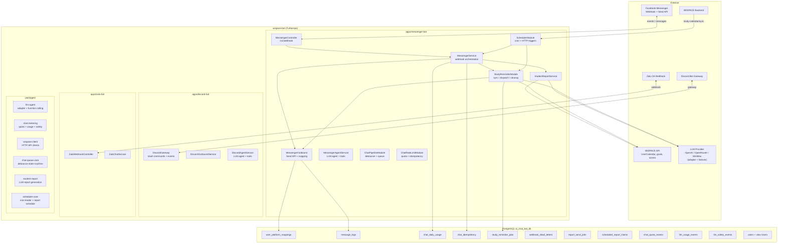

# Overview — WISPACE Bots (Turborepo Monorepo)

Turborepo monorepo connecting **WISPACE** (IELTS Writing learning platform) with **Facebook Messenger**, **Discord**, and **Zalo**: students link accounts, receive AI progress reports and upcoming study session reminders.

| App | Status |
|-----|--------|
| `apps/messenger-bot` | Fully functional — chat, reports, reminders, rate limit |
| `apps/discord-bot` | Fully functional — chat, quota, pending cap + typing indicator, 6/7 tool handlers, report cron |
| `apps/zalo-bot` | Fully functional — chat, quota, pending cap, account linking, report cron, study reminders, CI/CD |

Shared packages (`packages/`): `llm-agent`, `chat-metering`, `chat-agent`, `wispace-client`, `chat-history`, `student-report`, `chat-queue-core`, `chat-pipeline`, `study-reminder-shared`, `scheduler-core`, `ops-health`, `bot-metrics`, `cleanup-cron`, `reschedule-confirm`, `bot-common`, `database`, `doppler-sync`, `date-utils`.

This project prioritizes fast shipping, with a **dedicated** PostgreSQL DB (`ai_chat_bot_db`) + WISPACE HTTP API, not yet separated into a standalone microservice.

---

## 1. Existing Features

### 1.1. Platform ↔ WISPACE Linking

- Students open `m.me/{page}?ref={token}&topic=...&cadence=...` links issued by WISPACE (Messenger), or use Discord/Zalo OAuth linking.
- Webhook/OAuth receives the event → saves `user_id` ↔ `external_user_id` + `platform` to `user_platform_mappings`.
- Bot menu (Messenger persistent menu, Discord slash commands): register reports, view progress, preview study reminders.

### 1.2. Study Reports (Exam Reminder Report)

- **Automatic:** cron **08:00** daily — sends reports to registered users within a **2–3 day** window before the exam (`WISPACE_REPORT_DAYS_BEFORE_EXAM_*`).
- **Manual:** menu **"View Learning Progress"** or `POST /messenger/send-reports`.
- Data: WISPACE API (`TaskScoreAverage`, `User/goals`) → OpenAI → Vietnamese message.

### 1.3. Study Session Reminders

- **Automatic:** sync schedule → `study_reminder_jobs` table → dispatch **30 minutes** before class (configurable via `.env`).
- **On schedule change:** WISPACE calls `POST /messenger/study-calendar/sync` with `{ userId }` immediately after POST/DELETE `UserCalendar`.
- **Preview:** menu **"Upcoming Study Reminders"**.
- Schedule source: `UserCalendar` API (`x-psid`) — API-only (I3 ✓).
- Details: [study-session-reminder.md](../apps/messenger-bot/docs/study-session-reminder.md).

### 1.4. Free-form Chat + Rate Limit (FREE_FORM)

- WISPACE-linked users can **send text messages** → bot replies via LLM agent (`MessengerChatEnqueueService` debounce → `MessengerChatProcessorService` → `MessengerAgentService`).
- **Daily quota** per `(platform, external_user_id, usage_date)` ICT — `chat_daily_usage`; idempotency `message.mid` — `chat_idempotency`.
- **Burst** `CHAT_BURST_PER_MINUTE`/min; **hard cap** concurrent (H3); **hint** "X remaining" (Phase 6).
- Menu postback, reminder cron, proactive reports — **no** quota deduction.
- **Single instance:** `CHAT_QUEUE_STORE=memory` (RAM debounce). **≥2 pods:** `CHAT_QUEUE_STORE=redis` (requires `REDIS_ENABLED=true`; `CHAT_QUEUE_SHARED=true` maps to `redis`).
- Details + runbook: [chat-rate-limit-quota.md](../apps/messenger-bot/docs/chat-rate-limit-quota.md), section 12 below.

---

## 2. Architecture



### Main Flows

| Flow | Trigger | Result |
|------|---------|--------|
| Registration / webhook | Meta sends POST `/webhook` | Save mapping, reply to message |
| Exam-scheduled reports | Cron 08:00 or postback | LLM report → Messenger |
| Schedule change | WISPACE `POST /messenger/study-calendar/sync` | Sync jobs by `userId` |
| Study reminders (automatic) | Cron sync 30min + adaptive dispatch (S2) | Job queue → LLM reminder → Messenger |
| Free-form chat (text) | Webhook text → debounce queue | Reserve quota → LLM agent → Messenger |
| Ops / test | `POST /messenger/*` | Full sync, manual send |

### Responsibility Boundaries

| Component | Belongs to this project | Belongs to WISPACE (external) |
|-----------|---------------------|-------------------------------|
| Messenger message sending, bot menu | ✓ | |
| Mapping + logs + jobs tables | ✓ (migration) | |
| `UserCalendars`, user profiles | Read only | ✓ owns the data |
| Sync on schedule change | `POST /messenger/study-calendar/sync` | ✓ WISPACE calls after POST/DELETE schedule |
| `UserCalendar`, goals, scores API | Call (x-psid) | ✓ hosts API |
| Calling sync after schedule change | Receives `POST study-calendar/sync` | ✓ calls after POST/DELETE schedule |

---

## 3. Code Structure

Repo uses **Clean Architecture** — each feature in `src/modules/<name>/` has 4 layers: `domain` → `application` → `infrastructure` → `presentation`. Rule details: [AGENTS.md § Clean Architecture](../AGENTS.md#clean-architecture) and `.claude/rules/clean-architecture.md`.

```
wispace-bot/                          # Turborepo root
├── apps/
│   ├── messenger-bot/                # Messenger Bot (NestJS)
│   │   ├── src/
│   │   │   ├── main.ts, app.module.ts
│   │   │   ├── shared/
│   │   │   │   ├── config/poc.constants.ts
│   │   │   │   ├── common/           # InternalApiKeyGuard
│   │   │   │   └── prompts/          # *.system.txt
│   │   │   ├── infrastructure/
│   │   │   │   ├── database/         # TypeORM entities, migrations
│   │   │   │   └── redis/            # Redis client, health
│   │   │   └── modules/
│   │   │       ├── messenger/        # domain | application | infrastructure | presentation
│   │   │       │   ├── chat-pipeline.module.ts
│   │   │       │   ├── user-linking.module.ts
│   │   │       │   └── messenger-outbound.module.ts
│   │   │       ├── chat-rate-limit/  # quota + idempotency (H2–H7)
│   │   │       ├── llm-execution/    # LLM provider adapter + concurrency gate
│   │   │       ├── llm-usage/        # LLM token usage tracking
│   │   │       ├── llm-safety/       # LLM hallucination event tracking
│   │   │       ├── student-report/   # Wispace goals/scores → LLM report
│   │   │       ├── study-reminder/   # sync / dispatch / cleanup
│   │   │       ├── scheduler/        # cron + HTTP ops endpoints
│   │   │       └── metrics/          # Prometheus /metrics
│   │   ├── docs/
│   │   ├── scripts/                  # CLI utilities (not run in app)
│   │   └── .env.example
│   ├── discord-bot/                  # Discord bot (NestJS)
│   └── zalo-bot/                     # Zalo bot (NestJS)
├── packages/                         # Shared packages
│   ├── llm-agent/                    # LLM adapter + function calling
│   ├── chat-metering/                # quota + usage + safety
│   ├── wispace-client/               # HTTP API clients
│   ├── chat-history/                 # in-memory chat history store
│   ├── student-report/               # LLM report generation
│   ├── chat-queue-core/              # debounce state machine
│   ├── study-reminder-shared/        # reminder schedule + dispatch + sync + worker
│   ├── scheduler-core/               # cron leader + report schedule
│   ├── ops-health/                   # ops health snapshot
│   ├── bot-metrics/                  # Prometheus metrics
│   └── cleanup-cron/                 # shared cleanup utilities
├── .env.shared.example               # Cross-bot shared env vars
└── turbo.json
```

### NestJS Modules

| Module | Role |
|--------|------|
| `DatabaseModule` | TypeORM + PostgreSQL, auto migration on start |
| `RedisModule` | Redis client lifecycle + health check |
| `MessengerOutboundModule` | Send API, `MessengerRepository`, ports `MESSAGE_SENDER`, `MESSENGER_MAPPING_READER` |
| `MessengerModule` | Webhook orchestration, profile menu, message log, dead letter |
| `ChatPipelineModule` | Chat queue debounce + agent LLM + tools + store resolvers (split from MessengerModule) |
| `UserLinkingModule` | Link flow + mapping + token verify (split from MessengerModule) |
| `ChatRateLimitModule` | FREE_FORM quota: `checkQuota`, `reserve`, `refund`, burst counter, idempotency |
| `LlmExecutionModule` | LLM provider adapter (OpenAI/OpenRouter/MiniMax failover) + concurrency gate |
| `LlmUsageModule` | LLM token usage tracking (inline persist) + cleanup cron |
| `LlmSafetyModule` | LLM hallucination/safety event tracking + cleanup |
| `StudentReportModule` | WISPACE goals/scores → `StudentReportService` (LLM report) |
| `StudyReminderModule` | Schedule sync, job dispatch, cleanup, LLM study reminders |
| `SchedulerModule` | `ReportCronService`, operational HTTP endpoints |
| `MetricsModule` | Prometheus `/metrics` endpoint |

`AppModule` imports `StudyReminderModule` directly. `StudyReminderModule` imports `MessengerOutboundModule` (no `forwardRef` with `MessengerModule`). Reminder dispatch sends messages via port `MESSAGE_SENDER`, not by calling `MessengerService` directly.

---

## 4. Database

### Tables Created (migration)

| Table | Purpose |
|-------|---------|
| `user_platform_mappings` | `user_id`, `external_user_id`, `platform` (messenger/discord/zalo), `cadence`, `topic`, `status` |
| `message_logs` | Audit of sent / failed messages |
| `chat_daily_usage` | FREE_FORM chat quota counter per `(external_user_id, usage_date)` (from `@wispace/chat-metering`) |
| `chat_idempotency` | Idempotency `message.mid` when reserving quota (from `@wispace/chat-metering`) |
| `study_reminder_jobs` | Reminder queue (`pending` → `sent` / …) |
| `scheduled_report_claims` | Multi-pod 08:00 report cron claim + advisory lock |
| `report_send_jobs` | Outbox retry for report cron 5xx (R5) |
| `webhook_dead_letters` | Dead-letter webhook entries + auto-retry |
| `chat_quota_events` | Dual-write quota audit events (C2 hybrid) |
| `llm_usage_events` | LLM token usage tracking (from `@wispace/chat-metering`) |
| `llm_safety_events` | LLM hallucination/safety event tracking (from `@wispace/chat-metering`) |
| `users` + view `"Users"` | Display name / exam date cache — Redis `cache:user:display:{userId}` when R5 enabled |

Migration: `1717747200008-CreateMessengerUsersCacheTable`.

### WISPACE (HTTP API — no local tables except `users` cache)

| Source | Used for |
|--------|----------|
| `UserCalendar` API (`x-psid`) | Upcoming schedules (API-only, I3 ✓) |
| `User/goals`, `TaskScoreAverage` API | Reports, exam dates |

---

## 5. HTTP API

### Messenger (public / Meta)

| Method | Path | Description |
|--------|------|-------------|
| GET | `/v1/webhook` | Meta webhook verification |
| POST | `/v1/webhook` | Receive messaging events (guard `X-Hub-Signature-256` when `MESSENGER_WEBHOOK_SIGNATURE_VERIFY` enabled) |
| POST | `/v1/messenger/profile/setup` | Configure get started + persistent menu (requires `INTERNAL_API_KEY`) |

All bot HTTP APIs are versioned under `/v1` (global prefix). Infra endpoints (`/health*`, `/metrics`) are excluded and stay unversioned.

`m.me` links are only issued by the **WISPACE backend** (opaque token) — no more `GET /messenger/m-me-link`.

### Operations & WISPACE Integration

All endpoints below require header **`X-Internal-Api-Key`** (or `Authorization: Bearer …`) matching `INTERNAL_API_KEY` in `.env`.

| Method | Path | Body | Description |
|--------|------|------|-------------|
| POST | `/v1/messenger/study-calendar/sync` | `{ "userId": number }` | **Called by WISPACE** after POST/DELETE `UserCalendar` |
| POST | `/v1/messenger/send-reports` | `{ "psid"?: string, "allowDuplicate"?: boolean }` | Ops send reports: bypass exam window; defaults to skip already sent today |
| POST | `/v1/messenger/send-reports/retry-dispatch` | — | Manually dispatch outbox R5 |
| POST | `/v1/messenger/sync-study-reminders` | — | Sync all users (ops / fallback cron) |
| POST | `/v1/messenger/send-study-reminders` | — | Sync + dispatch due jobs |
| POST | `/v1/messenger/study-reminder/evening-rollover` | — | Trigger evening rollover job state transitions |
| POST | `/v1/messenger/profile/setup` | — | Configure bot menu (ops) |
| POST | `/v1/messenger/mapping/relink` | `{ "psid": string, "userId": number, "allowRelink"?: boolean }` | Ops relink PSID to userId |
| POST | `/v1/messenger/ops/doppler-sync` | — | Doppler webhook runtime sync + container restart |
| GET | `/v1/messenger/ops/llm-usage/summary` | Query: `psid` **or** `userId`; `from`/`to` (YYYY-MM-DD, default today) | Total tokens + estimated USD per feature for one student |
| GET | `/v1/messenger/ops/llm-usage/fleet` | Query: `date` (YYYY-MM-DD, default today) | Total tokens + estimated USD fleet-wide by feature |
| GET | `/health/db` | — | DB health check |
| GET | `/health/redis` | — | Redis health check (503 when enabled but unreachable) |
| GET | `/metrics` | — | Prometheus metrics scrape |

Internal cron (30-minute sync, adaptive dispatch) does **not** go through HTTP — no API key needed.

---

## 6. Cron Jobs

| Name | Schedule | Service |
|------|----------|---------|
| `exam-reminder-report` | `0 8 * * *` (08:00 ICT) | `ReportCronService` — daily student reports |
| `report-send-retry` | `*/15 * * * *` | `ReportSendRetryDispatchService` — outbox R5 retry |
| `ops-health-daily` | `0 0 9 * * *` (09:00 ICT) | `OpsHealthCronService` — ops health alert |
| `study-reminder-sync` | `0 */30 * * * *` (every 30 min) | `StudyReminderWorkerService` — sync upcoming sessions |
| `study-reminder-dispatch` | Adaptive 30s–3.5min (`STUDY_REMINDER_POLL_*`) | `StudyReminderWorkerService` — S2 adaptive dispatch |
| `study-reminder-cleanup` | `0 0 3 * * *` (03:00) | `StudyReminderWorkerService` — purge old terminal jobs |
| `study-reminder-evening-rollover` | Dynamic (config hour, ICT) | `StudyReminderWorkerService` — rollover job states |
| `messenger-message-log-cleanup` | `0 0 3 * * 1` (Monday 03:00 ICT) | `MessengerMessageLogCleanupService` — purge old message_logs |
| `messenger-chat-queue-flush` | `*/2 * * * * *` (every 2 sec) | `MessengerChatQueueWorkerService` — flush debounced queue (distributed mode) |
| `webhook-dead-letter-retry` | `0 */5 * * * *` (every 5 min) | `MessengerWebhookDeadLetterCronService` — retry dead-letter webhooks |
| `chat-quota-events-cleanup` | `0 30 3 1 * *` (1st of month 03:30 ICT) | `ChatQuotaEventCleanupCronService` — purge old chat_quota_events |
| `llm-usage-cleanup` | `0 0 4 1 * *` (1st of month 04:00 ICT) | `LlmUsageCleanupCronService` — purge old llm_usage_events |
| `llm-safety-cleanup` | `0 3 * * *` (daily 03:00 ICT) | `LlmSafetyCleanupService` — purge old llm_safety_events |

Study reminder sync also runs **on server start** (`onModuleInit`).

---

## 7. OpenAI & Prompts

System prompts are in `src/shared/prompts/*.system.txt`, loaded via `load-system-prompt.ts`. Nest copies them to `dist/shared/prompts/` on build (`nest-cli.json` → `assets`).

| File | Used by |
|------|---------|
| `student-report.system.txt` | `modules/student-report/application/services/student-report.service.ts` |
| `study-reminder.system.txt` | `modules/study-reminder/application/services/study-reminder.service.ts` |
| `messenger-chat.system.txt` | `modules/messenger/application/agent/messenger-agent.service.ts` |

Missing `OPENAI_API_KEY` → fallback to hardcoded templates in service (no API call).

All `chat.completions.create` calls go through **`LlmExecutionService`** (`src/modules/llm-execution/`) — caps concurrent in-process calls (`p-limit`, `LLM_MAX_CONCURRENT`), retries 429/5xx (`LLM_OPENAI_RETRY_*`). Disable gate: `LLM_EXECUTION_ENABLED=false`. Scaling ≥2 pods: in-memory gate does **not** share across pods — Redis gate needed later.

LLM safety:

- `MessengerAgentService` blocks English/Vietnamese prompt injection before OpenAI, redacts malicious history, caps context, and sanitizes JSON-format tool results.
- External data from WISPACE/user profile entering reminders/reports must be sanitized via `src/shared/utils/prompt-injection.utils.ts`.
- JSON output from OpenAI must be parsed + shape-validated via `src/shared/utils/llm-json-output.utils.ts`; invalid shape falls back to template, no direct type casting for formatting.

## 7.1. AbortSignal propagation (LLM + WISPACE calls)

Timeout/cancellation now aborts the underlying request instead of only rejecting the caller:

- **Shared utils** — `packages/bot-common/src/abort.utils.ts`: `isAbortError` (matches `AbortError` + `TimeoutError` deadlines) and signal-aware `sleep(ms, signal)` (rejects on abort). Re-exported by `packages/llm-agent/src/utils/retry.utils.ts` and `packages/wispace-client/src/utils/with-retry.ts`.
- **LLM** — `LlmAgentInput.signal` / `LlmJsonRequest.signal` propagate through `agent.service` → OpenAI adapter (`completions.create` second arg) → failover loop stops on abort. The agent loop aborts the in-flight provider call on its own `globalAgentTimeoutMs` deadline; retry backoff sleeps abort when the signal fires. `LlmExecutionService` (messenger) accepts `LlmExecutionContext.signal` and merges it with a per-call deadline for `retryWithBackoff`.
- **WISPACE clients** — each fetch attempt uses `mergeWithTimeout(callerSignal, requestTimeoutMs)` (`packages/wispace-client/src/utils/abort-signal.utils.ts`): the caller signal cancels the whole call, the per-attempt timeout aborts the in-flight fetch so no retry overlaps a timed-out request. `AbortError`/`TimeoutError` are never retried (`isWispaceRetryable` / retry-loop guards).
- **Budgets** — circuit-breaker timeout = total budget: `computeCircuitBreakerTimeout(requestTimeoutMs, maxRetries)` = `requestTimeoutMs * (maxRetries + 1) + 10_000` (see `packages/wispace-client/src/utils/with-retry.ts`).
- `UserCalendarScheduleClient.getCalendarSessions({ swallowErrors: true })` rethrows abort errors — cancellation is never masked as "no sessions".

---

## 8. `.env` Configuration

See `.env.example` (app-specific) + `.env.shared.example` (cross-bot shared config at repo root). Main groups:

- **Meta:** `PAGE_ACCESS_TOKEN`, `VERIFY_TOKEN`, `MESSENGER_APP_SECRET`, `MESSENGER_WEBHOOK_SIGNATURE_VERIFY`, `MESSENGER_PAGE_ID`, `GRAPH_API_VERSION`
- **OpenAI (shared):** `OPENAI_API_KEY`, `OPENAI_MODEL`
- **LLM failover (shared):** `LLM_PROVIDER_FAILOVER_ORDER` (CSV: `openai,openrouter,minimax`; empty = no failover), `OPENROUTER_API_KEY`, `OPENROUTER_MODEL`, `OPENROUTER_BASE_URL`, `MINIMAX_API_KEY`, `MINIMAX_MODEL`, `MINIMAX_BASE_URL`, `LLM_FAILOVER_COOLDOWN_LONG_MS`, `LLM_FAILOVER_COOLDOWN_SHORT_MS`, `LLM_FAILOVER_QUICK_RETRY_DELAY_MS`
- **LLM execution gate:** `LLM_EXECUTION_ENABLED`, `LLM_MAX_CONCURRENT`, `LLM_OPENAI_RETRY_MAX_ATTEMPTS`, `LLM_OPENAI_RETRY_BACKOFF_MS`
- **LLM global concurrency:** `LLM_GLOBAL_CONCURRENCY_ENABLED`, `LLM_GLOBAL_MAX_CONCURRENT`
- **LLM usage (C2):** `LLM_USAGE_*`; USD estimate: `LLM_COST_USD_PER_1M_INPUT_TOKENS_<MODEL>` / `LLM_COST_USD_PER_1M_OUTPUT_TOKENS_<MODEL>` (e.g. `gpt-5.4` → `GPT_5_4`: input `2.50`, output `15.00` per [OpenAI pricing](https://developers.openai.com/api/docs/pricing); ≠ actual invoice)
- **LLM safety:** `LLM_SAFETY_EVENTS_ENABLED`, `LLM_SAFETY_WARNING_DAILY_THRESHOLD`, `LLM_SAFETY_EVENT_RETENTION_DAYS`
- **WISPACE API (shared):** `WISPACE_API_USER_CALENDAR_URL`, `WISPACE_API_USER_GOALS_URL`, `WISPACE_API_TASK_SCORE_URL`, `WISPACE_INTERNAL_KEY` — auth: `x-psid` + `X-Internal-Key`
- **Study reminder (shared):** `STUDY_REMINDER_*` — **required**, no hardcoded fallbacks in code; `STUDY_REMINDER_STUCK_PROCESSING_MS`
- **Chat rate limit:** `CHAT_RATE_LIMIT_ENABLED`, `CHAT_FREE_FORM_DAILY_LIMIT`, `CHAT_BURST_PER_MINUTE`, `CHAT_BURST_STORE` (R3: `postgres` | `memory` | `redis`), `CHAT_USAGE_TIMEZONE` (shared), `CHAT_RATE_LIMIT_WHITELIST_PSIDS`, `CHAT_QUOTA_REMAINING_HINT_THRESHOLD`, `CHAT_IDEMPOTENCY_STUCK_RESERVED_MS` (H2), `CHAT_MERGED_TEXT_MAX_CHARS` / `CHAT_BURST_COUNT_REFUNDED` (H5), `CHAT_IDEMPOTENCY_RETENTION_DAYS` (H6)
- **Chat quota events:** `CHAT_QUOTA_EVENTS_ENABLED`, `CHAT_QUOTA_EVENTS_RETENTION_DAYS`, `CHAT_QUOTA_EVENTS_CLEANUP_ENABLED`
- **Chat queue:** `CHAT_DEBOUNCE_MS`, `CHAT_MAX_BUBBLES`, `CHAT_BUBBLE_MAX_CHARS`, `CHAT_QUEUE_STORE` (R4), `CHAT_QUEUE_SHARED` (H7 legacy), `CHAT_HISTORY_STORE` (R1), `CHAT_DEDUPE_STORE` (R2), `CHAT_QUEUE_PROCESSING_STUCK_MS`, `CHAT_QUEUE_STALE_TTL_MS`, `CHAT_QUEUE_CLEANUP_INTERVAL_MS`, `CHAT_WEBHOOK_DEDUPE_RETENTION_MS`, `CHAT_HISTORY_TTL_MS`, `CHAT_HISTORY_MAX_MESSAGES`
- **Ops API:** `INTERNAL_API_KEY` — header `X-Internal-Api-Key` for sync / send-reports / profile setup
- **Doppler runtime sync:** `DOPPLER_RUNTIME_SYNC_ENABLED`, `DOPPLER_RUNTIME_TOKEN`, `DOPPLER_PROJECT`, `DOPPLER_CONFIG`, `DOPPLER_RUNTIME_SYNC_DEBOUNCE_SECONDS`
- **Deploy:** `DEPLOY_DIR`, `DEPLOY_ENV_FILE`, `DEPLOY_COMPOSE_FILE`, `DEPLOY_CONTAINER_NAME`, `GHCR_PULL_TOKEN`, `GHCR_USER`, `DEPLOY_UID`, `DEPLOY_GID`, `DOCKER_GID`
- **Exam reports:** `WISPACE_REPORT_DAYS_BEFORE_EXAM_MIN/MAX`, `REPORT_SEND_CONCURRENCY`
- **DB:** `DB_HOST`, `DB_PORT`, `DB_NAME` (`ai_chat_bot_db`), `DB_USER`, `DB_PASSWORD`, `DB_MIGRATIONS_RUN`, `DB_POOL_SIZE`, `DB_POOL_IDLE_TIMEOUT_MS`, `DB_POOL_CONNECTION_TIMEOUT_MS`
- **Redis (optional, VPS):** `REDIS_ENABLED`, `REDIS_HOST`, `REDIS_PORT`, `REDIS_PASSWORD` — R0–R4 stores + R5 user display cache; `GET /health/redis` when enabled
  - Redis runs **standalone on VPS** (folder `~/redis`, Docker publish `6379`) — not in the app repo. Local + prod share `REDIS_HOST` = VPS IP.
- **User display cache (R5):** `USER_DISPLAY_NAME_CACHE_ENABLED`, `USER_DISPLAY_NAME_CACHE_TTL_SECONDS`

---

## 9. NPM Scripts

```bash
npm run start:dev              # Dev server
npm run build                  # Compile + copy prompts
npm run migration:run          # Run migrations
npm run db:inspect             # Explore DB
npm run db:explore-study-schedule
npm run study-reminder:sync    # Build + migrate + sync + dispatch
npm run study-reminder:sync-only
npm run study-reminder:jobs    # Print jobs in DB
npm run study-reminder:jobs -- --failed   # S1: terminal failed
npm run study-reminder:jobs -- --stuck    # S1: stuck processing
npm run ops:health             # I1+S1 combined ops snapshot
npm run chat-quota:status      # Query chat quota (psid / userId / date)
npm run chat-quota:status -- --ops   # I1 fleet summary
npm run chat-quota:status -- --psid=<psid> --date=2026-06-15
npm run chat-quota:recover-stuck   # H2: refund stuck reserved
npm run chat-quota:cleanup         # H6: delete old completed/refunded idempotency records
npm run llm-usage:status           # Query LLM tokens (--psid, --user-id, --ops)
npm run chat-quota:rebuild         # Q1: rebuild daily counter from events
```

---

## 10. Scope & Limitations

- **Single instance** — `CRON_LEADER_ENABLED=false` (default); enable `CHAT_RATE_LIMIT_ENABLED=true` on prod.
- **Scaling ≥2 instances** — chat: `CHAT_QUEUE_SHARED=true` (H7); 08:00 reports: `CRON_LEADER_ENABLED` + `scheduled_report_claims` table (R4 ✓). Preparation runbook: [scale-phase-b-runbook.md](../apps/messenger-bot/docs/scale-phase-b-runbook.md).
- **Multi-platform** — Messenger (fully functional), Discord (fully functional), Zalo (fully functional). Shared packages in `packages/`.
- **Schedule integration** — WISPACE calls `POST /messenger/study-calendar/sync` on schedule change (S0 ✓); 30-minute cron is a fallback.
- **UserCalendar API** — requires `WISPACE_API_USER_CALENDAR_URL`; no more DB fallback.
- **Chat rate limit** — V1 + H1–H7 ✓; remaining project-wide gaps: [edge-cases-roadmap.md](./edge-cases-roadmap.md)
- **LLM Provider Abstraction** — adapter pattern with OpenAI + OpenRouter + MiniMax failover (PR #32).

Detailed study reminder trade-offs: section 11 in [study-session-reminder.md](../apps/messenger-bot/docs/study-session-reminder.md).

---

## 12. Runbook — Chat Rate Limit (V1)

| Parameter | Recommendation | Env |
|-----------|-------------------|-----|
| FREE_FORM / day | 15–20 | `CHAT_FREE_FORM_DAILY_LIMIT` |
| Burst | 3/min | `CHAT_BURST_PER_MINUTE` |
| Timezone reset | 00:00 ICT | `CHAT_USAGE_TIMEZONE=Asia/Ho_Chi_Minh` |
| Enable enforcement | Production | `CHAT_RATE_LIMIT_ENABLED=true` |
| PSID QA unlimited | Team-dependent | `CHAT_RATE_LIMIT_WHITELIST_PSIDS` (comma-separated) |

**Ops quota query:**

```bash
npm run chat-quota:status
npm run chat-quota:status -- --psid=<PSID>
npm run chat-quota:status -- --user-id=143 --date=2026-06-15
```

**Quick disable during incident:** set `CHAT_RATE_LIMIT_ENABLED=false` and restart — no code revert needed.

**No quota deduction:** menu postback, reminder cron, 08:00 reports, `CHAT_QUOTA_DENIED` messages / system errors.

**Hardening H1–H7:** ✓ done — H2 recover stuck, H3 hard cap, H4 send semantics, H5 abuse caps, H6 retention/logs, H7 shared queue. Details: [§5.10](../apps/messenger-bot/docs/chat-rate-limit-quota.md#510-edge-cases-thực-tế--roadmap-hardening-h1h7).

**Recover stuck reserved (H2):**

```bash
npm run chat-quota:status              # view stuckReserved + idempotency stats
npm run chat-quota:recover-stuck -- --dry-run
npm run chat-quota:recover-stuck
```

**Idempotency retention (H6):**

```bash
npm run chat-quota:cleanup -- --dry-run
npm run chat-quota:cleanup
# override: npm run chat-quota:cleanup -- --retention-days=60
```

Log grep (H6 / I1): `CHAT_QUOTA_DENY`, `CHAT_QUOTA_REFUND`, `CHAT_QUOTA_RECOVERED`, `OPS_HEALTH_ALERT`, `OPS_HEALTH_OK`.

**I1 — fleet ops summary:**

```bash
npm run chat-quota:status -- --ops
npm run ops:health
npm run ops:health -- --warn-only   # exit 1 when alert present (external cron)
```

Grep app logs (Docker / PM2 / file):

```bash
grep CHAT_QUOTA_DENY /path/to/app.log | tail -20
grep CHAT_QUOTA_REFUND /path/to/app.log | tail -20
grep CHAT_QUOTA_RECOVERED /path/to/app.log | tail -20
grep OPS_HEALTH_ALERT /path/to/app.log | tail -20
```

Internal cron: `OpsHealthCronService` runs **09:00 ICT** daily (`OPS_HEALTH_ALERT_ENABLED=true`).

**S1 — failed / stuck reminders:**

```bash
npm run study-reminder:jobs -- --summary
npm run study-reminder:jobs -- --failed
npm run study-reminder:jobs -- --stuck
npm run study-reminder:jobs -- --failed --hours=48 --limit=20
```

Combined I1+S1 snapshot: `npm run ops:health`.

**Scale ≥2 instances (H7):**

```env
CHAT_QUEUE_SHARED=true
npm run migration:run
```

Each pod runs a 2s cron poll buffer; debounce/history/`mid` dedupe stored in PostgreSQL.

Architecture details: [chat-rate-limit-quota.md](../apps/messenger-bot/docs/chat-rate-limit-quota.md).

---

## 11. Quick Local Setup

```bash
cp .env.example .env   # fill in real tokens
npm install
npm run migration:run
npm run start:dev
```

Or **Doppler** (no `.env` on disk): see [doppler-secrets.md](../apps/messenger-bot/docs/doppler-secrets.md) → `doppler setup` + `npm run start:dev:doppler`.

Meta webhook points to public URL (ngrok / tunnel) → `POST /v1/webhook`.

After first menu deploy: `POST /v1/messenger/profile/setup`.

Bootstrap reminder jobs: `npm run study-reminder:sync`.

---

## 12. VPS Deploy (Docker + GHCR + self-pull)

GitHub Actions (push to `main`): [`.github/workflows/deploy-bots.yml`](../.github/workflows/deploy-bots.yml) (1 file, 3 jobs: messenger/discord/zalo → `deploy-bot-reusable.yml`) **only builds + pushes the image to GHCR** — it no longer SSHes into the VPS for normal deploys. Shared image build: [`deploy/Dockerfile.bot`](../deploy/Dockerfile.bot) (`ARG APP_NAME`).

**Why no SSH from CI:** the VPS provider's edge network intermittently drops inbound SSH from GitHub Actions runner IPs (`Connection timed out`, independent of port or retry count — confirmed the VPS's own `ufw`/`iptables`/`sshd` show nothing, so the drop happens upstream of the box). Retrying from CI doesn't help since it's not a rate limit.

**VPS self-pull instead:** a cron job on the VPS runs [`.github/scripts/vps-self-pull-deploy.sh`](../.github/scripts/vps-self-pull-deploy.sh) every few minutes — `git fetch`/`reset` a local clone, check GHCR for an image tagged with the new commit SHA, and if published, run the existing [`vps-deploy.sh`](../.github/scripts/vps-deploy.sh) (unchanged: blue-green swap, health check, migrations, nginx switch). All outbound from the VPS, so the inbound edge-filter never applies. One-time setup (git clone + crontab entry + `GHCR_USER`/`GHCR_PULL_TOKEN`) is documented in the script's header comment.

`.env` sync is separate and unaffected: Doppler webhook → each bot's `/v1/*/ops/doppler-sync` HTTP endpoint (see `packages/doppler-sync`) keeps `.env` current independently of image deploys — no SSH involved either.

| GitHub Secret | Purpose |
|---------------|---------|
| `GHCR_PULL_TOKEN` | PAT `read:packages` — image build/push, and VPS `docker login ghcr.io` to pull |
| `VPS_HOST`, `VPS_USER`, `SSH_PRIVATE_KEY` | Only used by [`sync-env.yml`](../.github/workflows/sync-env.yml) (`env_only=true`, manual `workflow_dispatch`) — legacy env-only SSH path, kept as a fallback since it's rarely triggered |
| `DOPPLER_TOKEN` | Service token for **prd** config — used by `sync-env.yml` and the Doppler webhook sync |

Image: `ghcr.io/lengocanh2005it/wispace-bot/<app>:<commit-sha>` (also tagged `:latest`).

On VPS: `docker-compose.prod.yml` + `.env` at `/home/ngoc_anh/<app>/`. Legacy PM2 `publish/` no longer used after migration.

**Prod public URL:** `https://aiassist.aihubproduction.com` (Nginx → `127.0.0.1:5007`). Docker binds **localhost only** — does not expose `:5007` to the internet. Nginx: `client_max_body_size` + rate limit on `POST /v1/webhook` — see [`deploy/nginx/README.md`](../deploy/nginx/README.md).

Setup details for project/config `dev` + `prd`: [doppler-secrets.md](../apps/messenger-bot/docs/doppler-secrets.md).
