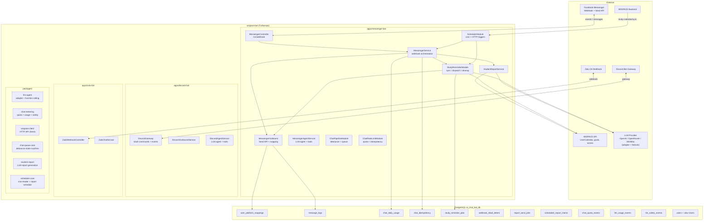

# Overview — WISPACE Bots (Turborepo Monorepo)

Turborepo monorepo connecting **WISPACE** (IELTS Writing learning platform) with **Facebook Messenger**, **Discord**, and **Zalo**: students link accounts, receive AI progress reports and upcoming study session reminders.

| App                  | Status                                                                                                                                                                              |
| -------------------- | ----------------------------------------------------------------------------------------------------------------------------------------------------------------------------------- |
| `apps/messenger-bot` | Fully functional — chat, reports, reminders, rate limit                                                                                                                             |
| `apps/discord-bot`   | Fully functional — chat, quota, pending cap + typing indicator, queued-failure fallback, OAuth account linking, 7/7 real tool handlers, report cron, study reminders, and CI/CD     |
| `apps/zalo-bot`      | Fully functional — chat, quota, pending cap, queued-failure fallback, account linking, 7/7 real tool handlers, report cron, study reminders, CI/CD, and shared health/ops hardening |

Shared packages (`packages/`): `llm-agent`, `chat-metering`, `chat-agent`, `wispace-client`, `chat-history`, `student-report`, `chat-queue-core`, `chat-pipeline`, `study-reminder-shared`, `scheduler-core`, `ops-health`, `bot-metrics`, `cleanup-cron`, `reschedule-confirm`, `bot-common`, `database`, `doppler-sync`, `date-utils`.

This project prioritizes fast shipping, with a **dedicated** PostgreSQL DB (`ai_chat_bot_db`) + WISPACE HTTP API, not yet separated into a standalone microservice.

---

## 1. Existing Features

### 1.1. Platform ↔ WISPACE Linking

- Students open `m.me/{page}?ref={token}&topic=...&cadence=...` links issued by WISPACE (Messenger), or use Discord/Zalo OAuth linking.
- Webhook/OAuth receives the event → saves `user_id` ↔ `external_user_id` + `platform` to `user_platform_mappings`.
- Bot menu (Messenger persistent menu, Discord slash commands): register reports, view progress, preview study reminders.

### 1.2. Study Reports (Exam Reminder Report)

- **Automatic:** cron **08:00** daily — sends reports to registered users within a **2–3 day** window before the exam (`WISPACE_REPORT_DAYS_BEFORE_EXAM_*`).
- **Manual:** menu **"View Learning Progress"** or `POST /messenger/send-reports`.
- Data: WISPACE API (`TaskScoreAverage`, `User/goals`) → OpenAI → Vietnamese message.

### 1.3. Study Session Reminders

- **Automatic:** sync schedule → `study_reminder_jobs` table → dispatch **30 minutes** before class (configurable via `.env`).
- **On schedule change:** WISPACE calls `POST /messenger/study-calendar/sync` with `{ userId }` immediately after POST/DELETE `UserCalendar`.
- **Preview:** menu **"Upcoming Study Reminders"**.
- Schedule source: `UserCalendar` API (`x-psid`) — API-only (I3 ✓).
- Details: [study-session-reminder.md](../apps/messenger-bot/docs/study-session-reminder.md).

### 1.4. Free-form Chat + Rate Limit (FREE_FORM)

- WISPACE-linked users can **send text messages** → bot replies via LLM agent (`MessengerChatEnqueueService` debounce → `MessengerChatProcessorService` → `MessengerAgentService`).
- **Daily quota** per `(platform, external_user_id, usage_date)` ICT — `chat_daily_usage`; idempotency `message.mid` — `chat_idempotency`.
- **Burst** `CHAT_BURST_PER_MINUTE`/min; **hard cap** concurrent (H3); **hint** "X remaining" (Phase 6).
- Menu postback, reminder cron, proactive reports — **no** quota deduction.
- Messenger report registration from chat is accepted only for an explicit request such as “đăng ký nhận báo cáo” or “muốn nhận báo cáo tự động”; ambiguous requests are acknowledged without account lookup or subscription writes.
- **Development/test:** `CHAT_QUEUE_STORE=memory` (RAM debounce). **Production:** all three bots require `CHAT_QUEUE_STORE=redis` (requires `REDIS_ENABLED=true`; `CHAT_QUEUE_SHARED=true` maps to `redis`). Enqueue writes are awaited before the Messenger/Zalo durable inbox completes; persistent Redis failures remain retryable. Redis keys use the legacy `chat:queue:*` namespace for Messenger and `chat:queue:discord:*` / `chat:queue:zalo:*` for the other bots.
- **Clarification follow-ups (#401):** ambiguous or contradictory chat is answered with a bounded menu and never reaches the LLM/tools until one choice is selected. State is keyed by platform + external user id and bounded by `CHAT_CLARIFICATION_TTL_MS`, `CHAT_CLARIFICATION_MAX_ATTEMPTS`, and `CHAT_CLARIFICATION_MAX_MENU_RESETS`; recent event ids form a short tombstone so delayed/replayed choices cannot execute tools. Definitive clarification-delivery failures are persisted in the outbound dead-letter table with a stable `deliveryKey` for the platform retry cron; ambiguous transport failures are not auto-resend.

### 1.5. Precreate Next Roadmap Exercise

- A clear natural-language request such as “tạo bài tập cho mình” may call the no-argument `precreate_next_exercise` tool on Messenger, Discord, or Zalo. It creates only the next exercise in the learner's roadmap and requires a linked account.
- The tool calls `POST WISPACE_API_PRECREATE_EXERCISE_URL` with an empty body and `X-Internal-Key: WISPACE_INTERNAL_KEY`. The platform identity header is `x-psid`, `x-discordid`, or `x-zaloid` respectively. The API is idempotent, so this POST is never automatically retried.
- `WISPACE_API_PRECREATE_EXERCISE_TIMEOUT_MS` is required (the example value is `30000`); LLM tool execution is limited to 35 seconds. Responses require an absolute HTTPS URL for `created` and `already_exists`; status flags are authoritative and advisory `message` text is sanitized before use.
- The current API accepts no `taskType`, `exerciseTopic`, `topic`, or `difficulty` selection. A future extension may support `taskType`/`exerciseTopic` when WISPACE provides the corresponding API contract.
- **Discord/Zalo queued failures:** a failure before the main reply is delivered sends one direct generic Vietnamese fallback through the outbound service. The fallback never re-enters the chat queue; original pipeline failures and fallback delivery failures are logged separately. Outbound sends retry only rate limits/5xx and explicit network failures; known 4xx/auth/validation errors fail fast. Discord retries reuse a stable `nonce` with `enforceNonce=true`; Zalo has no equivalent idempotency field in the current send payload. Timeout/ambiguous outcomes are recorded as `dm_send_ambiguous` and are not retried (#156).
- Details + runbook: [chat-rate-limit-quota.md](../apps/messenger-bot/docs/chat-rate-limit-quota.md), section 12 below.

---

## 2. Architecture



### Main Flows

| Flow                        | Trigger                                       | Result                                |
| --------------------------- | --------------------------------------------- | ------------------------------------- |
| Registration / webhook      | Meta sends POST `/webhook`                    | Save mapping, reply to message        |
| Exam-scheduled reports      | Cron 08:00 or postback                        | LLM report → Messenger                |
| Schedule change             | WISPACE `POST /messenger/study-calendar/sync` | Sync jobs by `userId`                 |
| Study reminders (automatic) | Cron sync 30min + adaptive dispatch (S2)      | Job queue → LLM reminder → Messenger  |
| Free-form chat (text)       | Webhook text → debounce queue                 | Reserve quota → LLM agent → Messenger |
| Ops / test                  | `POST /messenger/*`                           | Full sync, manual send                |

### Responsibility Boundaries

| Component                           | Belongs to this project               | Belongs to WISPACE (external)              |
| ----------------------------------- | ------------------------------------- | ------------------------------------------ |
| Messenger message sending, bot menu | ✓                                     |                                            |
| Mapping + logs + jobs tables        | ✓ (migration)                         |                                            |
| `UserCalendars`, user profiles      | Read only                             | ✓ owns the data                            |
| Sync on schedule change             | `POST /messenger/study-calendar/sync` | ✓ WISPACE calls after POST/DELETE schedule |
| `UserCalendar`, goals, scores API   | Call (x-psid)                         | ✓ hosts API                                |
| Calling sync after schedule change  | Receives `POST study-calendar/sync`   | ✓ calls after POST/DELETE schedule         |

---

## 3. Code Structure

Repo uses **Clean Architecture** — each feature in `src/modules/<name>/` has 4 layers: `domain` → `application` → `infrastructure` → `presentation`. Rule details: [AGENTS.md § Clean Architecture](../AGENTS.md#clean-architecture) and `.claude/rules/clean-architecture.md`.

```
wispace-bot/                          # Turborepo root
├── apps/
│   ├── messenger-bot/                # Messenger Bot (NestJS)
│   │   ├── src/
│   │   │   ├── main.ts, app.module.ts
│   │   │   ├── shared/
│   │   │   │   ├── config/poc.constants.ts
│   │   │   │   ├── common/           # InternalApiKeyGuard
│   │   │   │   └── prompts/          # *.system.txt
│   │   │   ├── infrastructure/
│   │   │   │   ├── database/         # TypeORM entities, migrations
│   │   │   │   └── redis/            # Redis client, health
│   │   │   └── modules/
│   │   │       ├── messenger/        # domain | application | infrastructure | presentation
│   │   │       │   ├── chat-pipeline.module.ts
│   │   │       │   ├── user-linking.module.ts
│   │   │       │   └── messenger-outbound.module.ts
│   │   │       ├── chat-rate-limit/  # quota + idempotency (H2–H7)
│   │   │       ├── llm-execution/    # LLM provider adapter + concurrency gate
│   │   │       ├── llm-usage/        # LLM token usage tracking
│   │   │       ├── llm-safety/       # LLM hallucination event tracking
│   │   │       ├── student-report/   # Wispace goals/scores → LLM report
│   │   │       ├── study-reminder/   # sync / dispatch / cleanup
│   │   │       ├── scheduler/        # cron + HTTP ops endpoints
│   │   │       └── metrics/          # Prometheus /metrics
│   │   ├── docs/
│   │   ├── scripts/                  # CLI utilities (not run in app)
│   │   └── .env.example
│   ├── discord-bot/                  # Discord bot (NestJS)
│   └── zalo-bot/                     # Zalo bot (NestJS)
├── packages/                         # Shared packages
│   ├── llm-agent/                    # LLM adapter + function calling
│   ├── chat-metering/                # quota + usage + safety
│   ├── wispace-client/               # HTTP API clients
│   ├── chat-history/                 # in-memory chat history store
│   ├── student-report/               # LLM report generation
│   ├── chat-queue-core/              # debounce state machine
│   ├── study-reminder-shared/        # reminder schedule + dispatch + sync + worker
│   ├── scheduler-core/               # cron leader + report schedule
│   ├── ops-health/                   # ops health snapshot
│   ├── bot-metrics/                  # Prometheus metrics
│   └── cleanup-cron/                 # shared cleanup utilities
├── .env.shared.example               # Cross-bot shared env vars
└── turbo.json
```

### NestJS Modules

| Module                    | Role                                                                                   |
| ------------------------- | -------------------------------------------------------------------------------------- |
| `DatabaseModule`          | TypeORM + PostgreSQL, auto migration on start                                          |
| `RedisModule`             | Redis client lifecycle + health check                                                  |
| `MessengerOutboundModule` | Send API, `MessengerRepository`, ports `MESSAGE_SENDER`, `MESSENGER_MAPPING_READER`    |
| `MessengerModule`         | Webhook orchestration, profile menu, message log, dead letter                          |
| `ChatPipelineModule`      | Chat queue debounce + agent LLM + tools + store resolvers (split from MessengerModule) |
| `UserLinkingModule`       | Link flow + mapping + token verify (split from MessengerModule)                        |
| `ChatRateLimitModule`     | FREE_FORM quota: `checkQuota`, `reserve`, `refund`, burst counter, idempotency         |
| `LlmExecutionModule`      | LLM provider adapter (OpenAI/OpenRouter/MiniMax failover) + concurrency gate           |
| `LlmUsageModule`          | LLM token usage tracking (inline persist) + cleanup cron                               |
| `LlmSafetyModule`         | LLM hallucination/safety event tracking + cleanup                                      |
| `StudentReportModule`     | WISPACE goals/scores → `StudentReportService` (LLM report)                             |
| `StudyReminderModule`     | Schedule sync, job dispatch, cleanup, LLM study reminders                              |
| `SchedulerModule`         | `ReportCronService`, operational HTTP endpoints                                        |
| `MetricsModule`           | Prometheus `/metrics` endpoint                                                         |

`AppModule` imports `StudyReminderModule` directly. `StudyReminderModule` imports `MessengerOutboundModule` (no `forwardRef` with `MessengerModule`). Reminder dispatch sends messages via port `MESSAGE_SENDER`, not by calling `MessengerService` directly.

---

## 4. Database

### Tables Created (migration)

| Table                         | Purpose                                                                                           |
| ----------------------------- | ------------------------------------------------------------------------------------------------- |
| `user_platform_mappings`      | `user_id`, `external_user_id`, `platform` (messenger/discord/zalo), `cadence`, `topic`, `status`  |
| `message_logs`                | Metadata audit of sent / failed messages (message bodies omitted for privacy, #262)               |
| `chat_daily_usage`            | FREE_FORM chat quota counter per `(external_user_id, usage_date)` (from `@wispace/chat-metering`) |
| `chat_idempotency`            | Idempotency `message.mid` when reserving quota (from `@wispace/chat-metering`)                    |
| `study_reminder_jobs`         | Reminder queue (`pending` → `sent` / …)                                                           |
| `scheduled_report_claims`     | Multi-pod 08:00 report cron claim + advisory lock                                                 |
| `report_send_jobs`            | Outbox retry for report cron 5xx (R5)                                                             |
| `webhook_dead_letters`        | Dead-letter webhook entries + auto-retry                                                          |
| `chat_quota_events`           | Dual-write quota audit events (C2 hybrid)                                                         |
| `llm_usage_events`            | LLM token usage tracking (from `@wispace/chat-metering`)                                          |
| `llm_safety_events`           | LLM hallucination/safety event tracking (from `@wispace/chat-metering`)                           |
| `users` + view `"Users"`      | Display name / exam date cache — Redis `cache:user:display:{userId}` when R5 enabled              |
| `discord_account_links`       | Discord ↔ WISPACE mapping (`last_welcomed_at` dedupes welcome DMs, #137)                          |
| `discord_link_verify_records` | Durable verify-intent outbox — reconciled by the `discord-link-reconcile` cron (#137)             |

Migration: `1717747200008-CreateMessengerUsersCacheTable`.

### WISPACE (HTTP API — no local tables except `users` cache)

| Source                               | Used for                                                                  |
| ------------------------------------ | ------------------------------------------------------------------------- |
| `UserCalendar` API (`x-psid`)        | Upcoming schedules (API-only, I3 ✓)                                       |
| `User/goals`, `TaskScoreAverage` API | Reports, exam dates                                                       |
| `roadmap/precreate-exercise` API     | Create the next roadmap exercise (`x-psid`, `x-discordid`, or `x-zaloid`) |

---

## 5. HTTP API

### Messenger (public / Meta)

| Method | Path                          | Description                                                                                              |
| ------ | ----------------------------- | -------------------------------------------------------------------------------------------------------- |
| GET    | `/v1/webhook`                 | Meta webhook verification                                                                                |
| POST   | `/v1/webhook`                 | Receive messaging events (guard `X-Hub-Signature-256` when `MESSENGER_WEBHOOK_SIGNATURE_VERIFY` enabled) |
| POST   | `/v1/messenger/profile/setup` | Configure get started + persistent menu (requires `INTERNAL_API_KEY`)                                    |

All bot HTTP APIs are versioned under `/v1` (global prefix). Infra endpoints (`/health`, `/health/ready`, `/health/detail`, `/metrics`) are excluded and stay unversioned. `/health` (liveness) and `/health/ready` (readiness, status-only) are public; `/health/detail` requires `X-Internal-Api-Key`.

### Webhook ingestion semantics (durable — Messenger + Zalo)

Both bots use a **write-ahead inbox** (`webhook_inbound_events`, shared table in `packages/database`):

1. After signature/authentication succeeds, **every inbound event is persisted to `webhook_inbound_events` before the endpoint acknowledges it** (returns 200). A persistence failure propagates → non-2xx → the platform redelivers (Meta does; Zalo does not guarantee it, but the bot never acks what it could not store).
2. **Duplicate deliveries are idempotent**: the unique `(platform, event_id)` index makes a re-delivery a no-op (Messenger mid / Zalo msg_id; postbacks/follows use a composite `{type}:{userId}:{timestamp}` id). This replaces the old in-memory/Redis `CHAT_DEDUPE_STORE` (removed).
3. **Processing retries are bounded**: a handler failure marks the row `failed` with exponential backoff (`next_retry_at = now + min(base * 2^n, cap)`); a crash between persist and process leaves the row `pending`, picked up the same way. The inbound retry cron (every 30 s, advisory-locked per platform — `MESSENGER_WEBHOOK_INBOUND_RETRY`, `ZALO_WEBHOOK_INBOUND_RETRY`) claims due rows and replays them **with bounded parallelism** (`WEBHOOK_INBOUND_RETRY_CONCURRENCY`, default 5 — claim-then-process keeps one-owner transitions); after `WEBHOOK_INBOUND_MAX_RETRIES` failures the row becomes `abandoned` (terminal failure state, audit trail in `last_error`). A stale `processing` lease is abandoned without automatic replay to avoid duplicating outbound side effects (the lease scan is indexed by `(platform, status, updated_at)`).
4. Config: `WEBHOOK_INBOUND_MAX_RETRIES` (5), `WEBHOOK_INBOUND_BASE_RETRY_MS` (60 s), `WEBHOOK_INBOUND_CAP_RETRY_MS` (8 min), `WEBHOOK_INBOUND_RETRY_LIMIT` (20), `WEBHOOK_INBOUND_RETRY_CONCURRENCY` (5). Messenger's old inbound dead-letter table flow (`messenger_webhook_dead_letters` + 5-min retry cron) was replaced by this inbox; `webhook_dead_letters` remains for **outbound** send retries (Discord/Zalo).
5. **Raw-payload retention**: the daily `webhook-inbound-cleanup` cron (03:15 ICT, advisory-locked per platform) deletes terminal (`completed`/`abandoned`) rows older than `WEBHOOK_INBOUND_RETENTION_DAYS` (default 30). Non-terminal rows (`pending`/`failed`/`processing`) are never deleted — retry/recovery keeps working. External IDs in logs are masked via `maskExternalId` (`packages/bot-common`); composite event ids are masked in log output with `maskEventId` (dedupe keys unchanged).

`m.me` links are only issued by the **WISPACE backend** (opaque token) — no more `GET /messenger/m-me-link`.

### Operations & WISPACE Integration

All endpoints below require header **`X-Internal-Api-Key`** (or `Authorization: Bearer …`) matching `INTERNAL_API_KEY` in `.env`.

| Method | Path                                            | Body                                                                   | Description                                                                                                                                           |
| ------ | ----------------------------------------------- | ---------------------------------------------------------------------- | ----------------------------------------------------------------------------------------------------------------------------------------------------- |
| POST   | `/v1/messenger/study-calendar/sync`             | `{ "userId": number }`                                                 | **Called by WISPACE** after POST/DELETE `UserCalendar`                                                                                                |
| POST   | `/v1/messenger/send-reports`                    | `{ "psid"?: string, "allowDuplicate"?: boolean }`                      | Ops send reports: bypass exam window; defaults to skip already sent today                                                                             |
| POST   | `/v1/messenger/send-reports/retry-dispatch`     | —                                                                      | Manually dispatch outbox R5                                                                                                                           |
| POST   | `/v1/messenger/sync-study-reminders`            | —                                                                      | Sync all users (ops / fallback cron)                                                                                                                  |
| POST   | `/v1/messenger/send-study-reminders`            | —                                                                      | Sync + dispatch due jobs                                                                                                                              |
| POST   | `/v1/messenger/study-reminder/evening-rollover` | —                                                                      | Trigger evening rollover job state transitions                                                                                                        |
| POST   | `/v1/messenger/profile/setup`                   | —                                                                      | Configure bot menu (ops)                                                                                                                              |
| POST   | `/v1/messenger/mapping/relink`                  | `{ "psid": string, "userId": number, "allowRelink"?: boolean }`        | Ops relink PSID to userId                                                                                                                             |
| POST   | `/v1/messenger/ops/doppler-sync`                | —                                                                      | Legacy endpoint; disabled in production containers without Docker socket                                                                              |
| GET    | `/v1/messenger/ops/llm-usage/summary`           | Query: `psid` **or** `userId`; `from`/`to` (YYYY-MM-DD, default today) | Total tokens + estimated USD per feature for one student                                                                                              |
| GET    | `/v1/messenger/ops/llm-usage/fleet`             | Query: `date` (YYYY-MM-DD, default today)                              | Total tokens + estimated USD fleet-wide by feature                                                                                                    |
| GET    | `/health`                                       | —                                                                      | **Public liveness** — generic `{ "status": "ok" }` only, never leaks dependency details                                                               |
| GET    | `/health/ready`                                 | —                                                                      | **Public readiness** — 200 only when DB and (if configured) Redis are reachable; 503 `{ "status": "error" }` status-only (deploy gate uses this path) |
| GET    | `/health/detail`                                | —                                                                      | **Internal** (`X-Internal-Api-Key`) — full DB/Redis connection detail for ops                                                                         |
| GET    | `/metrics`                                      | —                                                                      | Prometheus metrics scrape                                                                                                                             |

Internal cron (30-minute sync, adaptive dispatch) does **not** go through HTTP — no API key needed.

---

## 6. Cron Jobs

| Name                                | Schedule                                      | Service                                                                                                                                                                                                                 |
| ----------------------------------- | --------------------------------------------- | ----------------------------------------------------------------------------------------------------------------------------------------------------------------------------------------------------------------------- |
| `exam-reminder-report`              | `0 8 * * *` (08:00 ICT)                       | `ReportCronService` — daily student reports                                                                                                                                                                             |
| `weekly-cleanup-duplicate-mappings` | `0 3 * * 1` (Monday 03:00 ICT)                | `ReportCronService` — deactivate duplicate ACTIVE mappings                                                                                                                                                              |
| `report-send-retry`                 | `*/15 * * * *`                                | `ReportSendRetryDispatchService` — outbox R5 retry                                                                                                                                                                      |
| `report-claims-stale-reset`         | `*/30 * * * *`                                | `ReportClaimStaleResetCronService` — per-platform lease recovery for `scheduled_report_claims` (`REPORT_CLAIM_STALE_RESET_MS`=2h)                                                                                       |
| `ops-health-daily`                  | `0 0 9 * * *` (09:00 ICT)                     | `OpsHealthCronService` — ops health alert                                                                                                                                                                               |
| `study-reminder-sync`               | `0 */30 * * * *` (every 30 min)               | `StudyReminderWorkerService` — sync upcoming sessions                                                                                                                                                                   |
| `study-reminder-dispatch`           | Adaptive 30s–3.5min (`STUDY_REMINDER_POLL_*`) | `StudyReminderWorkerService` — S2 adaptive dispatch                                                                                                                                                                     |
| `study-reminder-cleanup`            | `0 0 3 * * *` (03:00)                         | `StudyReminderWorkerService` — purge old terminal jobs                                                                                                                                                                  |
| `study-reminder-evening-rollover`   | Dynamic (config hour, ICT)                    | `StudyReminderWorkerService` — rollover job states                                                                                                                                                                      |
| `messenger-message-log-cleanup`     | `0 0 3 * * 1` (Monday 03:00 ICT)              | `MessengerMessageLogCleanupService` — purge old message_logs                                                                                                                                                            |
| `messenger-chat-queue-flush`        | `*/2 * * * * *` (every 2 sec)                 | `MessengerChatQueueWorkerService` — flush debounced queue (distributed mode)                                                                                                                                            |
| `webhook-inbound-retry`             | `*/30 * * * * *` (every 30 sec)               | `PlatformWebhookInboundRetryCronService` — replay `webhook_inbound_events` (bounded backoff, per-platform advisory lock)                                                                                                |
| `webhook-inbound-cleanup`           | `0 15 3 * * *` (03:15 ICT daily)              | `PlatformWebhookInboundCleanupService` — purge terminal (`completed`/`abandoned`) raw-payload rows older than `WEBHOOK_INBOUND_RETENTION_DAYS` (default 30; `WEBHOOK_INBOUND_CLEANUP_ENABLED=false` disables)           |
| `chat-quota-stuck-recovery`         | `*/5 * * * *`                                 | `ChatQuotaStuckRecoveryCronService` — H2: refund slots stuck `reserved` (`CHAT_IDEMPOTENCY_STUCK_RESERVED_MS`)                                                                                                          |
| `chat-quota-events-cleanup`         | `0 30 3 1 * *` (1st of month 03:30 ICT)       | `ChatQuotaEventCleanupCronService` — purge old chat_quota_events                                                                                                                                                        |
| `chat-idempotency-cleanup`          | `0 30 3 * * *` (03:30 ICT daily)              | `ChatIdempotencyCleanupCronService` — H6: purge terminal `chat_idempotency` rows (`CHAT_IDEMPOTENCY_RETENTION_DAYS`)                                                                                                    |
| `llm-usage-cleanup`                 | `0 0 4 1 * *` (1st of month 04:00 ICT)        | `LlmUsageCleanupCronService` — purge old llm_usage_events                                                                                                                                                               |
| `llm-safety-cleanup`                | `0 3 * * *` (daily 03:00 ICT)                 | `LlmSafetyCleanupService` — purge old llm_safety_events                                                                                                                                                                 |
| `cron-leader-heartbeat`             | `*/1 * * * *`                                 | `CronLeaderHeartbeatService` — refresh lease (`cron_leader_leases`) when `CRON_LEADER_ENABLED`                                                                                                                          |
| `discord-link-reconcile`            | `*/5 * * * *`                                 | `DiscordLinkReconcileCronService` — re-commit missing Discord mappings from `discord_link_verify_records` (advisory lock `DISCORD_LINK_RECONCILE`; `DISCORD_LINK_RECONCILE_AGE_MS`/`DISCORD_LINK_RECONCILE_MAX_AGE_MS`) |

Study reminder sync also runs **on server start** (`onModuleInit`).

---

## 7. OpenAI & Prompts

System prompts are in `src/shared/prompts/*.system.txt`, loaded via `load-system-prompt.ts`. Nest copies them to `dist/shared/prompts/` on build (`nest-cli.json` → `assets`).

| File                        | Used by                                                                 |
| --------------------------- | ----------------------------------------------------------------------- |
| `student-report.system.txt` | `modules/student-report/application/services/student-report.service.ts` |
| `study-reminder.system.txt` | `modules/study-reminder/application/services/study-reminder.service.ts` |
| `messenger-chat.system.txt` | `modules/messenger/application/agent/messenger-agent.service.ts`        |

Missing `OPENAI_API_KEY` → fallback to hardcoded templates in service (no API call).

All `chat.completions.create` calls go through **bounded admission control** (#389) — Messenger's `LlmExecutionService` and the shared env-driven port (`createEnvLlmExecutionPort` in `packages/llm-agent`, used by Discord/Zalo chat + reports) both run on one `BoundedAdmissionQueue` core: `LLM_MAX_CONCURRENT` caps in-flight provider calls, `LLM_MAX_QUEUE_DEPTH` (default 50) hard-caps the wait queue, and `LLM_ADMISSION_WAIT_MS` (default 8000, chat) / `LLM_BACKGROUND_ADMISSION_WAIT_MS` (default 1500, reports/reminders — background sheds first) bound how long a call may wait before a typed `LlmOverloadError` (`queue_full` | `wait_timeout` | `global_saturated` | `redis_unavailable`) is thrown before the provider is ever invoked. Retries 429/5xx (`LLM_OPENAI_RETRY_*`) and per-request deadline (`LLM_REQUEST_TIMEOUT_MS`) still **abort the in-flight request** (composed with the caller's AbortSignal), not just the wrapper promise; caller cancellation also cancels admission waiting including Redis-global slot acquisition. Disable gate: `LLM_EXECUTION_ENABLED=false`. Scaling ≥2 pods: set `LLM_GLOBAL_CONCURRENCY_ENABLED=true` (+ `REDIS_ENABLED`) for one Redis-distributed aggregate budget (key `llm:concurrency:global`) shared across all pods and bots — startup fails closed when the flag is set without Redis. Metrics: `<prefix>_llm_admission_rejected_total{reason}`, `<prefix>_llm_admission_wait_seconds`, `<prefix>_llm_admission_queue_depth`.

LLM safety:

- `MessengerAgentService` blocks English/Vietnamese prompt injection before OpenAI, redacts malicious history, caps context, and sanitizes JSON-format tool results.
- The shared `LlmAgentService` accepts only names from `AGENT_TOOL_NAMES`; unknown model tool calls receive a fixed failed result for protocol validity but never reach a platform executor.
- External data from WISPACE/user profile entering reminders/reports must be sanitized via `src/shared/utils/prompt-injection.utils.ts`.
- JSON output from OpenAI must be parsed + shape-validated via `src/shared/utils/llm-json-output.utils.ts`; invalid shape falls back to template, no direct type casting for formatting.
- **Safety telemetry is redacted at rest** (`LlmSafetyCore.recordGroundingWarning`, `packages/chat-metering/src/llm-safety/redact-safety-text.ts`): payloads persist only a sanitized excerpt (control chars stripped, credential-like patterns — JWT/Bearer/PEM/emails/VN phones/key=value — replaced with `[REDACTED]`) plus SHA-256 hash and original length; raw user text, assistant text, tool data and error fields are never written to `llm_safety_events`.
- **Reminder time is server-derived** (#123): the study reminder always renders `scheduledTimeLabel` from the trusted session data; a model-emitted `scheduledTime` is never displayed (mismatches are logged only).
- **Report facts are source-derived** (#124): `streak`, `tình trạng task 1/2` and the factual headline line are generated deterministically from source data (`packages/student-report`); the LLM only writes a prose headline — contradictory dates/bands/counts/task statuses in model output are ignored.

## 7.1. AbortSignal propagation (LLM + WISPACE calls)

Timeout/cancellation now aborts the underlying request instead of only rejecting the caller:

- **Shared utils** — `packages/bot-common/src/abort.utils.ts`: `isAbortError` (matches `AbortError` + `TimeoutError` deadlines) and signal-aware `sleep(ms, signal)` (rejects on abort). Re-exported by `packages/llm-agent/src/utils/retry.utils.ts` and `packages/wispace-client/src/utils/with-retry.ts`.
- **LLM** — `LlmAgentInput.signal` / `LlmJsonRequest.signal` propagate through `agent.service` → OpenAI adapter (`completions.create` second arg) → failover loop stops on abort. The agent loop aborts the in-flight provider call on its own `globalAgentTimeoutMs` deadline; retry backoff sleeps abort when the signal fires. `LlmExecutionService` (Messenger) and `createEnvLlmExecutionPort` (shared port, Discord/Zalo chat + reports) accept `meta.signal` and pass the caller signal **composed with the per-call deadline into the provider request itself** (`fn(signal)`) — a deadline/cancellation aborts the underlying HTTP call, never just the wrapper promise. Study-reminder LLM calls carry the execution deadline; chat callers can pass `signal` end-to-end (chat processor → `PlatformAgentInput.signal` → agent loop).
- **WISPACE clients** — each fetch attempt uses `mergeWithTimeout(callerSignal, requestTimeoutMs)` (`packages/wispace-client/src/utils/abort-signal.utils.ts`): the caller signal cancels the whole call, the per-attempt timeout aborts the in-flight fetch so no retry overlaps a timed-out request. `AbortError`/`TimeoutError` are never retried (`isWispaceRetryable` / retry-loop guards).
- **Budgets** — circuit-breaker timeout = total budget: `computeCircuitBreakerTimeout(requestTimeoutMs, maxRetries)` = `requestTimeoutMs * (maxRetries + 1) + 10_000` (see `packages/wispace-client/src/utils/with-retry.ts`).
- `UserCalendarScheduleClient.getCalendarSessions({ swallowErrors: true })` rethrows abort errors — cancellation is never masked as "no sessions".

---

## 8. `.env` Configuration

See `.env.example` (app-specific) + `.env.shared.example` (cross-bot shared config at repo root). Main groups:

- **Meta:** `PAGE_ACCESS_TOKEN`, `VERIFY_TOKEN`, `MESSENGER_APP_SECRET`, `MESSENGER_WEBHOOK_SIGNATURE_VERIFY`, `MESSENGER_PAGE_ID`, `GRAPH_API_VERSION`
- **OpenAI (shared):** `OPENAI_API_KEY`, `OPENAI_MODEL`
- **LLM failover (shared):** `LLM_PROVIDER_FAILOVER_ORDER` (CSV: `openai,openrouter,minimax`; empty = no failover), `OPENROUTER_API_KEY`, `OPENROUTER_MODEL`, `OPENROUTER_BASE_URL`, `MINIMAX_API_KEY`, `MINIMAX_MODEL`, `MINIMAX_BASE_URL`, `LLM_FAILOVER_COOLDOWN_LONG_MS`, `LLM_FAILOVER_COOLDOWN_SHORT_MS`, `LLM_FAILOVER_QUICK_RETRY_DELAY_MS`
- **LLM execution gate:** `LLM_EXECUTION_ENABLED`, `LLM_MAX_CONCURRENT`, `LLM_MAX_QUEUE_DEPTH`, `LLM_ADMISSION_WAIT_MS`, `LLM_BACKGROUND_ADMISSION_WAIT_MS`, `LLM_OPENAI_RETRY_MAX_ATTEMPTS`, `LLM_OPENAI_RETRY_BACKOFF_MS`, `LLM_REQUEST_TIMEOUT_MS`
- **LLM global concurrency:** `LLM_GLOBAL_CONCURRENCY_ENABLED`, `LLM_GLOBAL_MAX_CONCURRENT` — Redis-distributed aggregate provider budget across all pods/bots (key `llm:concurrency:global`)
- **LLM usage (C2):** `LLM_USAGE_*`; USD estimate: `LLM_COST_USD_PER_1M_INPUT_TOKENS_<MODEL>` / `LLM_COST_USD_PER_1M_OUTPUT_TOKENS_<MODEL>` (e.g. `gpt-5.4` → `GPT_5_4`: input `2.50`, output `15.00` per [OpenAI pricing](https://developers.openai.com/api/docs/pricing); ≠ actual invoice)
- **LLM safety:** `LLM_SAFETY_EVENTS_ENABLED`, `LLM_SAFETY_WARNING_DAILY_THRESHOLD`, `LLM_SAFETY_EVENT_RETENTION_DAYS`
- **WISPACE API (shared):** `WISPACE_API_USER_CALENDAR_URL`, `WISPACE_API_USER_GOALS_URL`, `WISPACE_API_TASK_SCORE_URL`, `WISPACE_API_PRECREATE_EXERCISE_URL`, `WISPACE_API_PRECREATE_EXERCISE_TIMEOUT_MS`, `WISPACE_INTERNAL_KEY` — auth: platform header (`x-psid`, `x-discordid`, or `x-zaloid`) + `X-Internal-Key`; next-exercise POST is idempotent and has no automatic retry. **Every upstream URL is validated fail-closed at startup** (`packages/wispace-client`): HTTPS required (dev-only `http://localhost` exception when `NODE_ENV != production`), no embedded credentials/fragments, no localhost/private targets in production, optional `WISPACE_ALLOWED_HOSTS` allowlist — a violation fails the app instead of sending the internal key/link tokens elsewhere.
- **Study reminder (shared):** `STUDY_REMINDER_*` — **required**, no hardcoded fallbacks in code; `STUDY_REMINDER_STUCK_PROCESSING_MS`
- **Chat rate limit:** `CHAT_RATE_LIMIT_ENABLED`, `CHAT_FREE_FORM_DAILY_LIMIT`, `CHAT_BURST_PER_MINUTE`, `CHAT_BURST_STORE` (R3: `postgres` | `memory` | `redis`), `CHAT_USAGE_TIMEZONE` (shared), `CHAT_RATE_LIMIT_WHITELIST_PSIDS`, `CHAT_QUOTA_REMAINING_HINT_THRESHOLD`, `CHAT_IDEMPOTENCY_STUCK_RESERVED_MS` (H2), `CHAT_MERGED_TEXT_MAX_CHARS` / `CHAT_BURST_COUNT_REFUNDED` (H5), `CHAT_IDEMPOTENCY_RETENTION_DAYS` (H6)
- **HTTP throttling:** `WEBHOOK_RATE_LIMIT_PER_MINUTE` / `WEBHOOK_RATE_LIMIT_TTL_MS` control authenticated Messenger/Zalo webhook bursts; `THROTTLE_DEFAULT_LIMIT` / `THROTTLE_DEFAULT_TTL_MS` control other throttled routes. `REDIS_ENABLED=true` uses one atomic Redis window across pods; disabled Redis uses the existing in-process store, while configured-but-unavailable Redis fails closed.
- **Chat quota events:** `CHAT_QUOTA_EVENTS_ENABLED`, `CHAT_QUOTA_EVENTS_RETENTION_DAYS`, `CHAT_QUOTA_EVENTS_CLEANUP_ENABLED`
- **Chat queue:** `CHAT_DEBOUNCE_MS`, `CHAT_MAX_BUBBLES`, `CHAT_BUBBLE_MAX_CHARS`, `CHAT_QUEUE_STORE` (Redis is mandatory in production on all three bots), `CHAT_QUEUE_SHARED` (legacy alias), `CHAT_HISTORY_STORE` (R1), `CHAT_QUEUE_PROCESSING_STUCK_MS`, `CHAT_QUEUE_STALE_TTL_MS`, `CHAT_QUEUE_CLEANUP_INTERVAL_MS`, `CHAT_HISTORY_TTL_MS`, `CHAT_HISTORY_MAX_MESSAGES`. A shared 2s poller claims ready Redis buffers with per-user locks; the durable inbox completes only after enqueue persistence.
- **Ops API:** `INTERNAL_API_KEY` — header `X-Internal-Api-Key` for sync / send-reports / profile setup
- **Doppler:** production env is applied by the manual `sync-env.yml` workflow; `DOPPLER_RUNTIME_SYNC_ENABLED=false` in deployed containers.
- **Deploy:** `GHCR_PULL_TOKEN`, `GHCR_USER`, `DEPLOY_UID`, `DEPLOY_GID`
- **Exam reports:** `WISPACE_REPORT_DAYS_BEFORE_EXAM_MIN/MAX`, `REPORT_SEND_CONCURRENCY`
- **DB:** `DB_HOST`, `DB_PORT`, `DB_NAME` (`ai_chat_bot_db`), `DB_USER`, `DB_PASSWORD`, `DB_MIGRATIONS_RUN`, `DB_POOL_SIZE`, `DB_POOL_IDLE_TIMEOUT_MS`, `DB_POOL_CONNECTION_TIMEOUT_MS` — **TLS is enforced independent of `NODE_ENV`**: any host that is not localhost/a private IPv4 address fails startup and migration commands when `DB_SSL != true`. `DB_ALLOW_INSECURE_HOSTS` (comma-separated) is the only plaintext exception — for hostnames that cannot be IP-classified (e.g. Docker-internal `postgres`). TLS always verifies the peer (`rejectUnauthorized: true`); supply the CA via `DB_SSL_CA`. Production PgBouncer is session-mode, uses `DB_HOST=pgbouncer`/`DB_PORT=5432` on the monitoring network, and receives its backend credentials through `PGBOUNCER_DB_USER`/`PGBOUNCER_DB_PASSWORD` in `deploy/docker-compose.pgbouncer.yml`.
- **Redis (optional, VPS):** `REDIS_ENABLED`, `REDIS_HOST`, `REDIS_PORT`, `REDIS_PASSWORD`, `REDIS_TLS`, `REDIS_CA`, `REDIS_PRIVATE_NETWORK` — R0–R4 stores + R5 user display cache; readiness via `GET /health/ready` when enabled
  - Redis runs **standalone on VPS** (folder `~/redis`, Docker publish restricted to the private Docker bridge) — not in the app repo. Do not use the VPS public IP as `REDIS_HOST`.
- **User display cache (R5):** `USER_DISPLAY_NAME_CACHE_ENABLED`, `USER_DISPLAY_NAME_CACHE_TTL_SECONDS`

---

## 9. NPM Scripts

```bash
npm run start:dev              # Dev server
npm run build                  # Compile + copy prompts
npm run migration:run          # Run migrations
npm run db:inspect             # Explore DB
npm run db:explore-study-schedule
npm run study-reminder:sync    # Build + migrate + sync + dispatch
npm run study-reminder:sync-only
npm run study-reminder:jobs    # Print jobs in DB
npm run study-reminder:jobs -- --failed   # S1: terminal failed
npm run study-reminder:jobs -- --stuck    # S1: stuck processing
npm run ops:health             # I1+S1 combined ops snapshot
npm run chat-quota:status      # Query chat quota (psid / userId / date)
npm run chat-quota:status -- --ops   # I1 fleet summary
npm run chat-quota:status -- --psid=<psid> --date=2026-06-15
npm run chat-quota:recover-stuck   # H2: refund stuck reserved
npm run chat-quota:cleanup         # H6: delete old completed/refunded idempotency records
npm run llm-usage:status           # Query LLM tokens (--psid, --user-id, --ops)
npm run chat-quota:rebuild         # Q1: rebuild daily counter from events
npm run --workspace=@wispace/zalo-bot db:explain-oauth-cleanup  # EXPLAIN indexed OAuth-state expiry predicate
```

---

## 10. Scope & Limitations

- **Single instance** — `CRON_LEADER_ENABLED=false` (default); enable `CHAT_RATE_LIMIT_ENABLED=true` on prod. Production chat still uses Redis so an accepted webhook is restart-safe.
- **Scaling ≥2 instances** — chat: `CHAT_QUEUE_SHARED=true` (legacy alias for Redis); 08:00 reports: `CRON_LEADER_ENABLED` + `scheduled_report_claims` table (R4 ✓). Preparation runbook: [scale-phase-b-runbook.md](../apps/messenger-bot/docs/scale-phase-b-runbook.md).
- **Multi-platform** — Messenger (fully functional), Discord (fully functional), Zalo (fully functional). Shared packages in `packages/`.
- **Schedule integration** — WISPACE calls `POST /messenger/study-calendar/sync` on schedule change (S0 ✓); 30-minute cron is a fallback.
- **UserCalendar API** — requires `WISPACE_API_USER_CALENDAR_URL`; no more DB fallback.
- **Chat rate limit** — V1 + H1–H7 ✓; remaining project-wide gaps: [edge-cases-roadmap.md](./edge-cases-roadmap.md)
- **LLM Provider Abstraction** — adapter pattern with OpenAI + OpenRouter + MiniMax failover (PR #32).

Detailed study reminder trade-offs: section 11 in [study-session-reminder.md](../apps/messenger-bot/docs/study-session-reminder.md).

---

## 12. Runbook — Chat Rate Limit (V1)

| Parameter          | Recommendation | Env                                                 |
| ------------------ | -------------- | --------------------------------------------------- |
| FREE_FORM / day    | 15–20          | `CHAT_FREE_FORM_DAILY_LIMIT`                        |
| Burst              | 3/min          | `CHAT_BURST_PER_MINUTE`                             |
| Timezone reset     | 00:00 ICT      | `CHAT_USAGE_TIMEZONE=Asia/Ho_Chi_Minh`              |
| Enable enforcement | Production     | `CHAT_RATE_LIMIT_ENABLED=true`                      |
| PSID QA unlimited  | Team-dependent | `CHAT_RATE_LIMIT_WHITELIST_PSIDS` (comma-separated) |

**Ops quota query:**

```bash
npm run chat-quota:status
npm run chat-quota:status -- --psid=<PSID>
npm run chat-quota:status -- --user-id=143 --date=2026-06-15
```

**Quick disable during incident:** set `CHAT_RATE_LIMIT_ENABLED=false` and restart — no code revert needed.

**No quota deduction:** menu postback, reminder cron, 08:00 reports, `CHAT_QUOTA_DENIED` messages / system errors.

**Hardening H1–H7:** ✓ done — H2 recover stuck, H3 hard cap, H4 send semantics, H5 abuse caps, H6 retention/logs, H7 shared queue. Details: [§5.10](../apps/messenger-bot/docs/chat-rate-limit-quota.md#510-edge-cases-thực-tế--roadmap-hardening-h1h7).

**Recover stuck reserved (H2):**

```bash
npm run chat-quota:status              # view stuckReserved + idempotency stats
npm run chat-quota:recover-stuck -- --dry-run
npm run chat-quota:recover-stuck
```

**Idempotency retention (H6):**

```bash
npm run chat-quota:cleanup -- --dry-run
npm run chat-quota:cleanup
# override: npm run chat-quota:cleanup -- --retention-days=60
```

Log grep (H6 / I1): `CHAT_QUOTA_DENY`, `CHAT_QUOTA_REFUND`, `CHAT_QUOTA_RECOVERED`, `OPS_HEALTH_ALERT`, `OPS_HEALTH_OK`.

**I1 — fleet ops summary:**

```bash
npm run chat-quota:status -- --ops
npm run ops:health
npm run ops:health -- --warn-only   # exit 1 when alert present (external cron)
```

Grep app logs (Docker / PM2 / file):

```bash
grep CHAT_QUOTA_DENY /path/to/app.log | tail -20
grep CHAT_QUOTA_REFUND /path/to/app.log | tail -20
grep CHAT_QUOTA_RECOVERED /path/to/app.log | tail -20
grep OPS_HEALTH_ALERT /path/to/app.log | tail -20
```

Internal cron: `OpsHealthCronService` runs **09:00 ICT** daily (`OPS_HEALTH_ALERT_ENABLED=true`).

**S1 — failed / stuck reminders:**

```bash
npm run study-reminder:jobs -- --summary
npm run study-reminder:jobs -- --failed
npm run study-reminder:jobs -- --stuck
npm run study-reminder:jobs -- --failed --hours=48 --limit=20
```

Combined I1+S1 snapshot: `npm run ops:health`.

**Scale ≥2 instances (H7):**

```env
CHAT_QUEUE_SHARED=true   # legacy alias for CHAT_QUEUE_STORE=redis (requires REDIS_ENABLED=true)
npm run migration:run
```

Each pod runs a shared 2s poller against the platform Redis queue (`chat:queue:buffer:{psid}` for Messenger, platform-prefixed keys for Discord/Zalo) with per-user locks; ready members are tracked in bounded flush/stuck ZSET reads, and Messenger legacy active-set members are rehydrated once after deploy. Debounce buffers/history live in Redis, and webhook dedupe is the durable `webhook_inbound_events` inbox in PostgreSQL (no `CHAT_DEDUPE_STORE`).

Architecture details: [chat-rate-limit-quota.md](../apps/messenger-bot/docs/chat-rate-limit-quota.md).

---

## 11. Quick Local Setup

```bash
cp .env.example .env   # fill in real tokens
npm install
npm run migration:run
npm run start:dev
```

Or **Doppler** (no `.env` on disk): see [doppler-secrets.md](../apps/messenger-bot/docs/doppler-secrets.md) → `doppler setup` + `npm run start:dev:doppler`.

Meta webhook points to public URL (ngrok / tunnel) → `POST /v1/webhook`.

After first menu deploy: `POST /v1/messenger/profile/setup`.

Bootstrap reminder jobs: `npm run study-reminder:sync`.

---

## 12. VPS Deploy (Docker + GHCR + self-pull)

GitHub Actions (push to `main`): [`.github/workflows/deploy-bots.yml`](../.github/workflows/deploy-bots.yml) (1 file, 3 jobs: messenger/discord/zalo → `deploy-bot-reusable.yml`) **only builds + pushes the image to GHCR** — it no longer SSHes into the VPS for normal deploys. Shared image build: [`deploy/Dockerfile.bot`](../deploy/Dockerfile.bot) (`ARG APP_NAME`).

The shared Dockerfile pins base/action images by digest, prunes the Turborepo to the selected app, installs production dependencies only, and copies only runtime `dist/` plus dependencies into the final image.

**Why no SSH from CI:** the VPS provider's edge network intermittently drops inbound SSH from GitHub Actions runner IPs (`Connection timed out`, independent of port or retry count — confirmed the VPS's own `ufw`/`iptables`/`sshd` show nothing, so the drop happens upstream of the box). Retrying from CI doesn't help since it's not a rate limit.

**VPS self-pull instead:** a cron job on the VPS runs [`.github/scripts/vps-self-pull-deploy.sh`](../.github/scripts/vps-self-pull-deploy.sh) every few minutes — `git fetch`/`reset` a local clone, check GHCR for an image tagged with the new commit SHA, and if published, run the existing [`vps-deploy.sh`](../.github/scripts/vps-deploy.sh) (unchanged: blue-green swap, health check, migrations, nginx switch). All outbound from the VPS, so the inbound edge-filter never applies. One-time setup (git clone + crontab entry + `GHCR_USER`/`GHCR_PULL_TOKEN`) is documented in the script's header comment.

The `git fetch`/`reset` run **inside the script, after the deploy lock is held** (#172) — a concurrent cron tick can never reset the checkout mid-deploy. A failed fetch or a stale checkout fails closed with a timestamped `ERROR` in `~/vps-self-pull-deploy.log` and a **Telegram alert via the local Alertmanager** (`vps_self_pull_stall`, default route) instead of silently stalling (#144); the next tick (2 min) retries and posts an alert `resolved` once healthy. **Per-app deploy failures** (`vps_self_pull_app_failed`) alert once per `(app, sha)` via a per-app marker in `~/.vps-deploy-state/<app>.failed`; a later successful deploy clears the marker and posts the resolved alert (#202).

**Deploy hardening (#199/#201/#203/#204/#275/#276/#278):** `vps-deploy.sh` fails closed before cutover when `.env` is missing, the migration DB is unreachable, or the nginx upstream conf is missing (`SKIP_NGINX_CHECK=true` is the first-deploy escape hatch). The pre-cutover health gate allows a 4-minute cold start by default (`HEALTH_MAX_ATTEMPTS=120`, 2s interval); operators can override it for slower hosts. After `migration:run`, the new immutable release image runs `migration:show`; any pending or unverifiable migration status blocks nginx cutover. The live container is detected by the port nginx currently routes to (never removed by name); an interrupted deploy that left nginx routed to `${APP}-new` adopts it as `${APP}-old` instead of deleting it. Container start/stop honor `DOCKER_STOP_TIMEOUT` (default 60s) for the 45s app drain window. The migration advisory lock is held on the **same psql session** that runs the migration (`\!` shell escape + `/tmp/mig.exit` marker) — concurrent deploys are truly serialized. Post-switch monitoring verifies the **public nginx route** (`curl --resolve …:443:127.0.0.1 https://aiassist.aihubproduction.com/health[/discord|/zalo]/ready`) instead of only the standby port. Runtime images include `postgresql-client` (psql) for the migration session. Uploads exclude `.env` from `rsync --delete`. The CI download is immediately `chmod 600`ed; before reading, `vps-deploy.sh` applies `chmod 600` to `production.env` and any existing `.env`, writes the replacement in a same-directory mode-600 `mktemp`, atomically `mv`s it to `/home/ngoc_anh/<app>/.env`, and cleans `production.env` via an EXIT trap. It never creates `/home/ngoc_anh/.env`. `postgres-backup.sh` enforces `umask 077` + mode 700/600. **Metrics recovery (#278):** all bare-run blue-green containers join the external Docker network `monitoring`; Prometheus scrapes stable `<app>-metrics` aliases on fixed internal ports (`messenger=5007`, `discord=3001`, `zalo=3002`), while host active/standby ports remain nginx's cutover mechanism. The deploy script verifies protected `/metrics` with `INTERNAL_API_KEY` before cutover and through the monitoring-network container IP after alias handoff; alias/network failures roll back nginx before the old container is stopped.

**Migration barrier (#283):** self-pull deploys Messenger first because it owns the shared schema migration. Discord and Zalo are not attempted until Messenger's migration-owner deploy succeeds (or is already recorded at the target SHA), so an unordered app iteration cannot put traffic on a release whose schema barrier failed.

**Postgres backup & restore (#182/#185):** nightly `pg_dump` at 02:00 ICT via `deploy/postgres-backup.sh`, encrypted at rest with GPG AES-256 (`BACKUP_ENCRYPTION_PASSPHRASE` in `.env`), 14-day retention. Backups are gzip-validated before encryption and stored as `.sql.gz.gpg` in `/home/ngoc_anh/backups/ai_chat_bot_db/`. An hourly `deploy/backup-monitor.sh` checks the `.last-backup-success` timestamp and fires a `postgres_backup_stale` Alertmanager alert (→ Telegram) if no successful backup in 25h. Backup failures also fire `postgres_backup_failed` immediately. Pre-migration safety dumps (`pg_dump -Fc`) go to `pre-migrate/` with 1-day retention.

**Deploy failure policy (#271/#284):** `vps-deploy.sh` also fails closed when the image cannot be pulled, `RUN_MIGRATIONS=true` has no validated `MIGRATION_CMD`, or the pre-migration `pg_dump` fails/is empty. `SKIP_NGINX_CHECK=true` is only valid when no active container is detected; it cannot bypass a live traffic route.

**Restore from backup:**

```bash
# List available backups
ls -lt /home/ngoc_anh/backups/ai_chat_bot_db/*.sql.gz.gpg

# Decrypt + decompress + restore (replace TIMESTAMP accordingly)
source /home/ngoc_anh/messenger-bot/.env
gpg --batch --yes --decrypt --passphrase "$BACKUP_ENCRYPTION_PASSPHRASE" \
  /home/ngoc_anh/backups/ai_chat_bot_db/ai_chat_bot_db-TIMESTAMP.sql.gz.gpg \
  | gunzip | docker exec -i postgres_n8n_db psql -U "$DB_USER" -d "$DB_NAME" --single-transaction
```

**Recovery when the self-pull stalls** (bots N commits behind, `git fetch` failing silently in the past): run manually on the VPS —

```bash
cd ~/wispace-bot-src && git fetch origin main && git reset --hard origin/main
source ~/.ghcr-token && bash .github/scripts/vps-self-pull-deploy.sh
```

`.env` sync is separate: run the manual **Sync production env** workflow. Bot containers do not mount `.env` or `/var/run/docker.sock`; this keeps production secrets and the Docker host outside the application trust boundary.

| GitHub Secret                                                            | Purpose                                                                                                                                                                                   |
| ------------------------------------------------------------------------ | ----------------------------------------------------------------------------------------------------------------------------------------------------------------------------------------- |
| `GHCR_PULL_TOKEN`                                                        | PAT `read:packages` — image build/push, and VPS `docker login ghcr.io` to pull                                                                                                            |
| `VPS_HOST`, `VPS_USER`, `SSH_PRIVATE_KEY`                                | Only used by [`sync-env.yml`](../.github/workflows/sync-env.yml) (`env_only=true`, manual `workflow_dispatch`) — legacy env-only SSH path, kept as a fallback since it's rarely triggered |
| `DOPPLER_TOKEN_MESSENGER`, `DOPPLER_TOKEN_DISCORD`, `DOPPLER_TOKEN_ZALO` | Per-bot service tokens for **prd** config — passed to the reusable deploy workflow; `sync-env.yml` uses the Messenger token for manual env sync                                           |

Image: `ghcr.io/lengocanh2005it/wispace-bot/<app>:<commit-sha>` (also tagged `:latest`).

On VPS: `docker-compose.prod.yml` + `.env` at `/home/ngoc_anh/<app>/`. Legacy PM2 `publish/` no longer used after migration.

**Prod public URL:** `https://aiassist.aihubproduction.com` (Nginx → `127.0.0.1:5007`). Docker binds **localhost only** — does not expose `:5007` to the internet. Nginx: `client_max_body_size` + rate limit on `POST /v1/webhook` — see [`deploy/nginx/README.md`](../deploy/nginx/README.md).

Setup details for project/config `dev` + `prd`: [doppler-secrets.md](../apps/messenger-bot/docs/doppler-secrets.md).

### Runtime image verification

Before publishing a runtime image, build with --pull, record its size with docker image inspect, and run node deploy/verify-runtime-image.mjs <image> <app>. The verifier checks the app entrypoint and shared package artifacts and fails if typescript, ts-node, or jest remains anywhere under node_modules. Refresh a pinned base/tool image only from a reviewed release digest, then rerun this check and the normal quality gate in the same PR.

Measured locally on 2026-08-13 for messenger-bot with docker image inspect: pre-PR image 175,111,524 bytes; PR runtime image 123,265,651 bytes; reduction 51,845,873 bytes (29.6%). The runtime verifier passed on the PR image and rejected the pre-PR image because its production stage still contained development toolchain packages.

---

## 13. Security

### Secrets & local env files

- Local `.env` / `.env.shared` (and `apps/*/.env`) are git-ignored and excluded from Docker build contexts (`.dockerignore`), deployment bundles (built from the git checkout), and backups. Runtime secrets live in Doppler; containers never mount `.env`.
- **CI secret scanning:** the PR workflow runs [Gitleaks](https://github.com/gitleaks/gitleaks-action) on every push and pull request — a new secret fails the build.
- Production image hygiene is verified by `deploy/verify-runtime-image.mjs` (no TypeScript toolchain in the runtime image).

### DB port exposure

- PostgreSQL must never be published to `0.0.0.0`. All docker-compose files and `docker run` commands must bind DB ports to `127.0.0.1` only. Public DB exposure is a P1 security incident.

### Deploy privileges

- The deploy identity must not have root access. `DEPLOY_UID` must never be 0. Nginx reload should be restricted to the deploy user via sudoers: `deploy ALL=(root) NOPASSWD: /usr/sbin/nginx -s reload` only.

### Recovery procedure — exposed local `.env` file

If a local env file (`.env`, `.env.shared`, `apps/*/.env`) is believed to be exposed (backup leak, archive, accidental upload, screenshot, etc.):

1. **Rotate immediately** — every credential in that file: DB password, `INTERNAL_API_KEY`, `WISPACE_INTERNAL_KEY`, Meta/Discord/Zalo tokens and secrets, OpenAI/LLM provider keys, Doppler tokens. Treat them as compromised regardless of git status (git-ignore prevents commits, not leaks). This includes `/home/ngoc_anh/<app>/.env` or a downloaded `production.env` if either production file was exposed.
2. **Check exposure scope** — `git log --all --oneline` + `git log -S '<value-prefix>' --all` for accidental commits, GitHub secret-scanning alerts, PR artifact uploads, `ghcrawler`-style caches; verify no backup/archive pipeline ever ingested the repo directory _including_ ignored files (`.dockerignore`/`.gitignore` are the gates).
3. **Update Doppler** — push the rotated values to the `prd` config and run the manual **Sync production env** workflow so deployed bots pick them up. The deploy scripts only install the values; they never rotate them automatically.
4. **Re-bootstrap Zalo OA tokens** — `zalo_oa_tokens` are now encrypted at rest with `ZALO_TOKEN_ENCRYPTION_KEY`; after any key rotation, re-run the manual OA bootstrap (`apps/zalo-bot/docs/zalo-oa-token-bootstrap.md`). If the key itself was exposed, generate a new one first.
5. **Document the incident** — record what was exposed, what was rotated, and confirm the leak vector is closed (e.g. delete the stray backup, restrict the archive job).

### Fail-closed configuration

| Surface                  | Enforcement                                                                                                                                                                                                                                                                                                                           |
| ------------------------ | ------------------------------------------------------------------------------------------------------------------------------------------------------------------------------------------------------------------------------------------------------------------------------------------------------------------------------------- |
| PostgreSQL               | TLS required for every non-local/private host, **independent of `NODE_ENV`** — startup + migration fail; `DB_ALLOW_INSECURE_HOSTS` is the only narrow, tested plaintext exception for non-IP hostnames                                                                                                                                |
| WISPACE upstream URLs    | HTTPS only (dev loopback exception), no credentials/fragments, no private targets in production, optional `WISPACE_ALLOWED_HOSTS` allowlist — validated at startup for every client                                                                                                                                                   |
| Zalo OA tokens (at rest) | AES-256-GCM with per-row IV, key `ZALO_TOKEN_ENCRYPTION_KEY` (Doppler); legacy plaintext rows fail closed → re-bootstrap                                                                                                                                                                                                              |
| Zalo OA refresh          | Single-row transaction + `SELECT … FOR UPDATE`, re-read after lock, retries use the current persisted token — no double-spend of the single-use refresh token across workers                                                                                                                                                          |
| Discord linking          | Link commits at OAuth callback (verify → `upsertLink`), independent of guild membership — no pending state, no cookie, no join-status; `Referrer-Policy: no-referrer` on the redirect; redirect targets never carry secrets; verify-intent outbox + reconciliation cron re-commit the mapping after a crash between verify and upsert |

### Discord linking flow

`GET /v1/discord/oauth/callback` → `DiscordLinkCompletionService.completeLink` (controller chỉ redirect — toàn bộ business logic ở application): exchange code → verify WISPACE token → **persist verify intent** (`discord_link_verify_records`) → **`upsertLink` immediately** (retried, since WISPACE already consumed the single-use token) → consume intent (fire-and-forget) → relink notice nếu mapping bị thay thế → in guild? `DiscordWelcomeService.welcomeIfDue` (dedupe qua `discord_welcome_records` + `DISCORD_REWELCOME_WINDOW_MS`, default 24h) : redirect straight to `DISCORD_INVITE_URL`. Joining the server is only needed to _receive_ the welcome DM — `guildMemberAdd` re-sends it for already-linked users through the same `welcomeIfDue`; unlinked users get the organic welcome through `sendOrganicWelcomeIfDue` **unless** a fresh pending verify intent exists (`DISCORD_LINK_PENDING_ORGANIC_SKIP_MS`, default 120s — the callback owns the welcome). **Welcome dedupe (#231/#232/#233/#159):** one `discord_welcome_records` table (PK `discord_user_id`, `last_welcomed_at`, `source` organic|linked, `claim_expires_at`) is the single dedupe state for both paths — an organic join followed by a link within the window yields exactly one DM; `sendMenuButtons` returns a boolean and the welcome is marked only when Discord acknowledged the send (a failed send leaves the user unwelcomed for the next join/callback/reconcile to retry); `tryClaimWelcome` claims the slot atomically (one conditional upsert — wins when never welcomed / past the window / previous claim expired), so concurrent OAuth callback vs `guildMemberAdd` sends at most once, with `DISCORD_WELCOME_CLAIM_MS` (default 60s) as the lease that makes a crashed/failed sender's claim reclaimable; `DISCORD_GUILD_ID` unset fails closed in `isMember` (returns false), so the callback defers the welcome to `guildMemberAdd`. `onGuildMemberAdd` wraps the whole handler in try/catch (channel welcome isolated in a nested one) and always emits a summary log (#234); `discord_welcome_attempts_total{outcome=success|error|skipped}` tracks attempts. A crash between verify and upsert is reconciled by the `discord-link-reconcile` cron (5 min, advisory lock `DISCORD_LINK_RECONCILE`) — re-commits the mapping from the stored `userId` and delivers the welcome if the user is already in the guild; records older than `DISCORD_LINK_RECONCILE_MAX_AGE_MS` with no mapping are dropped with an error log (user retries with a fresh token). Relinking the same Discord ID to a different WISPACE user sends a DM notice to the account (`DiscordRelinkNotifier`) and logs a warning — the displaced user silently loses the link (by design). DM delivery failures (e.g. privacy-blocked users) increment `discord_dm_delivery_failures_total{reason}` (Prometheus). The frontend portal has no callback page and needs nothing from the redirect; WISPACE marks the link itself at verify time, which now matches the bot's mapping exactly. The portal distinguishes "linked + not joined" via `GET /v1/discord/link-status?userId=` (ops-guarded, returns `{ linked, inGuild }`) to show the join hint only when relevant.
