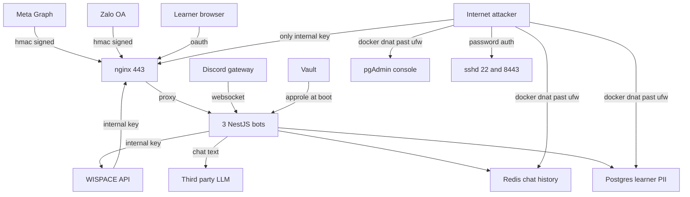

# wispace-bot — Threat Model

**Date:** 2026-09-14 · **Branch:** `main` @ `a153eba4` · **Target:** this repository plus the production VPS (host details withheld — see Redaction note)

> Live-host findings below were obtained with owner-granted SSH access, read-only commands only. No secret values were printed, and no mutating endpoint was called.

> **Remediation status — 2026-09-15.** TM-003 (SSH) is **closed**: password
> authentication is disabled on both 22 and 8443 (verified at the protocol
> level, server offers `publickey` only), `PermitRootLogin no`, fail2ban
> active, and the account password rotated. TM-001/002/006/007 (exposed
> data-store ports) remain **open** — see the note under Remediation order.
> No credential values appear in this document.

> **Redaction note.** This document is published with host identifiers,
> verbatim firewall and `pg_hba` rules, and internal network addresses removed.
> The analysis is unchanged. Two caveats, stated plainly rather than implied:
> the repository itself contains an nginx site config named after the
> production hostname, so the host is not actually secret; and git history
> retains earlier, unredacted revisions of this file. The credential that
> appeared in one of those revisions was rotated and remote password
> authentication has since been disabled, so it is inert. Redaction here is
> hygiene, not a containment boundary — the containment is closing the ports.

## Executive summary

The **application** is in good security shape. Webhook signature verification is HMAC + constant-time with replay windows, OAuth uses `__Host-` cookies with server-side state and PKCE, the LLM agent binds learner identity server-side (never from model output) and layers prompt-injection sanitising, write-tool budgets and secret redaction, secrets come from Vault at runtime, and SQL is parameterised. CI uses `pull_request` (not `pull_request_target`) and pins `known_hosts`.

The **host** is where the risk lives, and it inverts the picture. Three findings dominate, and all three share one root cause: **a control was configured correctly and then silently bypassed by a lower layer.** Docker's iptables DNAT rules publish Redis, both Postgres instances and pgAdmin straight past an active UFW deny-by-default policy — including past an explicit rule written to restrict Redis to a single IP. A root-owned `cloud-init` drop-in re-enables `PasswordAuthentication yes` and wins over the hardening file by filename sort order, so SSH accepts passwords (with `PermitRootLogin yes` and no fail2ban) despite the config a non-root operator can read saying `no`. And `deploy/vps-hardening-check.sh` — the control designed to catch exactly this drift — was never installed on the box, so none of it was ever reported.

Net effect: a learner-PII Postgres instance and the chat-history Redis are reachable from any IP on the internet. The SSH weakness described in TM-003 has since been remediated; the data-store exposure has not. Fix the host; the code is not the problem.

## Scope and assumptions

**In scope:** `apps/*` and `packages/*` runtime code, `deploy/`, `.github/workflows/`, and the live production VPS.

**Out of scope:** the WISPACE API itself (separate codebase — trusted as a peer here), `node_modules`, `dist`, `*.spec.ts`, and the unrelated tenants co-located on the VPS (`feedback-360`, `n8n`, `openclaw`) except as blast radius.

**Assumptions:**
- Single tenant (one WISPACE organisation), not multi-tenant SaaS.
- Attacker baseline: unauthenticated internet attacker, plus any learner who can DM a bot or post in a Discord guild channel the bot watches.
- Attacker does **not** hold Vault credentials, GitHub write access, or the Meta/Zalo app secrets.
- `deploy/vps-hardening.md` is the authoritative internal standard; drift from it is a finding regardless of exploitability.

**Open questions that would change ranking:**
1. ~~Is `INTERNAL_API_KEY` a single shared value across all three bots and the WISPACE backend?~~ **Resolved — it is not.** Digest comparison against Vault (no values printed) shows three distinct per-bot keys: messenger `d7c00168e697` (48 chars), discord `57cd5775192c` (64), zalo `c572554b092a` (64), plus a fourth distinct `WISPACE_INTERNAL_KEY` (`3544b3c2dd4a`) in `shared/prd`. The initial filing assumed sharing and ranked TM-004 **high** on that basis; the blast radius of one leaked key is one bot, so **TM-004 is revised down to medium**. `REDIS_PASSWORD` and the `DB_USER`/`DB_PASSWORD` pair *are* shared across all three bots (both live in `shared/prd`).
2. Does Postgres have TLS enabled? Could not determine; the default for the official image is off. If off, TM-002 additionally leaks credentials and PII in cleartext on the wire.
3. Is the Postgres superuser password high-entropy? TM-002's severity is currently carried entirely by that one secret.

## System model

### Primary components

| Component | Evidence |
|---|---|
| 3 NestJS bots — messenger / discord / zalo | `apps/*/src/main.ts` |
| nginx TLS terminator + rate limiter | `deploy/nginx/aiassist.aihubproduction.com.conf` |
| Postgres `ai_chat_bot_db` (+ pgbouncer) | `packages/database/`, `deploy/docker-compose.pgbouncer.yml` |
| Redis — chat history, queue, rate-limit counters | `packages/chat-history/`, `packages/bot-common/src/redis/` |
| HashiCorp Vault — runtime secrets, AppRole | `packages/bot-common/src/secrets/vault-secrets.ts` |
| LLM agent + tool executor | `packages/llm-agent/`, `packages/chat-agent/` |
| Prometheus / Grafana / Alertmanager / Tempo | `deploy/monitoring/docker-compose.yml` |
| GitHub Actions → GHCR → VPS blue-green deploy | `.github/workflows/deploy-bot-reusable.yml`, `.github/scripts/vps-deploy.sh` |

### Data flows and trust boundaries

- **Meta → `/v1/webhook`** — learner chat text, PSID. HTTPS. HMAC-SHA256 over raw body, constant-time compare, 5-minute timestamp replay window, nginx `limit_req burst=80`. Validated by `MessengerWebhookPayloadDto` + global `ValidationPipe({whitelist, forbidNonWhitelisted})`. Evidence: `apps/messenger-bot/src/shared/common/guards/messenger-webhook-signature.guard.ts`.
- **Zalo → `/v1/zalo/webhook`** — same shape; HMAC over `appId+rawBody+timestamp`, freshness check. Evidence: `apps/zalo-bot/src/modules/zalo-webhook/presentation/guards/zalo-webhook-signature.guard.ts`.
- **Browser → `/v1/{discord,zalo}/oauth/*`** — link tokens, OAuth codes. Server-side single-use state, `__Host-` cookie binding, PKCE (Zalo), `Referrer-Policy: no-referrer`, `Cache-Control: no-store`. Evidence: `apps/discord-bot/.../discord-oauth.controller.ts`.
- **WISPACE → `/v1/messenger/wispace/web-activity`** — learner `userId`. Gated by `InternalApiKeyGuard` only.
- **Operator → `/v1/{messenger,discord,zalo}/*` ops** — privacy purge, mapping relink, report send. Same single `InternalApiKeyGuard`. **Internet-reachable** (TM-004).
- **Bot → LLM provider** — learner chat text leaves the trust boundary to a third party. Endpoint constrained by `LLM_ALLOWED_BASE_URLS` / `LLM_ALLOWED_MODELS`; secrets stripped by `registerRuntimeSecrets` in `packages/bot-common/src/bootstrap/bot-bootstrap.ts`.
- **Bot → Wispace API** — `x-psid`/`x-discordid`/`x-zaloid` + `X-Internal-Key`; zod-validated responses.
- **Internet → Redis 6379 / Postgres 5432 / pgAdmin 8082** — **unintended boundary.** Docker DNAT bypasses UFW (TM-001, TM-002, TM-006).

#### Diagram

## Assets and security objectives

| Asset | Why it matters | Objective |
|---|---|---|
| Learner PII (`userId`, PSID/Discord/Zalo IDs, schedules, target scores, progress reports) | Real minors' study data; re-identifiable; regulatory exposure | C, I |
| Chat history in Redis | Free-form learner messages, personal context | C |
| `INTERNAL_API_KEY` | Sole gate on ops routes incl. privacy purge and report send | C |
| Postgres superuser credential | Sole gate on the internet-facing database | C, I |
| Vault AppRole (`VAULT_ROLE_ID`/`SECRET_ID`) | Unlocks every other secret | C |
| Meta / Zalo app secrets | Forge inbound webhooks; send as the brand | C, I |
| Platform↔WISPACE account mappings | Wrong mapping = cross-learner data disclosure | I |
| GHCR images + deploy SSH key | Supply chain into production | I |
| Bot availability | Missed study reminders, product failure | A |

## Attacker model

### Capabilities
- Reach any internet-exposed TCP port on the VPS; UFW does not constrain Docker-published ports.
- Send arbitrary chat text to any bot (DM or Discord guild channel) — the primary untrusted-input channel into the LLM.
- Initiate OAuth link flows with arbitrary `state` link tokens.
- Replay captured webhook deliveries within the 5-minute window.
- Attempt unlimited SSH password guesses (no fail2ban, no rate limit).

### Non-capabilities
- Cannot forge webhook signatures without the Meta/Zalo app secret.
- Cannot read Vault-injected runtime secrets from container env or `/proc/1/environ` (confirmed empirically).
- Cannot supply `userId` to LLM tools — identity is resolved server-side from the platform ID (`packages/chat-agent/src/agent/platform-agent-tools.service.ts:114`), so prompt injection cannot pivot to another learner.
- Cannot inject SQL — raw SQL appears only in developer-authored migrations and parameterised advisory locks.
- Cannot poison CI from a fork — `pull-request.yml` uses `pull_request` with `permissions: contents: read`.

## Entry points and attack surfaces

| Surface | How reached | Trust boundary | Notes | Evidence |
|---|---|---|---|---|
| `POST /v1/webhook` | Internet | Meta→bot | HMAC + replay window + rate limit | `messenger.controller.ts:38` |
| `GET /v1/webhook` | Internet | Meta→bot | `!==` compare; fail-open if var unset | `messenger.service.ts:138` |
| `POST /v1/zalo/webhook` | Internet | Zalo→bot | HMAC; `rawBody` falls back to re-serialisation | `zalo-webhook-signature.guard.ts` |
| `/v1/{discord,zalo}/oauth/*` | Internet | Browser→bot | Unauthenticated state creation | `discord-oauth.controller.ts:47` |
| `/v1/messenger/*` ops | **Internet** | Operator→bot | Single API key; verified 401 | `scheduler.controller.ts:74` |
| `/metrics` | **Internet** | Operator→bot | Single API key; verified 401 | `metrics.module.ts:43` |
| Redis `6379` | **Internet** | — | `-NOAUTH` — auth on, no TLS | live probe |
| Postgres `5432`/`5434` | **Internet** | — | `host all all all scram-sha-256` | live `pg_hba.conf` |
| pgAdmin `8082` | **Internet** | — | HTTP 302 to login | live probe |
| Grafana `3100` | **Internet** | — | Metrics/telemetry console | live probe |
| sshd `22` + `8443` | **Internet** | — | Password auth on, root login on, no fail2ban | live `sshd -T` |
| Discord gateway | Internet | Learner→bot | Any guild member can invoke the agent | `apps/discord-bot/` |

## Top abuse paths

1. **Learner PII exfiltration via exposed Postgres.** Scan the host for port 5432 → `pg_hba.conf` permits `host all all all scram-sha-256` → offline/online guess the superuser password (no connection rate limit, no fail2ban on 5432) → `SELECT * FROM user_messenger_mappings, study_reminder_jobs` → full learner identity graph and study data. **Impact: total confidentiality loss.**
2. **SSH takeover via cloud-init drift.** Note `sshd` on 22/8443 → password auth accepted → brute-force the login account (the password in place at the time of the audit followed a guessable project-name-plus-digits pattern; it has since been rotated) → `PermitRootLogin yes` gives a second path → host root → Vault AppRole bootstrap env → **every secret in the system.**
3. **Chat-history disclosure via exposed Redis.** Reach `6379` → brute-force `requirepass` unthrottled over a cleartext channel → dump chat history, queue contents and rate-limit state; write access additionally lets the attacker forge queue entries the bots will process.
4. **Ops-route abuse with one leaked key.** Obtain `INTERNAL_API_KEY` (from any of the bots, or from the WISPACE backend that shares the guard) → `POST /v1/messenger/*` from the open internet → purge learner privacy state, relink mappings to attacker-controlled accounts, or send reports to arbitrary PSIDs. **No network ACL to fall back on.**
5. **pgAdmin as a pivot.** Reach `8082` → default/weak pgAdmin credentials or a known pgAdmin CVE → the console already has network reach to both Postgres instances → same impact as path 1 without needing the DB password.
6. **Undetected drift (amplifier, not a path).** `vps-hardening-check.sh` was never installed → paths 1–3 and 5 have persisted unreported since provisioning, and would continue to.
7. **Neighbour-tenant pivot.** Compromise `feedback-360` (`:3000`), `n8n` or `openclaw` (`:47624`) on the shared host → local network reach to `127.0.0.1` services and Docker networks → `pg_hba.conf` grants `host all all 127.0.0.1/32 trust`, i.e. **passwordless superuser** from localhost.
8. **Prompt injection → write-tool abuse.** Craft chat text to make the agent call `reschedule_study_session` or `precreate_next_exercise`. *Well mitigated:* identity is server-resolved, explicit-intent gating, per-user daily/per-message budgets, tool-result sanitising. Residual: nuisance-level self-targeted writes only.
9. **Webhook replay.** Capture a signed delivery → replay within 5 minutes → duplicate inbound event. *Mitigated* by idempotent `(platform, event_id)` dedupe in the durable inbox.
10. **Stale-deploy supply chain.** All three containers still carry `-old` names (cutover incomplete); messenger/discord run mutable `:latest`. An attacker with GHCR write could publish `:latest` and land it on the next restart without a code review trail.

## Threat model table

| ID | Source | Prerequisites | Action | Impact | Assets | Existing controls (evidence) | Gaps | Recommended mitigations | Detection | Likelihood | Severity | Priority |
|---|---|---|---|---|---|---|---|---|---|---|---|---|
| TM-001 | Internet | None | Reach container ports published by Docker DNAT ahead of UFW | Exposes TM-002/003/006 | All data stores | UFW active, deny-in default, explicit Redis restrict rule (live `ufw status`) | Docker `-p 0.0.0.0` bypasses UFW entirely (live `iptables -t nat -L DOCKER`) | Bind every non-public container to `127.0.0.1:` in its compose/run spec; set `"iptables": false` or add a `DOCKER-USER` deny fence | Alert on any new `0.0.0.0` DNAT rule | high | high | **critical** |
| TM-002 | Internet | TM-001 | Connect to `5432`/`5434`, guess DB password | Full learner PII disclosure + tamper | Learner PII, DB creds | `scram-sha-256` for remote hosts | Reachable from any IP; `trust` for localhost; TLS unconfirmed; no connection throttle | Bind to `127.0.0.1`; restrict `pg_hba` to the Docker subnet; drop `trust`; enable TLS; rotate the superuser password | Alert on remote `pg_hba` auth failures | medium | high | **critical** |
| TM-003 | Internet | None | Brute-force SSH password on 22/8443 | Host root → Vault AppRole → all secrets | Everything | Key-based deploy path exists; `KbdInteractiveAuthentication no` | `50-cloud-init.conf` sets `PasswordAuthentication yes` and wins by sort order; `PermitRootLogin yes`; no fail2ban; weak password | Delete/override the cloud-init drop-in; `PermitRootLogin no`; install fail2ban; **rotate the current password now** | Alert on `Failed password` rate | high | high | **critical** |
| TM-004 | Internet | Leaked `INTERNAL_API_KEY` (per-bot, not shared — see Scope) | Call ops routes from the open internet | Privacy purge, mapping hijack, arbitrary report send | Learner PII, mappings | `InternalApiKeyGuard` constant-time, verified 401; `ThrottlerGuard` | `location /` is an unrestricted catch-all (`...com.conf:92`); one key, no scoping; question 1 unresolved | Add `allow`/`deny` on `/v1/*/ops` and `/metrics`; split the WISPACE-facing key from the ops key | Alert on `internal_auth_rejected` spikes | medium | medium | **medium** |
| TM-005 | — | — | Host drift persists unreported | Amplifies TM-001/002/003/006 | All | `vps-hardening-check.sh` exists in repo | Never installed; no cron; no evidence dir | Install it with the documented cron; fail the build on critical drift; **also fix its `PasswordAuthentication` grep**, which reads only non-root files and would have reported a false PASS | Route its exit code to Alertmanager | high | medium | **high** |
| TM-006 | Internet | TM-001 | Reach pgAdmin console on `8082` | DB admin access, pivot to TM-002 | Learner PII | Login page present (302) | Admin console on the public internet | Bind to `127.0.0.1`, reach via SSH tunnel only | Alert on `8082` auth failures | medium | high | **high** |
| TM-007 | Internet | TM-001 | Brute-force Redis `requirepass` in cleartext | Chat history disclosure; queue forgery | Chat history | `requirepass` on (verified `-NOAUTH`) | Internet-reachable, no TLS, unthrottled | Bind to `127.0.0.1`; enable TLS; long random password | Alert on Redis auth failures | medium | medium | **medium** |
| TM-008 | Neighbour tenant | Compromise a co-hosted app | Pivot to `localhost` services | Passwordless DB superuser via `trust` | Learner PII | Separate Docker networks | `trust` on `127.0.0.1/32`; unrelated tenants share the host | Remove `trust`; move the bots to a dedicated host | Audit unexpected local DB sessions | medium | high | **high** |
| TM-009 | Learner | Chat access | Prompt-inject to trigger write tools | Nuisance self-targeted writes | Learner's own data | Server-resolved identity (`platform-agent-tools.service.ts:114`), intent gating, write-tool budgets, `sanitizeToolResultContent` | Regex/classifier gate is best-effort | Keep classifier rollout; keep budgets enforced | `llm_safety_events` rate | medium | low | **low** |
| TM-010 | Internet | Meta app secret | Replay a signed webhook | Duplicate event | Availability | HMAC + 5-min window + `(platform, event_id)` dedupe | — | None needed | Duplicate-rate metric | low | low | **low** |
| TM-011 | Internet | `VERIFY_TOKEN` unset in Vault | Omit `hub.verify_token`; `undefined !== undefined` is false | Webhook verification bypass | Integrity | **Verified set in prod — returns 403** | No startup validation, no `.env.example` entry, non-constant-time `!==` | Add a boot-time required-env assert; use `timingSafeEqual` for consistency | Alert if the env key ever goes missing | low | low | **low** |
| TM-012 | Internet | Absent `rawBody` | Zalo guard falls back to `JSON.stringify(request.body)` | Verification fails closed (no bypass) | Integrity | Signature still required | Re-serialisation ≠ raw bytes | Fail closed explicitly when `rawBody` is absent | Log the fallback path | low | low | **low** |
| TM-013 | GHCR writer | Registry write access | Publish a malicious `:latest` | Arbitrary code in production | Supply chain | Deploy pins `known_hosts`; `pull_request` not `pull_request_target` | Mutable `:latest` on 2 of 3 bots; containers still named `-old`, cutover incomplete | Pin image digests; finish/repair the blue-green cutover | Alert on image digest change | low | high | **medium** |

## STRIDE coverage check

The threat enumeration above was built from entry points and trust boundaries rather than from a taxonomy. Running STRIDE over the result afterwards is a completeness check — its value is in showing which categories came back empty.

| Category | Threats | Assessment |
|---|---|---|
| **S** — Spoofing | TM-003 (SSH password auth), TM-004 (anyone holding the key is "the operator"), TM-009, TM-010, TM-011 | Well covered |
| **T** — Tampering | TM-002 (write access to learner data), TM-007 (forged queue entries), TM-013 (mutable `:latest`), TM-004 (mapping relink) | Well covered |
| **R** — Repudiation | **none** | **Gap — see below** |
| **I** — Information disclosure | TM-001, TM-002, TM-006, TM-007, plus the accepted boundary of learner chat text reaching a third-party LLM | Heaviest coverage |
| **D** — Denial of service | Thin — partially addressed below | Under-covered |
| **E** — Elevation of privilege | TM-003 (root → Vault → every secret), TM-002 (`trust` → superuser), TM-008 (neighbour-tenant pivot) | Well covered |

### The empty cell: Repudiation

Thirteen threats, none of them about attribution. The gap is systemic rather than an oversight in one place — privileged action is unattributable at four layers:

- **Ops routes** authenticate with one shared key per bot, so operator A, operator B, and a key holder are indistinguishable in the logs. Only the 401 path is counted today (`INTERNAL_AUTH_METRICS_PORT`); successful privileged calls log no caller.
- **`platform_link_audit_events`** stores what changed but has no actor column, and its five `event_type` values are all system-derived states — an operator-initiated relink produces nothing recognisable as a human decision.
- **Postgres sessions** share one `DB_USER` across all three bots, and `pg_hba`'s `trust` entries admit connections carrying no credential to attribute at all.
- **Vault** is the exception and holds up: an audit device writes every secret read to `/vault/logs/audit.log`. The weakness there is identity binding, not recording.

This matters because every mitigation in this document implicitly assumes post-incident investigation is possible. It currently is not. Tracked as #1167.

### The thin cell: Denial of service

Two paths the enumeration missed:

- The exposed database and cache ports are an availability problem independent of confidentiality. `max_connections` is a fixed budget and an unauthenticated connection still consumes a slot, so credential hardening does not close it — only the network-level binding fix does. This distinction decides whether a partial remediation of TM-002 is sufficient (it is not).
- `GET /v1/discord/oauth/url` is unauthenticated and writes a state record per call. `ThrottlerGuard` bounds the rate, but the store is still attacker-driven growth.

## Mitigation analysis — three attack classes

A third lens, orthogonal to STRIDE: how well does the system resist the three classes an attacker would actually attempt here?

### SQL injection — no exploitable path found

The repository contains exactly **three** string interpolations into SQL, and all three sit in *identifier* position, where Postgres placeholders are not available. They interpolate because they must, not through carelessness.

| Site | Interpolates | What constrains it |
|---|---|---|
| `packages/database/src/services/metering-and-operations/privacy-data.service.ts:1252` | `table`, `column` | `VERIFY_INTENT_TABLES` is a `Record<Platform,string>` with three hardcoded entries; `if (!table) return` runs first |
| `packages/study-reminder-shared/src/infrastructure/typeorm-study-reminder-job.repository.ts:419` | `timeoutMs` | `Math.max(1, Math.min(Math.trunc(x ?? 5000), 10000))` |
| `packages/database/src/migrations/1786933000000-*.ts:121` | index name | Migration; developer-controlled |

User-supplied values always travel as bound parameters. At the first site `externalUserId` — the only attacker-reachable input — is `$1`; an unrecognised `platform` makes the table lookup `undefined` and the function returns before a query is built. Everything else goes through TypeORM, behind a global `ValidationPipe({whitelist, forbidNonWhitelisted})`, with zod at the WISPACE boundary.

One structural weakness, not a security one: at the first site the thing protecting the `column` interpolation is the *table* lookup. The safety is emergent rather than declared, so someone removing the `!table` guard, or adding a branch that skips the lookup, would open a hole without realising what they had removed. Tracked in #1168.

### Credential theft — well layered, with one registry that has drifted

Working as intended: secrets live in Vault and are injected into `process.env` at runtime — verified empirically, since neither `docker exec printenv` nor `/proc/1/environ` observes them, so a shell inside a container does not yield the environment. `PAGE_ACCESS_TOKEN` travels as an `Authorization: Bearer` header rather than a query parameter, closing the classic "URL echoed into an error log" path. `redactSecrets` runs two layers — exact registered values first, shape patterns second — and `RedactedLogger` wraps every Logger before module init.

The gap is that `RUNTIME_SECRET_ENV_KEYS` (`packages/llm-agent/src/utils/secret-redaction.utils.ts:36`) is hand-maintained and has drifted from the names the code reads. Two entries name variables that exist nowhere in the codebase — `MESSENGER_PAGE_TOKEN` (real name `PAGE_ACCESS_TOKEN`) and `ZALO_APP_SECRET` (real name `ZALO_APP_SECRET_KEY`) — and four real secrets are absent entirely. The failure is silent: `collectRuntimeSecretValues` resolves a wrong name to nothing and filters it out by length.

`CREDENTIAL_SHAPES` provides no second net for the same values. It matches `sk-` keys, `Bearer <token>`, JWTs and credential-bearing connection strings, none of which describe a bare Meta token, a 20-char Zalo secret or a 32-char Discord client secret. Both layers miss the same set. No evidence any secret has actually reached model context — this is a hole in defence-in-depth, not an active leak. Tracked in #1168.

### Data exfiltration — the shortest path avoids the application entirely

| Path | State |
|---|---|
| Internet to Postgres 5432 | **Open.** `pg_hba` accepts any IP; one password; no TLS (`DB_SSL=false`) |
| Internet to Redis 6379 | **Open.** `requirepass` set, no TLS, no attempt throttling |
| Internet to pgAdmin 8082 | **Open.** Database admin console |
| Via ops routes | Key required, per-bot, but no network ACL behind it |
| Via the LLM | Deliberate, accepted boundary — learner chat text reaches a third party |
| Via the chat agent | Well defended: identity resolved server-side, tools never accept `userId` from model output |

Application-layer mitigations are genuinely good: `external_user_hash` instead of raw identifiers in the audit trail, `maskExternalId` in logs, six `*_RETENTION_DAYS` windows, `PRIVACY_CLEANUP_STORES` for purge, `sanitizeToolResultContent` on tool output.

None of it helps against a direct read of the tables. Hashing identifiers protects a leaked log; it protects nothing once `SELECT * FROM user_messenger_mappings` succeeds. Seven-day retention narrows the exposure window; it does not close the door.

That is the conclusion worth carrying out of this section: **defensive effort is concentrated in the layer the attack does not pass through.** SQL injection is defended to the point of having no remaining path, while the database sits on the public internet. An attacker does not need injection here; they need `psql`.

## Criticality calibration

- **Critical** — unauthenticated internet path to bulk learner PII, or to host/secret compromise. *Examples:* TM-002 (DB on the internet), TM-003 (SSH password + root login), TM-001 (the bypass enabling both).
- **High** — needs one credential or one pivot, then yields bulk PII or ops control. *Examples:* TM-004 (one key, no network ACL), TM-006 (pgAdmin exposed), TM-008 (`trust` from localhost).
- **Medium** — narrower impact, or a meaningful precondition. *Examples:* TM-007 (Redis behind a password), TM-013 (needs registry write).
- **Low** — bounded to the attacker's own data, or blocked by a control verified live. *Examples:* TM-009 (self-targeted writes), TM-011 (fail-open branch real in code, closed in prod).

## Focus paths for security review

| Path | Why it matters | Threat IDs |
|---|---|---|
| `deploy/monitoring/docker-compose.yml` | Port bindings — the `0.0.0.0` publishes that bypass UFW | TM-001, TM-006, TM-007 |
| `deploy/docker-compose.pgbouncer.yml` | Postgres/pgbouncer binding and exposure | TM-001, TM-002 |
| `deploy/nginx/aiassist.aihubproduction.com.conf:92` | `location /` catch-all puts every ops route on the internet | TM-004 |
| `deploy/vps-hardening-check.sh` | Never deployed; its sshd grep yields a false PASS as written | TM-005, TM-003 |
| `deploy/vps-hardening.md` | The standard the host has drifted from | TM-001, TM-003 |
| `packages/bot-common/src/guard/internal-api-key.guard.ts` | The single gate on all ops surfaces | TM-004 |
| `apps/messenger-bot/src/modules/scheduler/presentation/controllers/scheduler.controller.ts` | Highest-impact ops handlers (purge, relink, send) | TM-004 |
| `apps/messenger-bot/src/modules/messenger/application/services/messenger.service.ts:138` | Fail-open branch + non-constant-time compare | TM-011 |
| `apps/zalo-bot/.../zalo-webhook-signature.guard.ts` | `rawBody` fallback canonicalisation | TM-012 |
| `packages/chat-agent/src/agent/platform-agent-tools.service.ts` | Identity binding for LLM write tools — the control that stops cross-learner pivot | TM-009 |
| `.github/scripts/vps-deploy.sh` | Blue-green cutover left `-old` containers active | TM-013 |

## Remediation order

1. ~~Rotate the SSH password~~ — **done 2026-09-15**, together with disabling password authentication entirely, so the rotated value is no longer usable for remote access.
2. Close the exposed ports — **not** with one uniform change; see the subsection below. Covers TM-001, TM-002, TM-006, TM-007.
3. Remove `PasswordAuthentication yes` from `50-cloud-init.conf`, set `PermitRootLogin no`, install fail2ban (TM-003).
4. Drop `trust` from `pg_hba.conf`; scope remote auth to the Docker subnet (TM-002, TM-008).
5. Add `allow`/`deny` ACLs to `/v1/*/ops` and `/metrics` in nginx (TM-004).
6. Install `vps-hardening-check.sh` on its cron **and fix its sshd check to use `sshd -T`** rather than grepping files it cannot read (TM-005).

### Closing the ports crosses project boundaries

Step 2 is not a change this repository can make on its own. The four exposed
ports belong to four separate Compose projects, two of which live outside this
repo, and three of them have live consumers that connect *through* the public
binding:

| Port | Compose project | Config location | Live consumers observed |
|---|---|---|---|
| 6379 Redis | `redis` | own Compose project | services outside this repo, via the bridge gateway |
| 5434 (bot DB backend) | separate project | outside this repo | several services outside this repo, via the public binding |
| 5432 (unrelated DB) | separate project | outside this repo | none observed |
| pgAdmin, Grafana | separate projects | partly outside this repo | none observed |

Changing a published port requires recreating the container, and each consumer
above resolves the service by an address that a loopback bind would refuse. The
work is therefore: identify every consumer, move it onto a shared Docker network
addressed by container name, verify it, and only then drop the host publish —
per service, in that order.

The consumer list is a **lower bound**. `ss` on the host sees only
host-namespace sockets, so connections originating inside containers — including
the three bots — do not appear in it.

### Why step 2 is not one uniform change

Postgres and Redis are reached by different routes, and a single "bind everything to `127.0.0.1`" pass takes all three bots offline.

| Service | Config | Route the bots use | Loopback bind safe? |
|---|---|---|---|
| Postgres | `DB_HOST=pgbouncer` | Container name over Docker DNS on `app_n8n_db_network` | **Yes** — the host port is never used |
| Redis | `REDIS_HOST=the Docker bridge gateway | The host's Docker bridge gateway — out to the host, back in through the published port | **No** — this breaks it |

the Docker bridge gateway is the gateway of `messenger-bot_default`. A loopback socket does not accept connections arriving on a bridge interface. The cause is topological: the `redis` container sits alone on `redis_default` and shares no network with the bots, leaving the host detour as its only path.

- **Postgres (5432, 5434), pgAdmin (8082), Grafana (3100)** — bind to `127.0.0.1` directly. pgAdmin and Grafana then need an SSH tunnel to reach, which is a change to operator workflow, not only to config.
- **Redis** — give it the shape pgbouncer already has, adding the new path before removing the old one: `docker network connect app_n8n_db_network redis`, change `REDIS_HOST` to `redis`, restart the bots and confirm `/health/ready` is green, and only then remove `-p 6379:6379`.

Verification must run from a host that is **not** a single allow-listed operator address, since UFW carries a rule for that address that would mask the result. `/health/ready` must also be checked per bot: from outside, a closed port and an unreachable dependency look identical, so a port-only check passes while Redis is broken.

## Related

- [`threat-model-wispace-data-and-outbound.md`](./threat-model-wispace-data-and-outbound.md) — models what happens *after* a platform identity is verified (WISPACE reads, report and reminder outbound, privileged operations). This document is its host- and deployment-side complement; neither re-derives the other.
- Public tickets: #1155 (exposed data-store ports), #1164 (hardening check), #1165 (webhook hardening), #1166 (provider failover), #1167 (attribution), #1168 (secret registry + SQL invariant).
- Host findings are not public: they are tracked as draft repository security advisories, because the deployment is live and unpatched.

## Quality check

- [x] All discovered entry points covered — 12 surfaces enumerated, each mapped to at least one threat.
- [x] Every trust boundary appears in at least one threat, including the unintended Docker→internet boundary.
- [x] Runtime vs CI/dev separated — CI treated only in TM-013; tests and `node_modules` excluded.
- [x] Live-host claims verified empirically (external probes + read-only on-box commands), not inferred.
- [x] One methodology correction recorded: `docker exec printenv` cannot observe Vault-injected runtime secrets, so an initial "`VERIFY_TOKEN` unset" reading was a false positive — corrected by external probe (TM-011).
- [x] Question 1 (`INTERNAL_API_KEY` sharing) was subsequently resolved against Vault: keys are per-bot, and TM-004 was revised down from high to medium accordingly.
- [x] STRIDE applied as a post-hoc completeness check; it surfaced Repudiation as wholly absent and Denial of service as thin, both now recorded above rather than silently corrected.
